# Laboratorio 1: Mejorar la narrativa de datos utilizando el agente Analyst de Microsoft 365 Copilot

**Duración:** 25 minutos

# Objetivo

Este laboratorio utiliza el agente **Analyst** de Microsoft 365 Copilot
para analizar la hoja de cálculo **Project Nexus Survey Results**.
Cargue el archivo en el agente Analyst, ejecute los starter prompts para
extraer las principales tendencias, profundice en los promedios y cree
visualizaciones (gráficos, mapas de calor, etc.).

# Requisitos previos

1.  Acceso a una cuenta de Microsoft 365 con Copilot y Agents
    habilitados (agente Analyst disponible).

2.  Navegador: se recomienda Microsoft Edge (el módulo utiliza Edge en
    las instrucciones).

3.  Archivo Project Nexus Survey Results en formato CSV o XLSX (la
    página de Learn incluye un enlace de descarga desde GitHub).

## Ejercicio 1: Configurar y cargar el conjunto de datos

1.  **Abra una nueva pestaña en** **Microsoft Edge** y navegue a
    https://M365copilot.com. **Inicie sesión** utilizando el **nombre de
    usuario** y la contraseña proporcionados en la pestaña **Resources**
    del panel derecho del entorno de laboratorio.

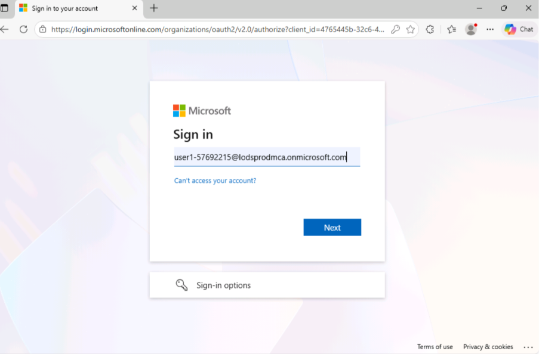

2.  En **Microsoft 365**, abra el **Analyst agent**.

3.  Si no es visible, seleccione el ícono **Expand navigation**, elija
    **Agents** → seleccione **Analyst Agent**.

4.  Haga clic en el ícono **Add content and agents (+)** del campo de
    prompt → seleccione **Upload images and files** → elija el archivo
    del laboratorio **Project Nexus survey results** desde **C:\Lab
    File**.

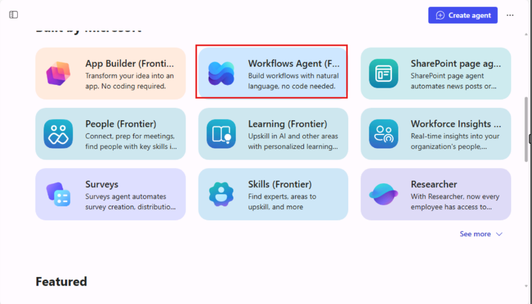

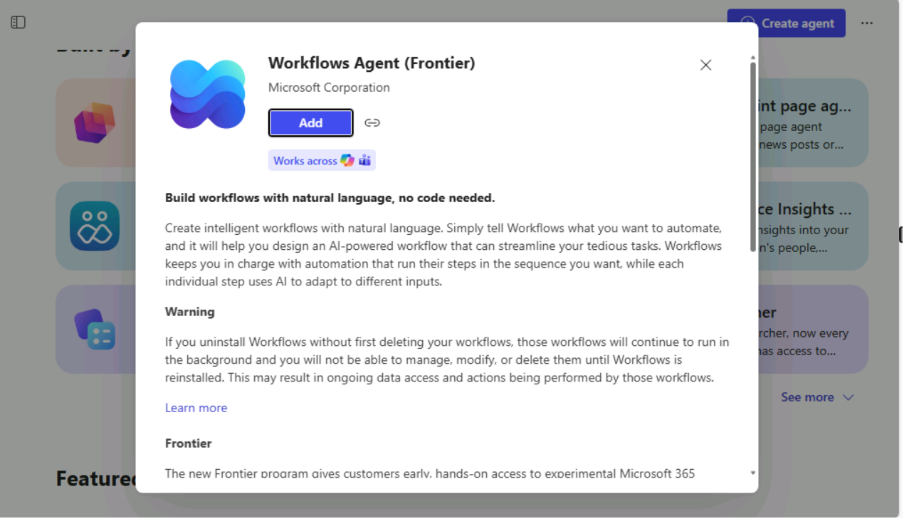

> **Nota:** Después de cargar el archivo, estará listo para comenzar a
> explorar e interactuar con el **agente *Analyst*.**

## Ejercicio 2: Ejecutar los prompts iniciales

1.  En el campo de prompt, escriba:  
    +++**Analyse this spreadsheet and tell me the top three
    trends**.+++  
    Luego haga clic en el botón **Execute**.  
    Espere a que el agente Analyst complete su análisis y valide la
    respuesta.

> 
>
> 
>
> **Nota:** La página puede mostrar un gran espacio en blanco en la
> interfaz. Si esto ocurre, desplácese hacia arriba para visualizar los
> resultados.
>
> 

2.  En el campo de prompt, escriba el siguiente prompt, valide la
    respuesta del agente y luego haga clic en el botón **Execute:  
    +++What is the average rating for each survey category?+++**

> 
>
> 

## Ejercicio 3: Probar prompts adicionales (cuantitativos, cualitativos y de visualización)

Este ejercicio permite explorar diferentes tipos de prompts de análisis
más allá de los ejemplos predefinidos y comprender cómo cada categoría
(cuantitativa, cualitativa y de visualización) puede generar insights
distintos a partir del mismo conjunto de datos.

### Prompts de análisis cuantitativo: 

El agente busca obtener información numérica o medible a partir de los
datos.

1.  En el campo de prompt, escriba el siguiente prompt, valide la
    respuesta del agente y luego haga clic en el botón **Execute.**

+++How many participants rated the project satisfaction as 4 or
higher?+++

**Resumen de la respuesta:**

- Un total de **22 participantes** calificaron la satisfacción del
  proyecto con **4 (Good)** o **5 (Excellent)** en la encuesta Project
  Nexus.

- Desglose detallado de calificaciones:

  - (Poor): 11 respuestas

  - (Fair): 7 respuestas

  - (Neutral): 10 respuestas

  - (Good): 14 respuestas

  - (Excellent): 8 respuestas

- Cálculo: **14 (Good) + 8 (Excellent) = 22 participantes** expresaron
  una satisfacción positiva.

2.  En el campo de prompt, escriba el siguiente prompt, valide la
    respuesta del agente y luego haga clic en el botón **Execute**.

+++Which category received the highest average rating, and which
received the lowest**?+++**

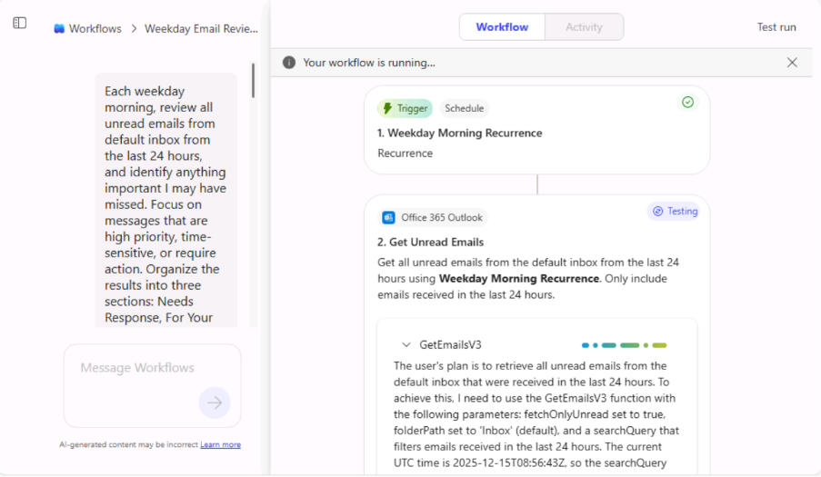

**Resumen de la respuesta:**

- El agente **Analyst** analizó los datos del archivo
  **Project_Nexus_survey_results.xlsx** y proporcionó los **promedios de
  calificación** en cuatro categorías principales.

- 📊 *Resumen de calificaciones promedio*

[TABLE]

### Prompts de análisis cualitativo**:** 

El agente busca explorar **opiniones, experiencias, percepciones o
*insights* descriptivos** de los datos, en lugar de valores numéricos.

1.  En el campo de prompt, escriba el siguiente prompt, valide la
    respuesta del agente y luego haga clic en el botón **Execute**:

+++Summarize the most common themes in the comments section.+++

**Resumen de la respuesta:**

- El agente **Analyst** identificó los **temas** **principales**
  mencionados por los participantes en los comentarios relacionados con
  la satisfacción del proyecto.

- Cada tema incluye el **número de menciones** y **ejemplos de
  comentarios** que representan la retroalimentación de los
  participantes.

2.  En el campo de prompt, escriba el siguiente prompt, valide la
    respuesta del agente y luego haga clic en el botón **Execute**.

+++Are there any recurring concerns or suggestions mentioned in the
comments**?+++**

**Resumen de la respuesta:**

- El agente **Analyst** identificó **preocupaciones y sugerencias
  recurrentes** en los comentarios de la encuesta Project Nexus.

### Prompts de insights y recomendaciones

El agente Analyst **interpreta los hallazgos de los datos, formula
conclusiones significativas** y **sugiere próximos pasos accionables**
basados en el análisis.

1.  En el campo de prompt, escriba el siguiente prompt, valide la
    respuesta del agente y luego haga clic en el botón **Execute**.

+++Based on the survey data, what are the top three strengths of Project
Nexus?+++

**Resumen de la respuesta:**

- El agente **Analyst** identificó las **principales fortalezas** a
  partir de los datos y comentarios de la encuesta Project Nexus.

2.  En el campo de prompt, escriba el siguiente prompt, valide la
    respuesta del agente y luego haga clic en el botón **Execute**.

+++What are the key areas for improvement suggested by the
participants?+++

**Resumen de la respuesta:**

- El agente **Analyst** destacó la **comunicación** como el **área
  principal de mejora**, basándose en la retroalimentación de los
  participantes de la encuesta Project Nexus.

### Prompts de visualización cuantitativa

**El agente Analyst presenta los datos numéricos** **de forma visual**
—mediante gráficos, tablas o diagramas— para facilitar su interpretación
y comparación.

1.  En el campo de prompt, escriba el siguiente prompt, valide la
    respuesta del agente y luego haga clic en el botón **Execute**.

**+++**Generate a pie chart of overall ratings distribution**.+++**

**Resumen de la respuesta:**

- El agente **Analyst** generó un **gráfico circular** que representa
  visualmente la **distribución de las calificaciones de Overall
  Experience** en la encuesta Project Nexus.

2.  En el campo de prompt, escriba el siguiente prompt, valide la
    respuesta del agente y luego haga clic en el botón **Execute**:

+++Create a bar chart comparing the average ratings for Project
Satisfaction, Communication Effectiveness, Timeline Adherence, and
Overall Experience.+++

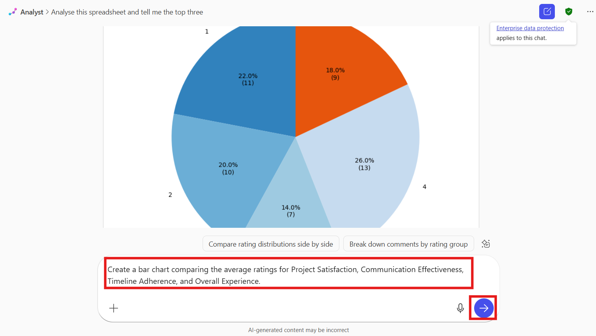

**Resumen de la respuesta:**

- El agente **Analyst** creó un **gráfico de barras** que visualiza los
  **promedios de calificación** en las cuatro categorías principales de
  la encuesta Project Nexus y proporcionó un resumen numérico.

## Ejercicio 4: Instrucciones para el elemento accionable del usuario final

Realice un análisis de datos integral de los resultados de la encuesta
Project Nexus utilizando diferentes tipos de prompts analíticos. Cada
tipo de prompt se centra en extraer insights o visualizaciones
específicas del conjunto de datos.

### Prompts de análisis cuantitativo

Utilice estos prompts para analizar **datos numéricos** e identificar
patrones o relaciones medibles.

1.  En el campo de prompt, escriba el siguiente prompt, valide la
    respuesta del agente y luego haga clic en el botón **Execute.**

+++What percentage of participants rated timeline adherence below 3?+++

> Esto calculará la proporción de participantes que otorgaron
> calificaciones bajas en el cumplimiento del cronograma.
>
> 

2.  En el campo prompt, introduzca el siguiente prompt y valide la
    respuesta del agente, luego haga clic en el botón **Execute**.

+++Can you identify any correlations between communication effectiveness
and overall experience?+++

El Analyst calculará el coeficiente de correlación e interpretará qué
tan estrechamente están relacionadas estas dos categorías.

> **Resultado esperado:**
>
> Un resumen numérico que muestre porcentajes, promedios o valores de
> correlación que revelen patrones en las calificaciones de los
> participantes.

### Prompts de análisis cualitativo

Utilice estos *prompts* para **extraer e interpretar comentarios
descriptivos** **o textuales** de las respuestas abiertas de la
encuesta.

1.  En el campo prompt, introduzca el siguiente prompt y valide la
    respuesta del agente, luego haga clic en el botón **Execute**.

+++Identify any comments that mention issues with communication or
timeline.+++

Esto filtrará los comentarios que contengan palabras clave o
preocupaciones relacionadas. Revise los comentarios extraídos para
identificar frases o temas recurrentes.

**Resultado esperado:**  
Una lista categorizada de insights cualitativos que resalten patrones de
retroalimentación relacionados con la comunicación y el cronograma del
proyecto.

### Prompts de insight y recomendaciones

Utilice estos *prompts* para **resumir los hallazgos** y **generar
recomendaciones** procesables basadas tanto en datos cuantitativos como
cualitativos.

1.  En el campo prompt, introduzca el siguiente prompt y valide la
    respuesta del agente, luego haga clic en el botón **Execute**.

+++Provide a summary report of the survey findings with actionable
recommendations.+++

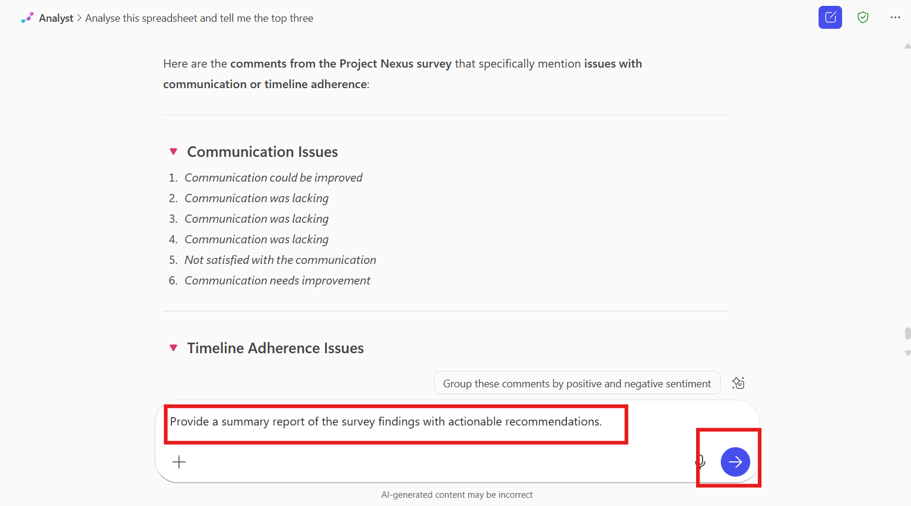

El Analyst compilará los hallazgos clave, destacará fortalezas y
debilidades, y sugerirá acciones de mejora.

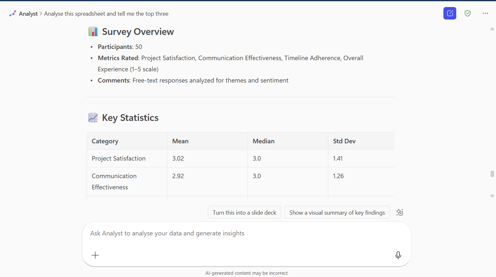

**Resultado esperado:**  
Un informe resumido que contenga insights estratégicos y recomendaciones
para mejorar el desempeño de proyectos futuros.

### Prompts de visualización cuantitativa

Utilice estos prompts para crear **visualizaciones de datos** que hagan
que los resultados numéricos sean más interpretables y estén listos para
su presentación.

1.  En el campo prompt, introduzca el siguiente prompt y valide la
    respuesta del agente, luego haga clic en el botón **Execute**.

+++Plot a histogram of the satisfaction ratings to see the distribution
of ratings.+++

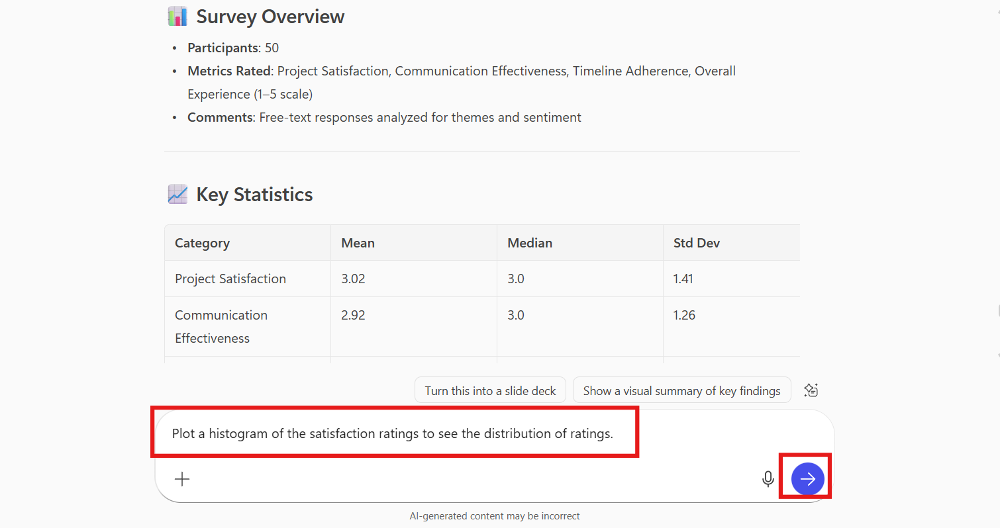

2.  Ejecute los siguientes prompts como se muestra en los pasos
    anteriores:

    - +++Generate a scatter plot to analyze the relationship between
      Communication Effectiveness and Overall Experience.+++

    - +++Create a correlation heatmap for all numeric rating
      categories.+++

    - +++Make a box plot for each rating category to show the range and
      quartiles.+++

    - +++Plot a line graph showing timeline adherence ratings over
      participants ordered by Participant ID.+++

> Revise cada visualización para identificar tendencias, relaciones y
> valores atípicos en los datos.

- **Resultado esperado:**  
  Una serie de gráficos (*histogram*, *scatter plot*, *heatmap*, *box
  plot* y *line graph*) que representen visualmente los datos de la
  encuesta, facilitando la comparación y la obtención de insights.

## Ejercicio 5: Exportar y reutilizar la respuesta del agente Analyst

### ¿Qué se puede hacer con la respuesta?

A continuación, se presenta una descripción general de las tareas
asociadas con cada ícono mostrado en su captura de pantalla:

1.  **Ícono Clipboard** – Probablemente utilizado para **copiar o
    pegar** contenido.

2.  **Ícono Thumbs-Up** – Generalmente indica que se **aprueba o gusta**
    una acción o elemento.

3.  **Ícono Thumbs-Down** – Indica **desaprobación o disgusto** hacia un
    elemento o acción.

4.  **Ícono Speaker** – Representa **configuraciones o control de
    volumen**.

5.  **Ícono Pencil** – Generalmente utilizado para tareas de **edición o
    redacción**.

6.  **Ícono Clock with Arrow** – El texto informativo (***tooltip***)
    indica *“**Add to recent page**”*, lo que significa que agrega el
    elemento actual a sus páginas visitadas recientemente para
    referencia rápida.

### Botón Copy

- **Propósito:** Permite al usuario **copiar** directamente **el texto
  del resumen, explicación o datos** del Analyst desde la respuesta.

- **Uso:** Al hacer clic, copia la **parte de texto** de la respuesta
  del Analyst (no la imagen del gráfico) al portapapeles.  
  Es útil si se desea **pegar los datos o el resumen** **en un
  informe**, documento o presentación.

- **Ejemplo de uso:**  
  Se puede copiar “22 participants rated the project satisfaction as 4
  or higher” para incluirlo en el archivo resumen del proyecto.

> 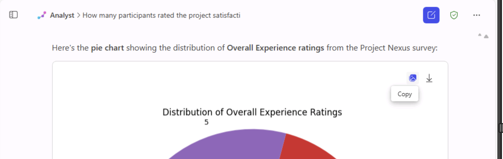
>
> 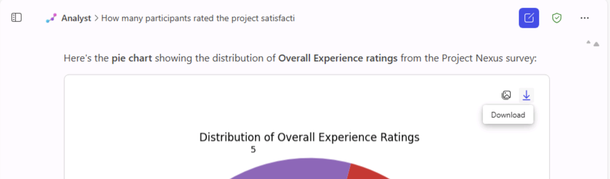

### Botón Download

- **Propósito:** Permite al usuario **descargar la visualización** (por
  ejemplo, un **gráfico circular**) como **archivo de imagen (por
  ejemplo, PNG).**

- **Uso:** Al hacer clic, guarda la **imagen del gráfico** en el sistema
  local.  
  Luego puede insertarse en **presentaciones de PowerPoint**,
  **documentos de Word o informes** como representación visual.

- **Ejemplo de uso:**  
  Se puede descargar el gráfico circular ***“Distribution of Overall
  Experience Ratings”*** para incluirlo en la presentación de análisis
  de la encuesta.  
    
  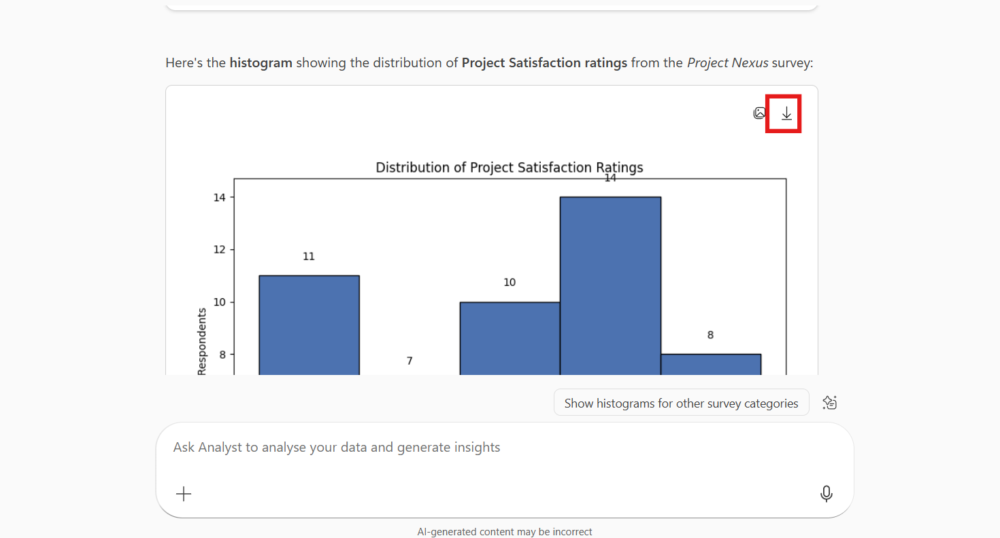

### Consejos de resolución de problemas y validación

- Si la interfaz del agente muestra un gran espacio en blanco:
  desplácese hacia arriba o hacia abajo; el contenido suele estar
  presente (el módulo señala esto como un problema conocido).

- Si las columnas numéricas se tratan como texto: abra la hoja de
  cálculo, asegúrese de que las columnas de calificación sean numéricas
  y vuelva a cargar el archivo.

- Si los gráficos no aparecen, solicite explícitamente al agente:

Please generate a bar chart comparing average ratings for \[list
categories\].

## Conclusión:

En este laboratorio, los participantes exploraron cómo el **Analyst
Agent** de Microsoft 365 Copilot mejora la narrativa de datos al
transformar información de encuestas sin procesar en insights
procesables y visualizaciones efectivas.  
Al analizar los resultados de la encuesta Project Nexus, los usuarios
aprendieron a aplicar **prompts cuantitativos, cualitativos y de
visualización** para descubrir tendencias, calcular promedios,
identificar temas clave y resaltar fortalezas y áreas de mejora.  
El laboratorio demostró cómo el Analyst Agent puede interpretar datos,
generar gráficos como circulares, de barras y mapas de calor, y resumir
hallazgos en recomendaciones significativas.  
Finalmente, los participantes practicaron la exportación y reutilización
de los resultados analíticos, reforzando cómo Copilot puede optimizar
las tareas de análisis de datos, elaboración de informes y
presentaciones, haciendo que los insights empresariales sean más
rápidos, claros y accesibles.
