# **Get Started with Workflows in Microsoft 365 Copilot**

## **What is Workflows Agent?**

Workflows is an agent in Microsoft 365 Copilot that helps you automate
work across Microsoft 365 using natural language. Instead of manually
configuring steps or connectors, you simply describe what you want, and
Workflows generates a working workflow using supported Microsoft 365
services. 

## **What you will build in this exercise**

You will create a workflow that:

- Runs **every weekday morning**

- Reviews **unread emails from the last 24 hours**

- Identifies **important or actionable emails**

- Organizes them into clear sections

- Sends a **summary to you in Microsoft Teams**

## **Prerequisites (Important – Check Before You Start)**

### **Licensing & Access**

Make sure:

- You have a **Microsoft 365 Copilot license**

- You are part of the **Frontier program**

- Workflows Agent (Frontier) is available in your tenant

**Note**: Workflows is **English-only** at the moment.

### **DLP & Connector Requirements (Admin setup)**

Your organization’s **DLP policy must allow**:

- **AI actions** (Power Platform connector)

- **Dataverse (AI prompt)**

- Microsoft 365 connectors:

  - Outlook

  - Teams

  - SharePoint

  - Planner

  - Approvals

These are required so Workflows can read emails, post to Teams, and
summarize content.

## Exercise 1: Add Workflows Agent to Copilot

1.  Sign in to **Microsoft 365 Copilot**

&nbsp;

1.  **Sign in with your Microsoft 365 Copilot account**

2.  Click **Yes,** to stay signed in.

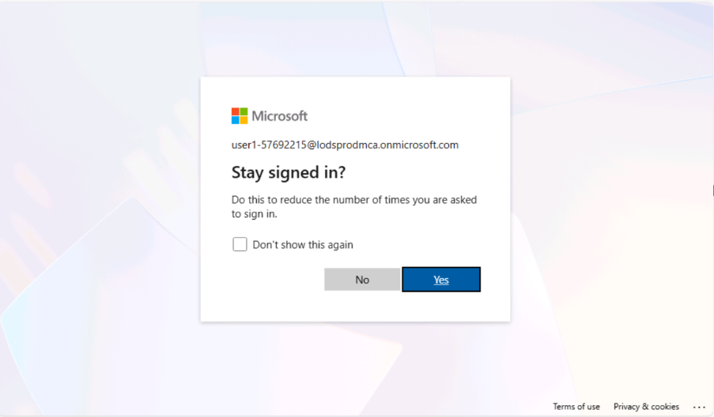

3.  After successful login, you will see **Copilot Chat** home page.

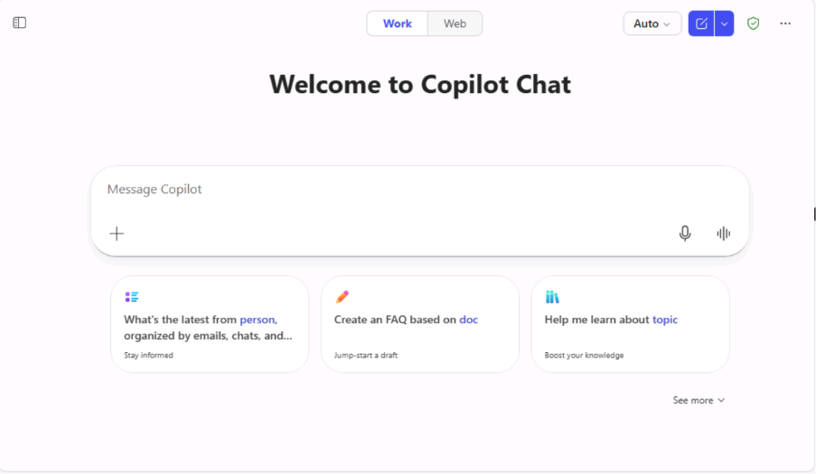

2.  In the **left navigation**, select **All Agents**

3.  Explore **Agent Store**

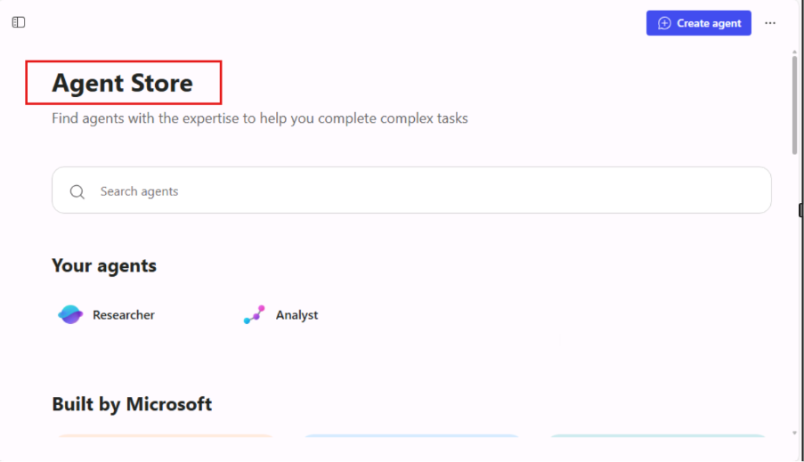

4.  Search for **Workflows (Frontier),** Select **Add**

5.  You should now see **Workflows** (Frontier) under **Agents** in the
    left pane.

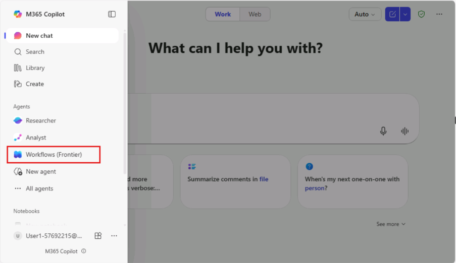

## **Exercise 2: Step-by-Step: Build Your First Workflow**

### Step 1: Open Workflows Agent

1.  Go to **Microsoft 365 Copilot**

2.  In the left navigation, select:  
    **Agents → Workflows Agent (Frontier)**

- You will see a chat interface of **Workflows (Frontier).**

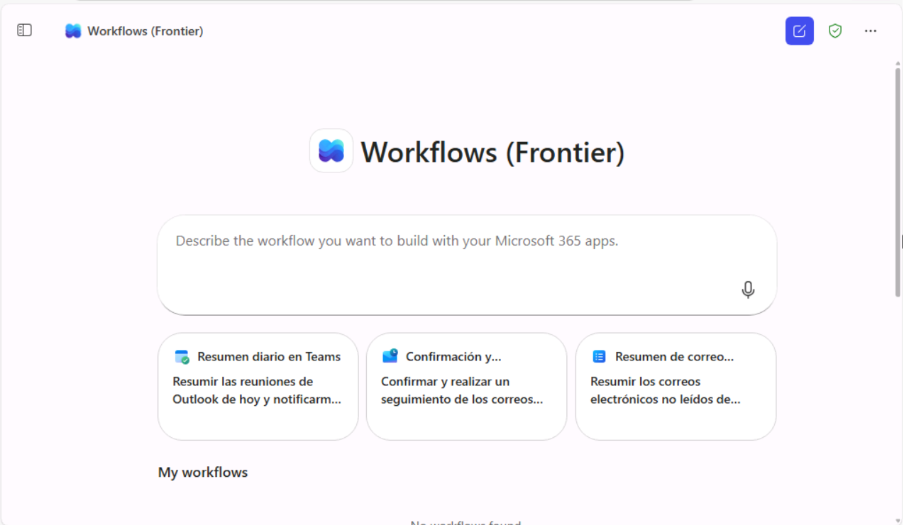

### Step 2: Describe Your Workflow in Natural Language

1.  Copy and paste the following **example prompt in the prompt box of
    Workflows Frontier,** and click **Send**

*“Each weekday morning, review all unread emails from default inbox from
the last 24 hours, and identify anything important I may have missed.
Focus on messages that are high priority, time-sensitive, or require
action. Organize the results into three sections: Needs Response, For
Your Information, and Other Important Emails. For each message, include
the sender, subject, a brief summary, any due dates or deadlines, and
next steps. Send to myself on Teams”*

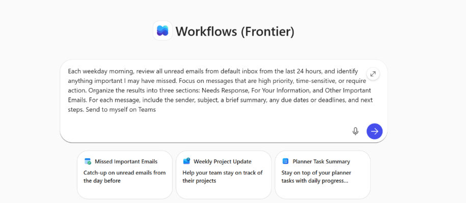

### Step 3: Understand What Copilot Just Did

Behind the scenes, Workflows automatically:

- Creates a **time-based trigger** (weekday mornings)

- Connects to:

  - **Outlook** (read unread emails)

  - **Dataverse AI prompt** (summarization & grouping)

  - **Teams** (send the output)

- Builds the workflow logic for you

You **did not** configure connectors manually—Copilot did it.

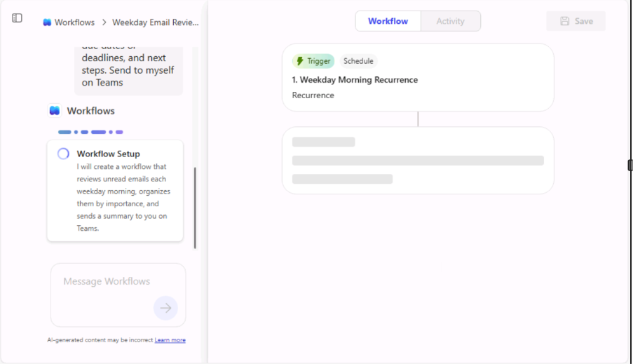

### Step 4: Review the Generated Workflow

1.  After processing your prompt, you’ll see:

- Trigger (Schedule)

- Actions (Read emails → AI summarize → Send Teams message)

- A **visual workflow designer**

2.  Take a moment to:

- Review steps

- Confirm inbox and Teams destination

- Rename the workflow (optional)

### Step 5: Save the Workflow

1.  Select **Save** on the top right corner of **Workflow** window

- Your workflow is now created and ready to test

### Step 6: Test the Workflow 

After saving the workflow, you’ll be prompted to test.

1.  Select **Test** from the top menu.

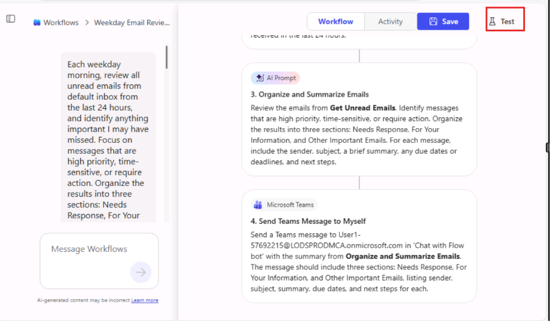

- Observe the test run generated in the Workflow window.

### Step 7: Review Test Results

1.  After the test runs:

2.  Check:

    1.  Emails detected

**Note:** I manually sent an email to my ODL account to verify that the
workflow triggers a notification in Microsoft Teams. If you don’t have
any new unread emails in your inbox, you’ll need to do the same to test
the workflow.

> 

2.  Categorization accuracy

> 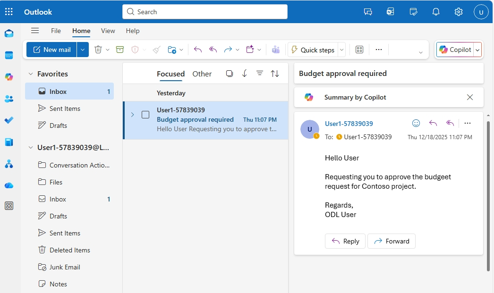

3.  Teams message format:

- Ensure that the Teams message format is matching the Outlook email
  details.

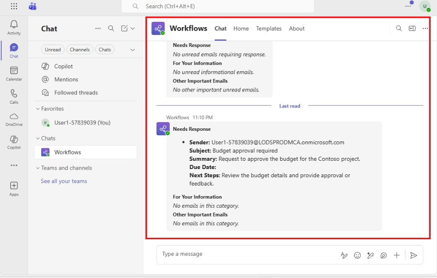

3.  If something looks wrong:

    1.  Update the prompt

    2.  Re-test

**Note**: You can iterate just like chatting—no rebuild required.

4.  Simple **SharePoint Document Review Workflow** for user to explore
    more

**Example prompt:**

*“When a new document is uploaded to the “Project Documents” library in
my SharePoint site, review the document and generate a short summary.
Highlight key points, action items, and any risks or missing
information. Send the summary to me in Microsoft Teams for review.”*

### Step 8: Monitor Workflow Runs

To see how your workflow performs over time:

1.  Go to the **Activity** tab located at the centre of the workflow
    window.

2.  Select the workflow you want to manage. You may choose your most
    recent workflow or any other workflow as required.

3.  View the following details:

&nbsp;

1.  **Trigger Time**  
    The exact date and time when the workflow was initiated.

2.  **Action Status (Success / Failed)**  
    The execution result of each action within the workflow, indicating
    whether the action completed successfully or encountered an error.

3.  **Output Details**  
    The response or data generated by each action, including inputs,
    outputs, and any error messages for troubleshooting.

4.  Click any run to see **step-by-step execution details**.

&nbsp;

1.  **Review the execution status**

    1.  A green banner such as “Your workflow ran successfully”
        indicates the run completed without errors.

    2.  If the run failed, error indicators will be shown instead.

2.  **View trigger details**

    1.  At the top of the run details, expand the Trigger section (for
        example, Get Unread Emails).

    2.  This shows when and how the workflow was triggered.

### Step 9: Manage Your Workflows

From the **Workflows (Frontier) home page**, you can:

1.  **View** all workflows you created under **My workflows** section of
    **Workflows (Frontier)** page.

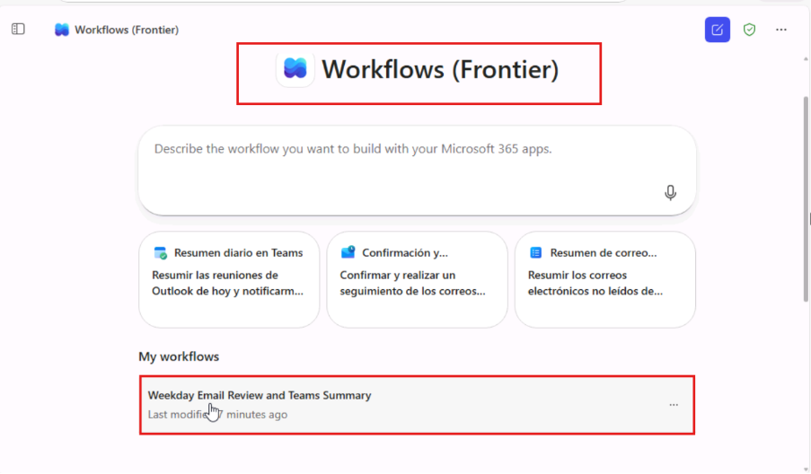

2.  Turn workflows on or off using the **ellipses (...).** Turning off a
    workflow pauses its automation.

&nbsp;

1.  Navigate to the **ellipsis** (three dots) on the right-hand side of
    the selected workflow, then click **Turn off** to pause the
    automation.

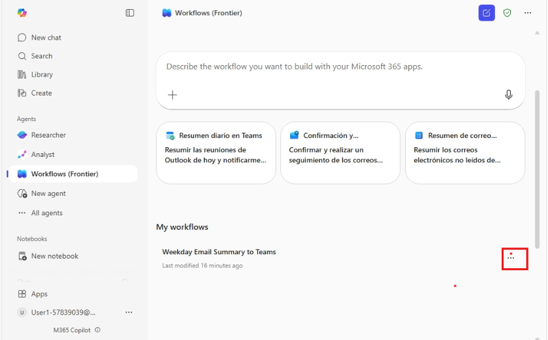

2.  Click on **Delete** to delete workflows permanently.

**Note**: Deleting a workflow removes it entirely and can’t be undone.

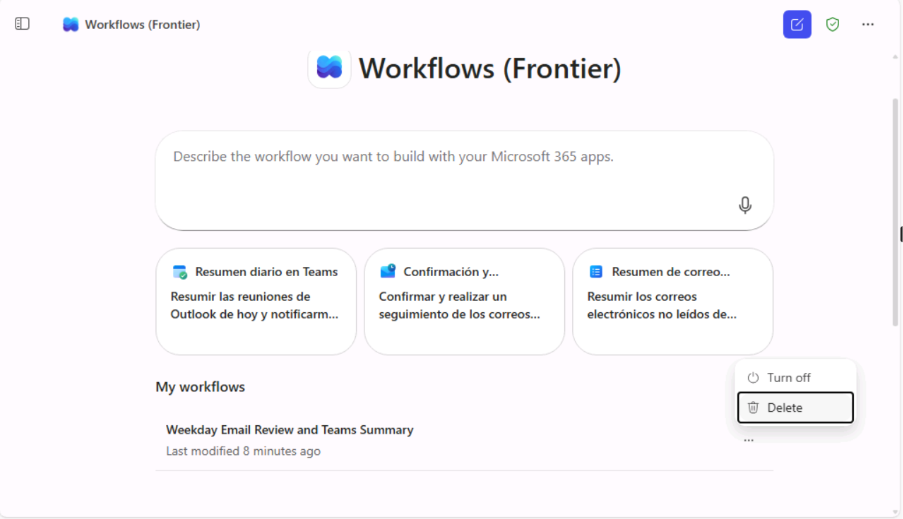

## **What You Learned in This Exercise**

By completing this beginner workflow, you learned how to:

- Use natural language to automate tasks

- Connect Outlook, Teams, and AI summarization automatically

- Test and monitor workflows

- Manage automations without Power Automate knowledge
