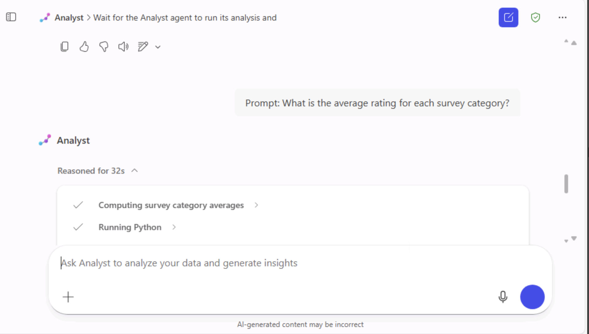
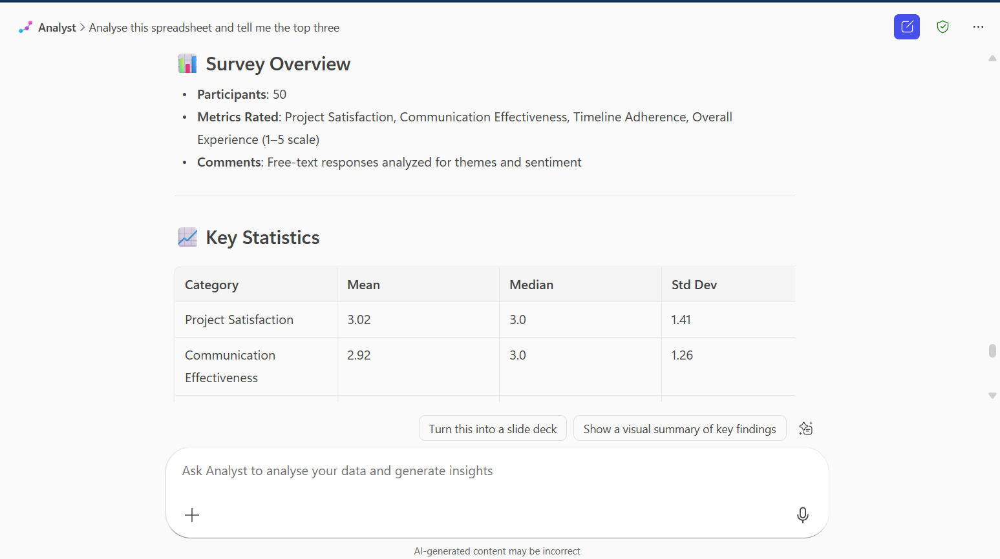

# Lab 1: Enhance data storytelling Using Microsoft 365 Copilot’s Analyst Agent

Duration **: 25 mins**

# Objective

This lab uses Microsoft 365 Copilot’s Analyst agent to analyse the
**Project Nexus Survey Results spreadsheet.** Upload the file to the
Analyst agent, run starter prompts to extract top trends, drill into
averages, and create visuals (charts, heatmaps, etc.).

# Pre-requisites

1.  Access to Microsoft 365 account with Copilot & Agents enabled
    (Analyst agent available).

2.  Browser: Microsoft Edge recommended (module uses Edge in
    instructions).

3.  Project Nexus Survey Results CSV / XLSX (the Learn page links to a
    GitHub download).

## Exercise 1: Set Up and Load the Dataset

1.  **Open a new tab in Microsoft Edge** and navigate to
    <https://M365copilot.com>.  
    **Sign in** using the **username and password** provided under the
    **Resources** tab in the right pane of your lab environment.

2.  In Microsoft 365, open the **Analyst** agent.

3.  If it’s not visible, go to **Expand navigation** icon choose
    **Agents** → select **Analyst Agent**.

4.  Click the prompt field’s **Add content and agents (+)** icon →
    **Upload images and files** → select **Project Nexus survey
    results** lab file from C:\\Lab File.

> **Note**: After the file is uploaded, you’re ready to start exploring
> and interacting with the **Analyst Agent.**

## Exercise 2: Run Starter Prompts

1.  In the prompt field, type: +++**Analyse this spreadsheet and tell me
    the top three trends.+++** and then click on the **Execute** button.
    Wait for the Analyst agent to run its analysis and validate the
    response.

> 
>
> 
>
> **Note**: the page warns of a possible large blank space in the UI —
> scroll up to see results if it appears.
>
> 

2.  In the prompt field enter the following prompt and validate agent
    response and then click on the **Execute** button.

> +++**What is the average rating for each survey category?+++**
>
> 
>
> 

## Exercise 3: Try Extra Prompts (Quantitative, Qualitative, and Visualization)

To explore additional types of analysis prompts beyond the predefined
examples and understand how each category (quantitative, qualitative,
and visualization) can generate different insights from the same
dataset.

### Quantitative analysis prompts: 

Agent seeks to obtain numerical or measurable information from data.

1.  In the prompt field enter the following prompt and validate agent
    response and then click on the **Execute** button.

+++How many participants rated the project satisfaction as 4 or
higher?+++

**Response Summary:**

-   A total of **22 participants** rated the project satisfaction as **4
    (Good)** or **5 (Excellent)** in the Project Nexus survey.

-   The detailed rating breakdown is:

    -   (Poor): 11 responses

    -   (Fair): 7 responses

    -   (Neutral): 10 responses

    -   (Good): 14 responses

    -   (Excellent): 8 responses

-   The calculation: **14 (Good) + 8 (Excellent) = 22 participants**
    expressing positive satisfaction.

2.  In the prompt field enter the following prompt and validate agent
    response and then click on the **Execute** button.

+++Which category received the highest average rating, and which
received the lowest**?+++**

**Response summary:**

-   The **Analyst** analysed data from the file
    **Project\_Nexus\_survey\_results.xlsx** and provided **average
    ratings** across four key categories.

-   📊 Average Ratings Summary

[TABLE]

### Qualitative analysis prompts**:** 

Agent seeks to explore **opinions, experiences, perceptions, or
descriptive insights** from data rather than numerical values.

1.  In the prompt field enter the following prompt and validate agent
    response and then click on the **Execute** button.

+++Summarize the most common themes in the comments section.+++

**Response summary:**

-   The **Analyst** identified key **themes** from participants’
    comments related to project satisfaction.

-   Each theme includes the **number of mentions** and **example
    comments** representing participant feedback.

2.  In the prompt field enter the following prompt and validate agent
    response and then click on the Execute button.

+++Are there any recurring concerns or suggestions mentioned in the
comments**?+++**

**Response summary:**

-   The **Analyst** identified **recurring concerns and suggestions**
    from the Project Nexus survey comments.

### Insight and recommendation prompts

Analyst **interpret data findings**, **draw meaningful conclusions**,
and **suggest actionable next steps** based on the analysis.

1.  In the prompt field enter the following prompt and validate agent
    response and then click on the **Execute** button.

+++Based on the survey data, what are the top three strengths of Project
Nexus?+++

**Response summary:**

-   The **Analyst** identified **key strengths** from the Project Nexus
    survey data and comments.

2.  In the prompt field enter the following prompt and validate agent
    response and then click on the **Execute** button.

+++What are the key areas for improvement suggested by the
participants?+++

Response summary:

-   The **Analyst** highlighted **Communication** as the **primary area
    for improvement** based on participant feedback from the Project
    Nexus survey.

### Quantitative visualization prompts

**Analyst** **present numerical data visually** — using charts, graphs,
or tables — to make quantitative findings easier to interpret and
compare.

1.  In the prompt field enter the following prompt and validate agent
    response and then click on the Execute button.

**+++**Generate a pie chart of overall ratings distribution**.+++**

Response summary:

-   The **Analyst** generated a **pie chart** to visually represent the
    **distribution of Overall Experience ratings** from the Project
    Nexus survey.

2.  In the prompt field enter the following prompt and validate agent
    response and then click on the **Execute** button.

+++Create a bar chart comparing the average ratings for Project
Satisfaction, Communication Effectiveness, Timeline Adherence, and
Overall Experience.+++

**Response summary:**

-   The **Analyst** created a **bar chart** visualizing the **average
    ratings** across four key categories from the Project Nexus survey
    and provided a numerical summary

## Exercise 4: Instruction for Actionable Item for End User

Perform a comprehensive data analysis of the Project Nexus survey
results using different types of analytical prompts. Each prompt type
focuses on extracting specific insights or visualizations from the
dataset.

### Quantitative Analysis Prompts

Use these prompts to analyze **numerical data** and identify measurable
patterns or relationships.

1.  In the prompt field enter the following prompt and validate agent
    response and then click on the **Execute** button.

+++What percentage of participants rated timeline adherence below 3?+++

> This will calculate the proportion of participants who gave low
> ratings for timeline adherence.
>
> 

2.  In the prompt field enter the following prompt and validate agent
    response and then click on the **Execute** button.

+++Can you identify any correlations between communication effectiveness
and overall experience?+++

The Analyst will calculate the correlation coefficient and interpret how
strongly these two categories are related.

> **Expected Outcome:**
>
> A numeric summary showing percentages, averages, or correlation values
> that reveal patterns in participant ratings.

### Qualitative Analysis Prompts

Use these prompts to extract and interpret **textual or descriptive
feedback** from open-ended survey comments.

1.  In the prompt field enter the following prompt and validate agent
    response and then click on the **Execute** button.

+++Identify any comments that mention issues with communication or
timeline.+++

This will filter comments containing specific keywords or related
concerns. Review the extracted comments to identify recurring phrases or
themes.

**Expected Outcome:**  
A categorized list of qualitative insights highlighting feedback
patterns related to communication and project timeline.

### Insight and Recommendation Prompts

Use these prompts to **summarize findings** and **generate actionable
recommendations** based on both quantitative and qualitative data.

1.  In the prompt field enter the following prompt and validate agent
    response and then click on the **Execute** button.

+++Provide a summary report of the survey findings with actionable
recommendations.+++

The Analyst will compile key takeaways, highlight strengths and
weaknesses, and suggest improvement actions.

**Expected Outcome:**  
A summarized report containing strategic insights and recommendations
for improving future project performance.

### Quantitative Visualization Prompts

Use these prompts to create **data visualizations** that make numerical
results more interpretable and presentation-ready.

1.  In the prompt field enter the following prompt and validate agent
    response and then click on the **Execute** button.

+++Plot a histogram of the satisfaction ratings to see the distribution
of ratings.+++

2.  Execute below give prompt as shown in above steps:

    -   +++Generate a scatter plot to analyze the relationship between
        Communication Effectiveness and Overall Experience.+++

    -   +++Create a correlation heatmap for all numeric rating
        categories.+++

    -   +++Make a box plot for each rating category to show the range
        and quartiles.+++

    -   +++Plot a line graph showing timeline adherence ratings over
        participants ordered by Participant ID.+++

> Review each visualization to identify data trends, relationships, and
> outliers.

-   **Expected Outcome:**  
    A series of charts (histogram, scatter plot, heatmap, box plot, and
    line graph) that visually represent survey data, aiding comparison
    and insight extraction.

## Exercise 5: Exporting and Reusing Analyst Agent response

### What you can do with the response

Here's a brief overview of the tasks associated with each icon shown in
your screenshot:

1.  **Clipboard Icon** – Likely used for **copying or pasting** content.

2.  **Thumbs-Up Icon** – Typically indicates **liking or approving** an
    item or action.

3.  **Thumbs-Down Icon** – Generally used to **dislike or disapprove**
    something.

4.  **Speaker Icon** – Represents **audio settings or volume control**.

5.  **Pencil Icon** – Commonly used for **editing or writing** tasks.

6.  **Clock with Arrow Icon** – Tooltip says **"Add to recent page"**,
    which means it adds the current item to your **recently accessed
    pages** for quick reference.

### Copy Button

-   **Purpose:** Allows the user to **copy** the chart’s **summary text,
    explanation, or data** directly from the Analyst’s response.

-   **Usage:**

When clicked, it copies the **text portion** of the Analyst’s response
(not the chart image) to the clipboard.

This is useful if you want to **paste the data or summary** into a
report, document, or presentation.

-   **Example Use Case:**  
    You might copy “22 participants rated the project satisfaction as 4
    or higher” to include in your project summary file.

> 
>
> 

### Download Button

-   **Purpose:** Lets the user **download the visualization** (like the
    **pie chart**) as an **image file (e.g., PNG)**.

-   **Usage:**

Clicking this saves the **chart image** to your local system.

You can then insert it into **PowerPoint slides, Word documents, or
reports** for visual representation.

-   **Example Use Case:**  
    You can download the **“Distribution of Overall Experience
    Ratings”** pie chart to include in your survey analysis
    presentation.  
      
    

### Troubleshooting and validation tips

-   If the agent UI shows a big blank space: scroll up/down; the content
    is usually present (module notes this as a known issue).

-   If numeric columns are treated as text: open the spreadsheet, ensure
    rating columns are numeric and re-upload.

-   If charts do not appear, ask the agent explicitly: Please generate a
    bar chart comparing average ratings for \[list categories\].

## Conclusion:

In this lab, participants explored how Microsoft 365 Copilot’s **Analyst
Agent** enhances data storytelling by transforming raw survey data into
actionable insights and compelling visualizations. By analyzing the
*Project Nexus Survey Results*, users learned to apply **quantitative,
qualitative, and visualization prompts** to uncover trends, calculate
averages, identify key themes, and highlight strengths and improvement
areas. The lab demonstrated how the Analyst Agent can interpret data,
generate charts such as pie, bar, and heat maps, and summarize findings
into meaningful recommendations. Finally, participants practiced
exporting and reusing analytical outputs, reinforcing how Copilot can
streamline data analysis, reporting, and presentation tasks — making
business insights faster, clearer, and more accessible.
