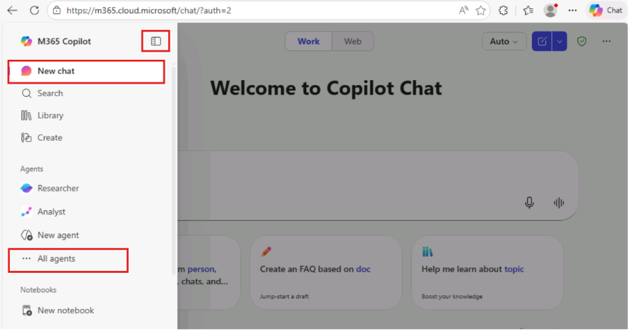
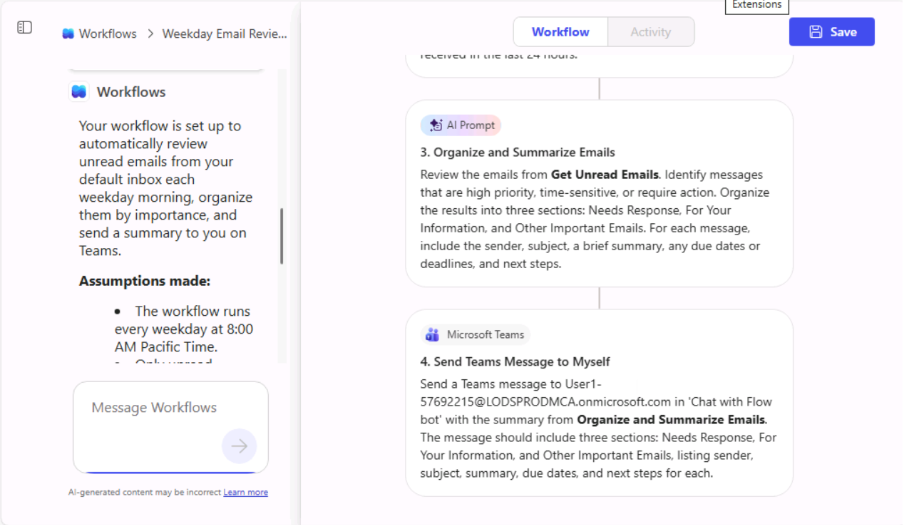
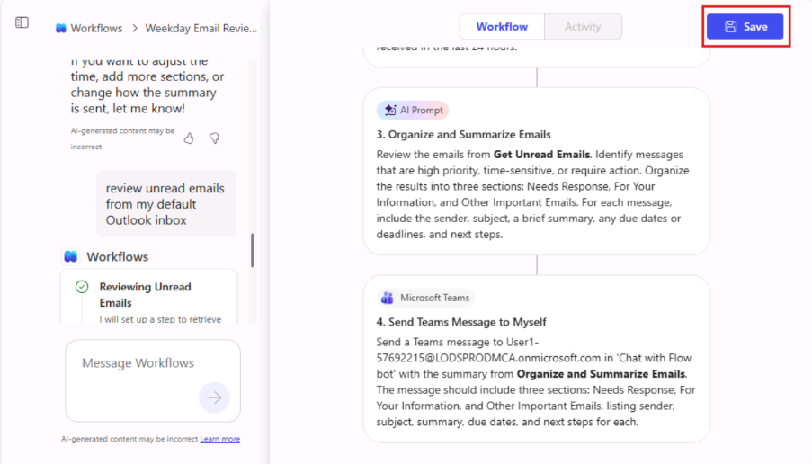
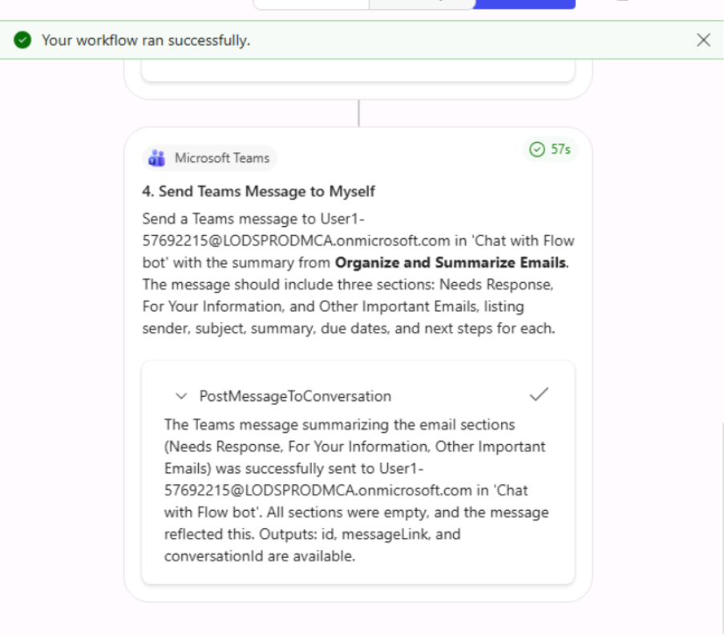
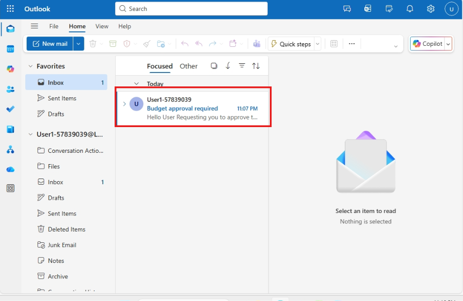
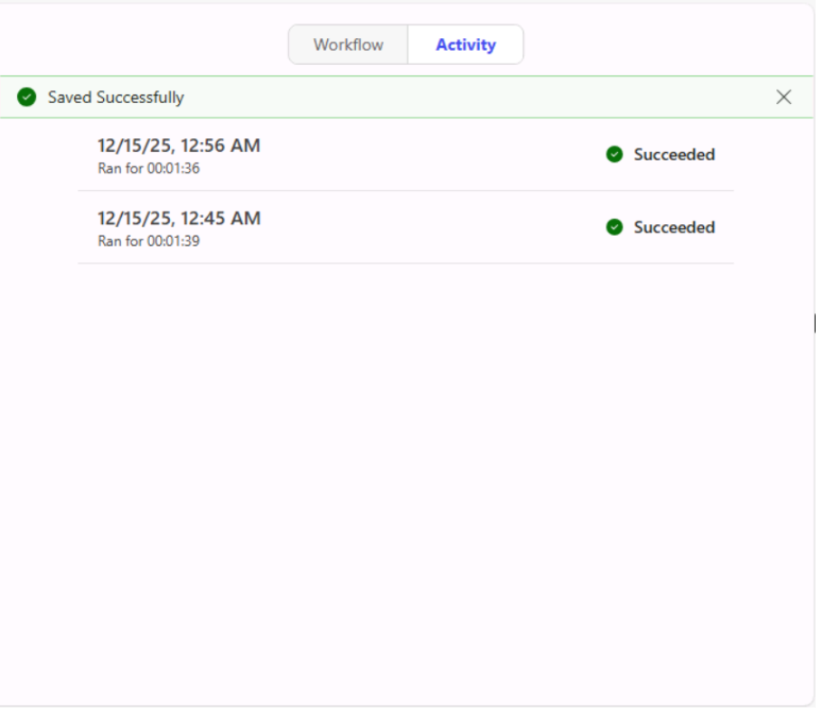
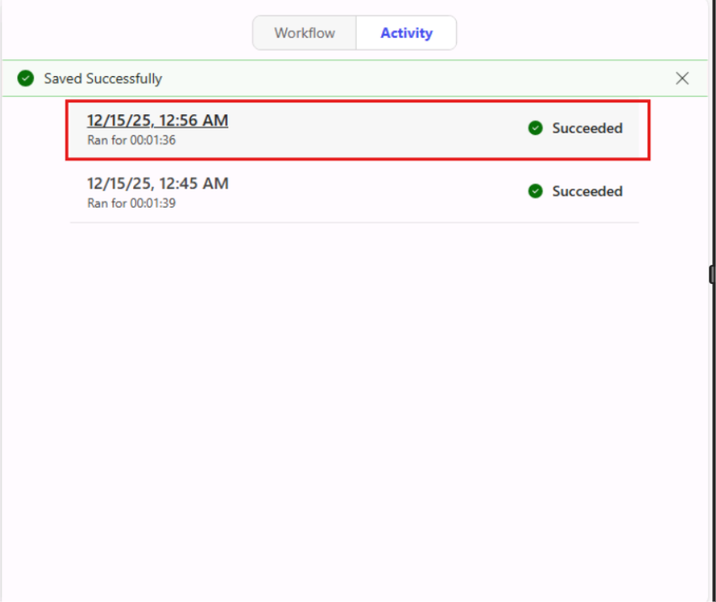
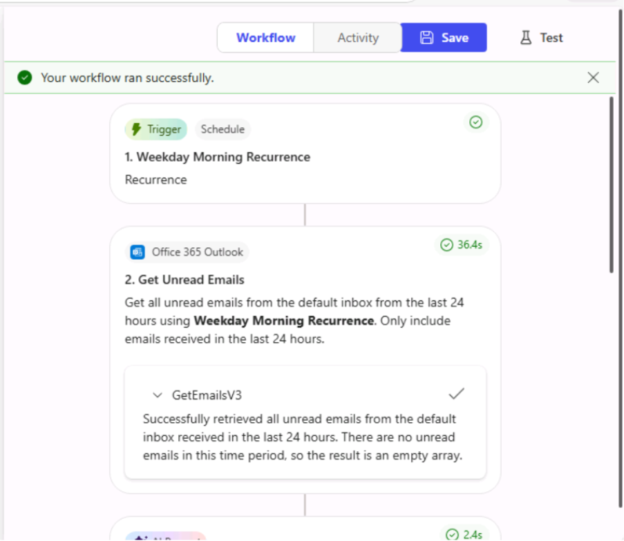
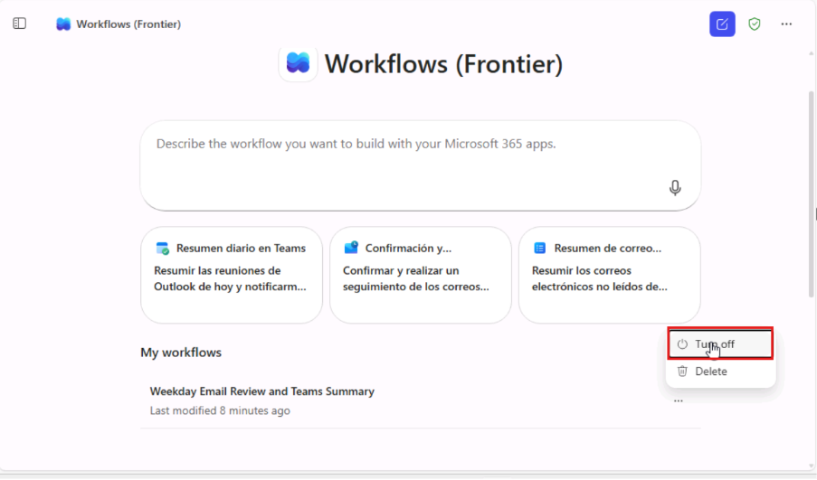

# **Introducción a Workflows en Microsoft 365 Copilot**

## **¿Qué es Workflows Agent?**

Workflows es un agente en Microsoft 365 Copilot que le ayuda a
automatizar el trabajo en Microsoft 365 mediante lenguaje natural. En
lugar de configurar manualmente pasos o conectores, simplemente describa
lo que desea, y Workflows genera un flujo de trabajo funcional
utilizando servicios compatibles de Microsoft 365. 

## **Lo que creará en este ejercicio**

Creará un flujo de trabajo que:  
• Se **ejecuta cada mañana entre semana**  
• Revisa los correos **electrónicos no leídos de las últimas 24
horas**  
• Identifica **correos importantes** o que requieren acción  
• Los **organiza en secciones claras**  
• Le envía un **resumen en Microsoft Teams**

## **Requisitos previos (Importante – verificar antes de comenzar)**

### **Licencias y acceso**

Asegúrese de que:

• Tiene una licencia de Microsoft 365 Copilot
• Forma parte del programa Frontier
• Workflows Agent (Frontier) está disponible en su tenant

**Nota:** Workflows actualmente **solo está disponible en inglés.**

### **Requisitos de DLP y conectores (configuración de administrador)**

La política de DLP de su organización debe permitir:

- **Acciones de IA (conector de Power Platform)**

- **Dataverse (prompt de IA)**

- **Conectores de Microsoft 365:  
  o Outlook  
  o Teams  
  o SharePoint  
  o Planner  
  o Approvals**

Estos son necesarios para que Workflows pueda leer correos electrónicos,
publicar en Teams y resumir contenido.

## Ejercicio 1: Agregar Workflows Agent a Copilot

1.  Inicie sesión en **Microsoft 365 Copilot**  
    a. **Inicie sesión con su cuenta de Microsoft 365 Copilot**

    

2.  Haga clic en **Yes** para mantener la sesión iniciada.

    

3.  Después de iniciar sesión correctamente, verá la página principal de
    **Copilot Chat**.

    

4.  En la navegación izquierda, seleccione **All Agents.**

    

5.  Explore **Agent Store**

    

6.  Busque **Workflows (Frontier)** y seleccione **Add.**

    

    

7.  Ahora debería ver Workflows (Frontier) en **Agents** en el panel
    izquierdo..

    

## **Ejercicio 2: Paso a paso: crear su primer flujo de trabajo**

### Paso 1: Abrir Workflows Agent

1.  Vaya a **Microsoft 365 Copilot.**

2.  En la navegación izquierda, seleccione:  
    **Agents → Workflows Agent (Frontier)**

    

    - Verá una interfaz de chat de **Workflows (Frontier).**

    

### Paso 2: Describir su flujo de trabajo en lenguaje natural

1.  Copie y pegue el siguiente prompt de **ejemplo en el cuadro de
    prompt de Workflows Frontier** y haga clic en **Send.**

    *“Each weekday morning, review all unread emails from default inbox from
    the last 24 hours, and identify anything important I may have missed.
    Focus on messages that are high priority, time-sensitive, or require
    action. Organize the results into three sections: Needs Response, For
    Your Information, and Other Important Emails. For each message, include
    the sender, subject, a brief summary, any due dates or deadlines, and
    next steps. Send to myself on Teams”*

    

### Paso 3: Comprender lo que Copilot acaba de hacer

Crea un desencadenador basado en tiempo (mañanas entre semana)  
• Se conecta a:  
o Outlook (leer correos no leídos)  
o Dataverse AI prompt (resumen y agrupación)  
o Teams (enviar el resultado)  
• Construye la lógica del flujo de trabajo por usted  
No configuró los conectores manualmente—Copilot lo hizo.

### Paso 4: Revisar el flujo de trabajo generado

1.  Después de procesar su prompt, verá:

    - Trigger (Schedule)

    - Actions (Read emails → AI summarize → Send Teams message)

    - Un diseñador **visual del flujo de trabajo**

    

2.  Tómese un momento para:

    - Revisar los pasos

    - Confirmar la bandeja de entrada y el destino en Teams

    - Renombrar el flujo de trabajo (opcional)

### Paso 5: Guardar el flujo de trabajo

1.  Seleccione **Save** en la esquina superior derecha de la ventana de
    **Workflow.**

    - Su flujo de trabajo ahora está creado y listo para probar

    

### Paso 6: Probar el flujo de trabajo 

Después de guardar el flujo de trabajo, se le pedirá que realice una
prueba.

1.  Seleccione **Test** en el menú superior.

    

    - Observe la ejecución de prueba generada en la ventana de Workflow.

    

### Paso 7: Revisar los resultados de la prueba

1.  Después de que se ejecute la prueba:

    

2.  Verifique:

    1.  Correos detectados

    **Nota:** Envié manualmente un correo electrónico a mi cuenta ODL para
    verificar que el flujo de trabajo activa una notificación en Microsoft
    Teams. Si no tiene correos no leídos nuevos en su bandeja de entrada,
    deberá hacer lo mismo para probar el flujo de trabajo.

    

3.  Precisión de la categorización.

    

4.  Formato del mensaje en Teams:

    - Asegúrese de que el formato del mensaje en Teams coincida con los
    detalles del correo electrónico de Outlook.

    

5.  Si algo no parece correcto:

    1.  Actualice el prompt

    2.  Vuelva a probar

    **Nota:** Puede iterar igual que en un chat—no es necesario reconstruir.

6.  Flujo de trabajo simple de revisión de documentos en SharePoint para
    que el usuario explore más

**Prompt de ejemplo:**

*“When a new document is uploaded to the “Project Documents” library in
my SharePoint site, review the document and generate a short summary.
Highlight key points, action items, and any risks or missing
information. Send the summary to me in Microsoft Teams for review.”*

### Paso 8: Supervisar las ejecuciones del flujo de trabajo

Para ver cómo funciona su flujo de trabajo a lo largo del tiempo:

1.  Vaya a la pestaña **Activity** ubicada en el centro de la ventana de
    Workflow.

    

2.  Seleccione el flujo de trabajo que desea administrar. Puede elegir
    su flujo de trabajo más reciente o cualquier otro flujo según sea
    necesario.

    

3.  Visualice los siguientes detalles:

    1.  **Trigger Time**  
        La fecha y hora exactas en que se inició el flujo de trabajo.

    2.  **Action Status (Success / Failed)**  
        El resultado de ejecución de cada acción dentro del flujo de
        trabajo, indicando si la acción se completó correctamente o encontró
        un error.

    3.  **Output Details**  
        La respuesta o los datos generados por cada acción, incluidos
        inputs, outputs y cualquier mensaje de error para la solución de
        problemas.

    

4.  Haga clic en **cualquier ejecución para ver los detalles paso a
    paso**.

    1.  **Revisar el estado de ejecución**

        1.  Un banner verde como “Your workflow ran successfully” indica que
            la ejecución se completó sin errores.

        2.  Si la ejecución falló, se mostrarán indicadores de error.

    2.  **Ver detalles del desencadenador**

        1.  En la parte superior de los detalles de ejecución, expanda la
            sección Trigger (por ejemplo, Get Unread Emails).

        2.  Esto muestra cuándo y cómo se activó el flujo de trabajo.

### Paso 9: Administrar sus flujos de trabajo

Desde la página principal de Workflows (Frontier), puede:

1.  **Ver todos** los flujos de trabajo que creó en la sección **My
    workflows de la** página de **Workflows (Frontier)**.

    

2.  Activar o desactivar flujos de trabajo utilizando los puntos
    **suspensivos (...)**. Desactivar un flujo de trabajo pausa su
    automatización.

    1.  Navegue al menú de puntos suspensivos (**tres puntos**) en el lado
        derecho del flujo de trabajo seleccionado, luego haga clic en **Turn
        off para pausar la automatización.**

        
        
        

    2.  Haga clic en **Delete** para eliminar los flujos de trabajo de forma
        permanente.

        **Nota:** Eliminar un flujo de trabajo lo elimina por completo y no se
        puede deshacer.

        

## **Lo que aprendió en este ejercicio**

Al completar este flujo de trabajo inicial, aprendió a:

- Usar lenguaje natural para automatizar tareas.

- Conectar Outlook, Teams y el resumen con IA automáticamente.

- Probar y supervisar flujos de trabajo.

- Administrar automatizaciones sin conocimientos de Power Automate
