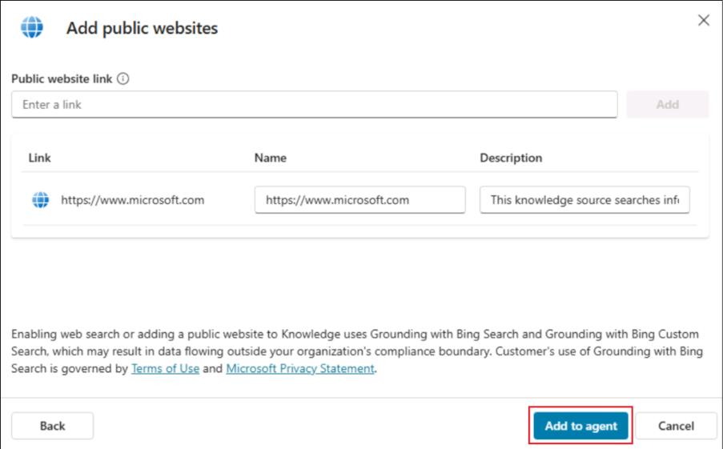
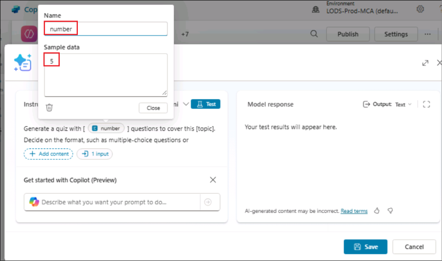

# Laboratorio 9 – Implementar una acción de prompt para un tema de agente de generación de cuestionarios

**Objetivo:**

Los prompt Actions son una de las formas de ampliar Microsoft Copilot.
Permiten crear acciones en lenguaje natural específicas para negocios.
Estas acciones son interpretadas por el modelo GPT para ejecutar la
acción necesaria según las instrucciones proporcionadas.

Estas acciones se encapsulan dentro de un AI plugin definition, que
Copilots puede invocar en tiempo de ejecución cuando se detecta un
intento o enunciado coincidente.

En este laboratorio, aprenderá a crear una Prompt Action para un tema de
generación de cuestionarios, la cual generará preguntas de un quiz
basadas en un tema proporcionado.

**Duración estimada:** 40 minutos

## Ejercicio 1: Crear un agente utilizando lenguaje natural

1.  Haga clic en **Home** para ir a la página principal de Copilot
    Studio. Si no se encuentra en la página de Copilot Studio, inicie
    sesión en+++https://copilotstudio.microsoft.com+++.

2.  En la página principal, en el área de texto bajo **Describe your
    agent to create it**, ingrese: +++I want you to be a question and
    answering assistant that can answer common questions from users
    using the content of a website+++ y haga clic en **Send**.

5.  Seleccione la pestaña **Describe**.

> 

6.  El sistema podría sugerir un nombre para el agente. Acepte la
    sugerencia o proporcione un nombre propio.

7.  Ingrese otros detalles sobre las funciones del agente, por ejemplo:

> +++help answer common product and support questions using the content
> of a website, and help answer HR questions from an uploaded file+++

9.  Proporcione
    +++[www.microsoft.com+++](http://www.microsoft.com+++/) como la
    página web que se usará como fuente de conocimiento.

10. Una vez ingresadas las instrucciones, haga clic en **Create** para
    crear el agente.

> **Nota:** La configuración del agente puede tardar unos minutos.
> Cuando finalice, haga clic en **Skip** para continuar. 

11. Una vez creado el agente, desplácese por la página para verificar
    que se haya creado con las instrucciones proporcionadas.

> 
>
> 

12. En el panel de **Test**, ingrese: +++What is Copilot Studio?+++ y
    presione **Enter**.

> 
>
> 

13. Ingrese +++What is the latest xbox model?+++

Para ambos pasos, el agente proporcionará una respuesta genérica, ya que
utilizará su conocimiento general.

## Ejercicio 2: Crear un Prompt Action para un tema de respuestas generativas

Las acciones permiten ampliar las capacidades de los agentes. En Copilot
Studio puede agregar varios tipos de acciones a sus agentes:

- **Prebuilt connector action:** utiliza conectores de Power Platform
  para acceder a datos de otros sistemas, como Salesforce, Zendesk,
  MailChimp o GitHub.

- **Custom connector action:** permite construir un conector para
  acceder a APIs públicas o privadas.

- **Power Automate cloud flow:** ejecuta flujos en la nube para realizar
  acciones y procesar datos.

- **AI Builder prompts:** emplea AI Builder y comprensión del lenguaje
  natural para escenarios específicos de negocio.

- **Bot Framework skill:** utiliza un manifiesto de skill que describe
  las acciones, entradas y salidas, endpoints y modelos de despacho.

En este ejercicio, aprenderá a agregar un **prompt** a un nodo de
**Topic.**

1.  En su agente, seleccione la pestaña **Topics**, haga clic en **+ Add
    a topic** y seleccione **From blank**.

2.  Ingrese el nombre del tema como: +++Generate questions for a
    quiz+++. En **Description**, agregue los siguientes detalles:

+++create a number of questions for a quiz based on a topic and format
the quiz based on the instruction provided+++

+++creates a quiz with a number of questions based on the topic provided
and formats the quiz+++

+++generate a quiz with a number of questions using the topic provide
and format the questions+++

+++creates questions for a quiz on a specific topic and format+++

+++format a quiz by a number of questions based on the topic provided+++

Seleccione **Save** en la esquina superior derecha para guardar el tema.

3.  Haga clic en el **+** debajo del nodo Trigger, seleccione **Add a
    tool** y luego **New prompt.**

4.  Aparecerá el cuadro de diálogo **Prompt**, y es posible que se
    muestre un flyout que le guiará sobre cómo crear su prompt.
    Seleccione **Next** para avanzar por la guía.

5.  Crearemos un prompt que generará preguntas para un cuestionario.
    Ingrese el nombre del prompt como +++Quiz Generator+++.

> 

6.  Pegue el siguiente contenido en la sección **Instructions**:

+++Generate a quiz with \[number\] questions to cover this \[topic\].
Decide on the format, such as multiple-choice questions or true/false
statements. Use this \[format\]. Designate the correct answer within
parentheses.+++

Seleccione \[**number**\], expanda **+ Add context** y seleccione
**Text**.

7.  Ingrese el nombre como +++number+++ e introduzca datos de ejemplo,
    por ejemplo +++5+++. Seleccione **Close.**

8.  Seleccione \[**topic**\], expanda **+ Add context** y seleccione
    **Text.** Ingrese el nombre como +++topic+++ e introduzca datos de
    ejemplo, por ejemplo +++Science+++.

9.  Seleccione \[**format**\], expanda **+ Add context** y seleccione
    **Text**. Ingrese el nombre como +++format+++ e introduzca datos de
    ejemplo, por ejemplo +++bullet points+++. Seleccione **Save** en la
    ventana de Prompt.

10. El nodo de acción del prompt aparecerá ahora en el lienzo de
    creación del tema. A continuación, se deben definir los valores de
    los parámetros de entrada para que el agente pueda completarlos.
    Seleccione el ícono …

11. Seleccione la pestaña **System** y elija **Acivity.Text** como valor
    de entrada para que la acción use la respuesta completa del usuario
    e identifique el valor de **format.**

12. Repita lo mismo para los demás parámetros de entrada de la acción
    del prompt.

13. A continuación, se debe definir la variable de salida de la acción
    del prompt, de modo que la respuesta pueda ser referenciada
    posteriormente en el tema. Seleccione el ícono \>, vaya a la pestaña
    **Custom**, seleccione **Create new** y nombre la variable como
    +++**VarQuizQuestionsResponse**+++.

14. Debajo de la acción del prompt, seleccione el ícono **+** para
    agregar un nuevo nodo y seleccione **Send a message**. Luego,
    seleccione el ícono de variable **{x}.**

> 

15. Seleccione la variable **VarQuizQuestionsResponse.text**. Esto
    añadirá la propiedad de texto de la respuesta de la acción del
    prompt al nodo **Send a message**. Seleccione **Save** para guardar
    el tema.

16. A continuación, se deben actualizar los detalles del tema, que serán
    utilizados por el agente para asociar el tema con la intención del
    usuario cuando el modo **Generative** esté habilitado.  
    Seleccione **Details** e ingrese lo siguiente:

    - **Display name** - +++generate questions for a quiz+++

    - **Description** - +++This topic creates questions for a quiz based
      on the number of questions, the topic and format provided by the
      user+++

Seleccione **Save** para guardar el tema.

17. Ahora estamos listos para probar el agente. En el panel de **test**,
    ingrese la siguiente pregunta y observe la salida:

+++Create 5 questions for a quiz based on geography and format the quiz
as multi choice+++

**Resumen**

En este laboratorio, hemos aprendido a crear una acción de prompt para
un tema mediante la creación de un prompt personalizado y a probar su
funcionamiento.
