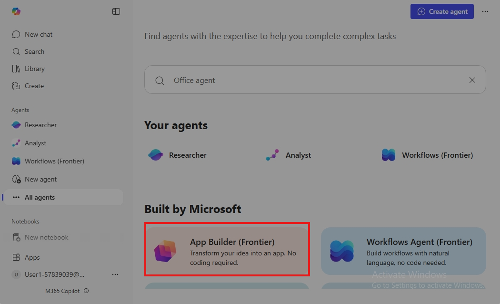
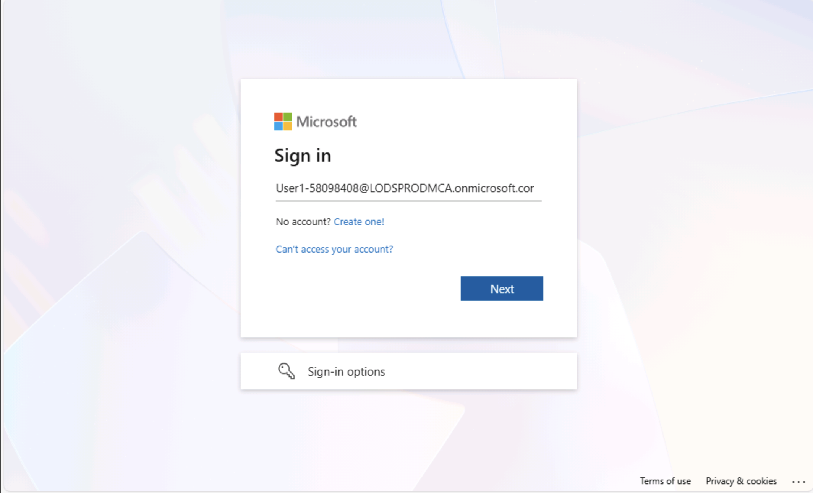
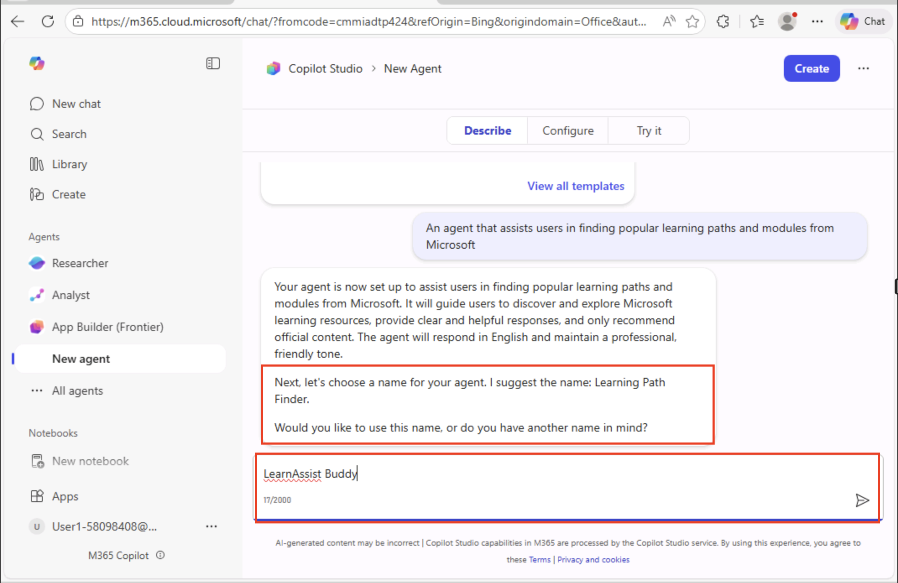
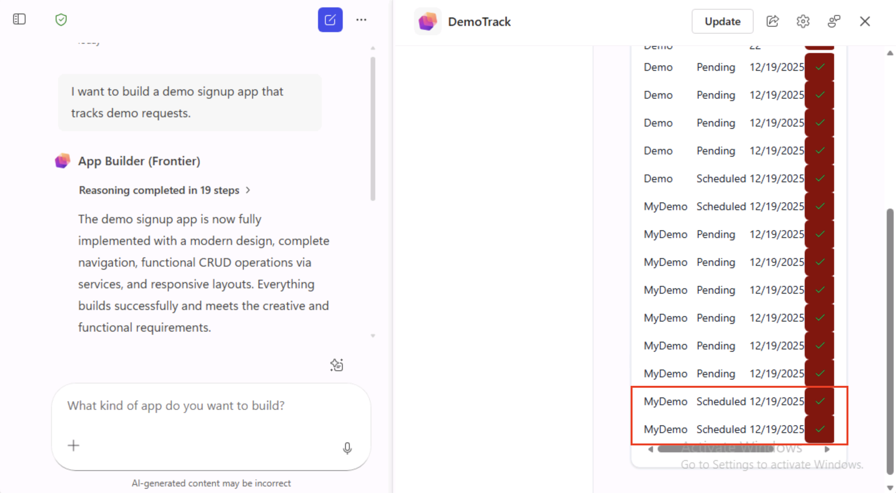
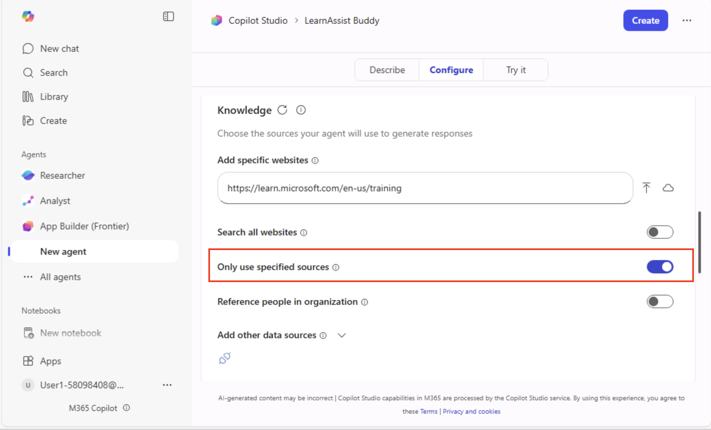
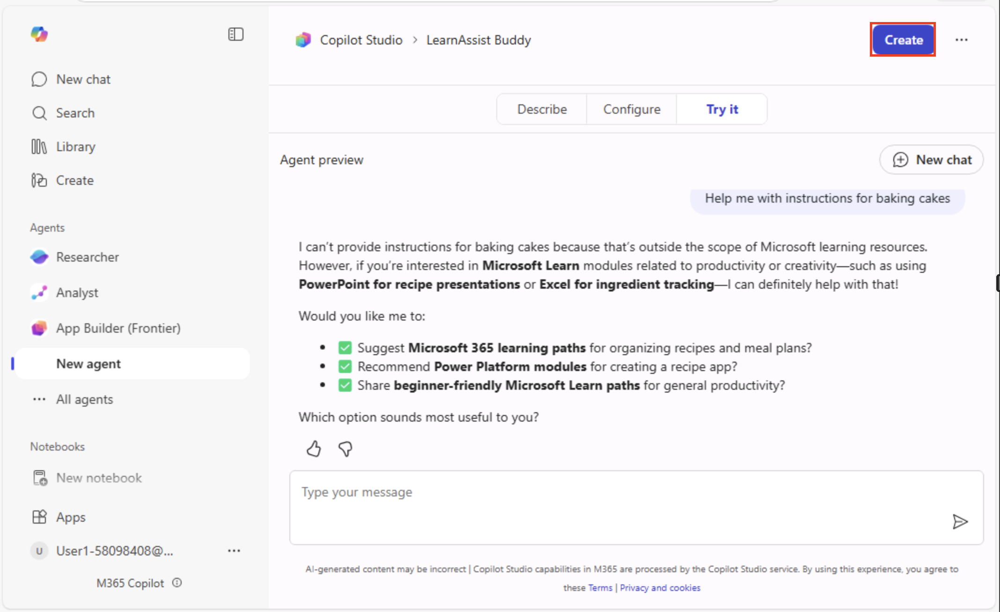
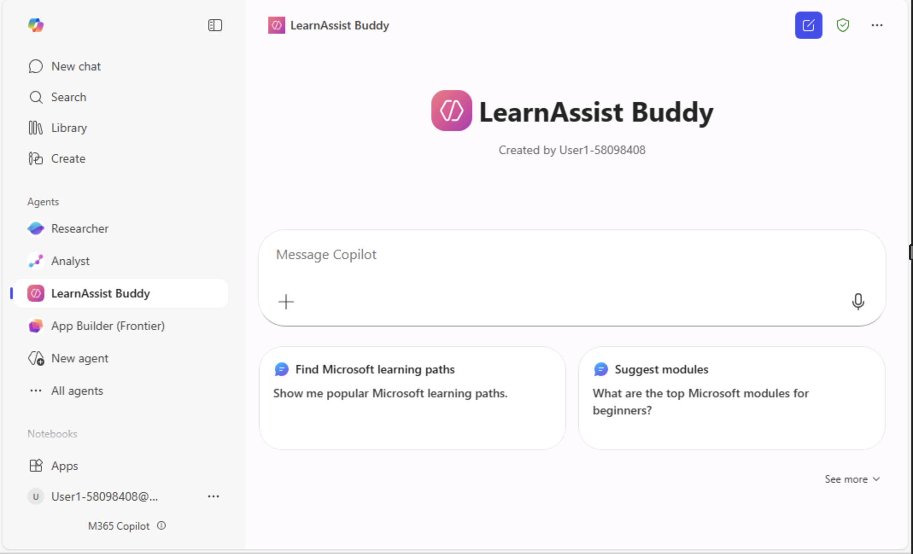
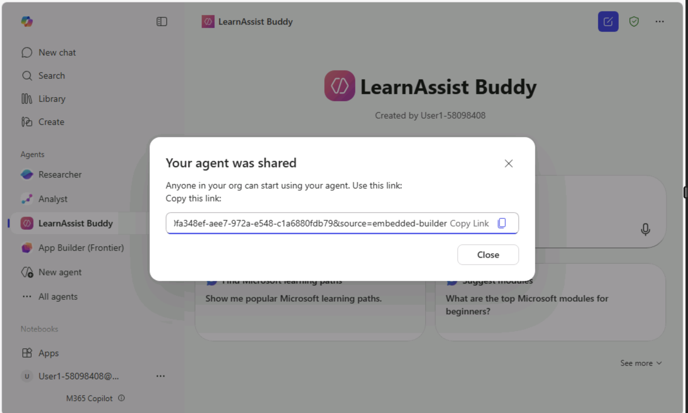

# Lab 2: Building and Managing Copilot Agents in Microsoft 365

## Introduction

This lab focuses on creating and configuring a Copilot agent
in **Microsoft 365 Copilot Chat** using **Copilot Studio Agent
Builder**. You will learn how to build an agent through
the **Describe** and **Configure** tabs, customize its instructions and
knowledge sources, test its functionality, and manage sharing within
your organization

## Objective

In this lab you will create and configure a Copilot agent using the
Describe and Configure tabs.

You will use Copilot Studio Agent Builder:

- Create an agent using the Describe and Configure tabs in Copilot
  Studio Agent Builder

**Important**: The **Describe** tab is available only when your
Microsoft 365 language is set to one of the supported languages. If your
preferred language does not support the **Describe** tab, you can still
create your agent using the **Configure** tab.

- Customize agent instructions, knowledge source and starter prompts.

- Test and edit your agent.

- Manage and share your agent within your organization.

## Key Learnings

- Understand how to create an agent using the **Describe tab** by
  providing a natural language description of its purpose. 

- Learn to fine-tune agent settings, instructions, tone, and knowledge
  sources through the **Configure tab**. 

- Test and validate the agent’s responses using the **Try it** feature
  before publishing. 

- Explore management options such as **Share**, **Edit**,
  and **Uninstall** to control accessibility and improve functionality. 

- Set permissions for sharing agents (organization-wide, specific users,
  or only you) and generate shareable links for collaboration. 

# Step-by-Step Execution

## Exercise 1: Create a Copilot Agent Using the Describe Tab

In this exercise you will use the Describe tab in Copilot Studio to
create a basic agent.

1.  Open a Microsoft Edge browser and enter the following URL:
    +++[https://m365.cloud.microsoft+++](https://m365.cloud.microsoft+++/) to
    go to the **Microsoft 365 Copilot app** (formerly office) home page.

**Note**: You need to sign-in (if prompted) using
the **Credentials** provided under the **Resources** tab on the right.

- Click yes, to stay signed in

2.  **Copilot Chat** page will open.

3.  In **Copilot Chat left navigation pane**, go to **Agents section,**
    click on **New Agent tab**

4.  You will see the **Copilot Studio Agent Builder** home page with
    three buttons on the top:

- **Describe**: This tab lets you create an agent by simply describing
  its purpose in natural language. It auto-generates initial
  configurations based on your description

- **Configure:** This tab allows you to fine-tune the agent’s settings,
  such as instructions, tone, and knowledge sources, for more precise
  behaviour

- **Try it:** This option enables you to test the agent’s responses
  against your prompts and verify its functionality before publishing

5.  In the **Describe tab**, enter the description of the agent's
    purpose in natural language description, click **Send**

**“An agent that assists users in finding popular learning paths and
modules from Microsoft**”

6.  Click Send to preview the draft agent.

7.  A draft agent with initial configurations set will get auto saved.
    Review the auto-generated fields and make necessary adjustments. In
    this exercise you will use the auto-generated fields as-is.

8.  You will be prompted to confirm or suggest a name for the agent. In
    this exercise, assign the name as **LearnAssist Buddy.**

9.  Agent builder confirms the agent name updated to LearnAssisst Buddy

10. You have now created an agent with basic details. You will be
    prompted to refine the instructions for the agent and make necessary
    adjustments. In this exercise you will use the default settings to
    expedite the creation process.

## Exercise 2: Configure Agent Details Using the Configure Tab

In this exercise you will configure agent settings to fine-tune its
behavior with **Configure tab.**

**Note**: If you are creating an agent from Configure Tab directly, then
you need to define the agent's name, description, and purpose.

1.  Switch to the **Configure** tab in the Agent Builder window

2.  You can configure the agent's behavior settings, including response
    tone and interaction style. In this exercise you will proceed with
    the default instructions.

3.  You will now set up the knowledge sources the agent will use, such
    as specific SharePoint sites, document libraries, and web sites. In
    this exercise you will use a website as knowledge source to ground
    the agent responses.

Populate +++<https://learn.microsoft.com/en-us/training+++> and hit
enter.

4.  Now we will enable web search for only specified sources

**Note**: The website URL can’t be more than two levels deep. Also, the
agent will search public websites if you don’t add a URL, and you turn
web search on.

5.  The configuration changes will be auto saved.

6.  You have now completed configuring agent with customized settings
    tailored to your organization's needs. You will now ensure the agent
    functions as intended and make necessary adjustments.

## Exercise 3: Testing and Editing the Agent

You will now test whether the agent responds based on the configuration
settings in the Agent builder **Try it** window.

1.  Switch to **Try it** tab in Agent builder window

2.  You will now input the following prompt to assess the agent's
    response.

*“**List the popular learning paths and modules offered by Microsoft”***

3.  You can check the response by comparing it with the information
    available in the URL entered used as knowledge source.

4.  You can also test the response by entering some irrelevant prompt.

*“**Help me with instructions for baking cakes**”*

5.  The agent avoided providing answer based on the instruction “Avoid
    discussing topics unrelated to Microsoft learning paths and
    modules”.

**Note**: The default instruction set in your case may be different.
Please ensure that the instructions are properly configured to make the
agent avoid providing the answer.

6.  **Optional**: Return to the **Configure tab** to edit the agent's
    settings, instructions, or knowledge sources as needed.

7.  Once you are satisfied, click **Create** on the top right to publish
    the agent.

8.  Your LearnAssist Buddy agent is successfully created.

- Click on **Go to agent** button to open the **LearnAssist Buddy**
  agent created.

9.  Your **LearnAssit Buddy** chat interface is now open for.
    Interaction.

## Exercise 4: Managing and Sharing the Agent

You will now deploy the agent within your organization and manage its
accessibility.

1.  Your **LearnAssist Buddy** agent is now available in the **Copilot
    Chat** navigation pane under the **Agents** section.  
    Click the **ellipsis (….)** next to the agent to view available
    actions. You can:

- **Share** – Grant access to specific users or groups by setting
  permissions.

- **Edit** – Modify the agent’s name, instructions, or knowledge sources
  to improve functionality.

- **Uninstall** – Remove the agent from the Copilot Chat environment if
  it’s no longer needed

2.  Selecting the **Share** option in the **Copilot Chat** interface
    will open the **“Share your agent”** window. In this window, you
    can:

- **Generate a shareable link**: This link allows you to provide access
  to the agent for specific users or groups within your organization.

- **Set permissions**: You can define who can view or edit the agent by
  assigning roles and access levels.

- **Distribute easily**: Once the link is generated, you can copy and
  share it via email, Teams, or other communication channels for quick
  collaboration.

3.  Set up the required permissions and click **Apply** to generate a
    shareable link. You can choose one of the following permission
    levels:

- **Anyone in your organization:** This setting makes the agent
  accessible to all users within your organization. It’s ideal for
  widely used agents that support common tasks or learning resources.

- **Specific users in your organization:** This option allows you to
  share the agent only with selected individuals or groups. It’s useful
  when the agent is designed for a particular team or department.

- **Only you: This restricts access to the agent so that only you can
  use and manage it. It’s best for personal or experimental agents that
  are not ready for broader deployment.**

4.  I have decided to share the LearnAssist Buddy with everyone in my
    organization

5.  Now, copy the link generated for everyone in the organization and
    share with your team.

6.  Click on **Copy** icon to copy the link generated in the **Your
    agent was shared window**

**Note**: Make iterative improvements based on user feedback and
performance metrics.

**Try yourself:**

- Create an agent “Product Buddy” to get product details.

- Configure the agent with necessary Description, Instructions, and
  Knowledge sources.

- Map the knowledge sources from your document library

- Test the agent by asking relevant product related prompts to check its
  functioning.

# Summary

By completing this lab, you have successfully created and configured a
Copilot agent, mapped it to relevant knowledge sources, tested its
behavior, and learned how to manage and share it within your
organization. These steps ensure that your agents deliver accurate,
context-aware responses and can be deployed effectively for team or
organizational use.
