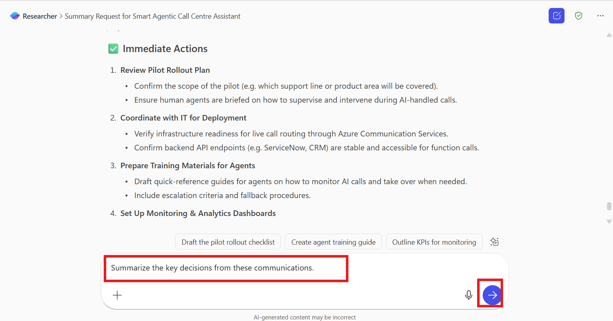
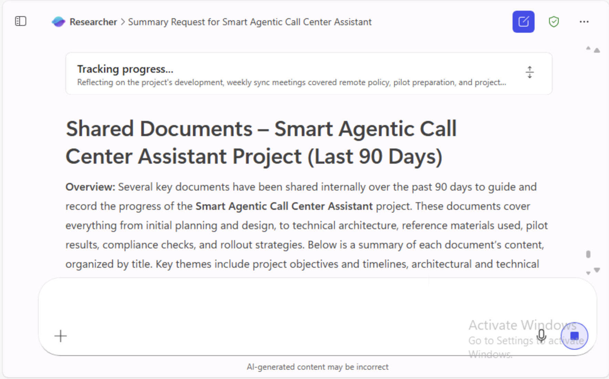

# Lab 2: Use the Researcher agent to surface insights, organize content, and produce professional-quality outputs directly in Microsoft 365 Copilot

**Duration: 25 mins**

## Overview

-   In this lab, you will learn how to use the **Researcher Agent** in
    Microsoft 365 to gather, summarize, and analyse organization-related
    information.

-   The Researcher Agent can collect relevant data from your documents,
    emails, chats, and Teams messages, helping you create summaries,
    reports, and follow-ups on a given project or topic.

## Learning Objectives

After completing this lab, you will be able to:

-   Locate and launch the **Researcher Agent** in Microsoft 365.

-   Use prompts to gather recent discussions, documents, and emails.

-   Interact with follow-up questions to refine results.

-   Generate summaries, reports, or action items related to a topic.

-   Explore advanced prompt use cases such as progress updates, meeting
    prep, and document discovery.

## Prerequisites

Before you begin, ensure the following:

-   You have access to **Microsoft 365** with Copilot features enabled.

-   Your account includes permissions to use the **Researcher Agent**.

-   You are signed into your Microsoft 365 account.

## Exercise 1: Access the Researcher Agent

1.  Navigate to +++<https://m365copilot.com/>+++ Microsoft 365 copilot
    page.

2.  Enter the **User ID** in the field and then click on the **Next**
    button to proceed.

3.  Enter **Password** in the field and then click on the **Sign in**
    button.

4.  Click on the **Yes** to stay Signed in.

> 

5.  In the left **navigation pane**, look for **Agents**.

    -   If **Researcher** appears directly under the **Agents** section
        → select **Researcher**.

> 

-   If not, select **Agents** –&gt; **Explore agents** in the navigation
    pane.

-   In the **Agent Store** window, under the **Built by Microsoft**
    section, select **Researcher**.

> 

6.  The **Researcher Agent window** opens in a new pane.

## Exercise 2: Run Your First Research Prompt

1.  In the **prompt field**, enter the following prompt and then click
    on the **Execute** button.

+++Help me gather and summarize all recent discussions, documents, and
emails related to **Smart Agentic Call Centre Assistant** from the past
90 days.+++

2.  Wait for the **Researcher Agent** to gather and summarize the data
    review the Researcher agent carefully. The Researcher Agent may ask
    clarifying questions. Enter +++**Go ahead**+++ in the prompt field
    and click on the **Execute** button.

3.  **Review the Researcher agent’s response**:

Agent’s response covers project progress, documentation evidence,
training impact, strategic insights, and forward plans—providing a full
situational analysis of the call centre AI initiative: covering every
aspect from planning to pilot execution.

## Exercise 3: Refine and Explore Additional Requests

### Action and Summary Prompts

Help the **Researcher Agent** perform a task *or* take a specific action
based on the data, findings, or situation.

1.  Enter the below given prompt in the field and then click on the
    **Execute** button.

+++List any action items for me.+++

2.  Enter the below given prompt in the field and then click on the
    **Execute** button.

+++Summarize the key decisions from these communications.+++

3.  Enter the below given prompt in the field and then click on the
    **Execute** button.

+++Draft an email to the team about the project participation.+++

### General Research and Information Gathering

These prompts help users **collect, analyse, and summarize** background
information about a topic, organization, market, or technology before
decision-making or documentation.

1.  Enter the below given prompt in the field and then click on the
    **Execute** button.

+++Summarize all recent documents, chats, and emails related to Smart
Agentic Call Centre Assistant.+++

2.  Enter the below given prompt in the field and then click on the
    **Execute** button.

+++Find and summarize feedback on our updated remote work policy.+++

### Meeting Preparation

Meeting preparation prompts help you **gather background information**,
**summarize key updates**, and **identify action items or discussion
points** before a meeting.  
They ensure that all participants come informed and ready to contribute
effectively.

1.  Enter the below given prompt in the field and then click on the
    **Execute** button.

+++Help me prepare for an upcoming meeting by summarizing recent
communication and shared files about.+++

2.  Enter the below given prompt in the field and then click on the
    **Execute** button.

+++What topics have been discussed in past weekly team syncs?+++

### Progress and Status Updates

**Progress and Status Updates**” is another ideal section for **Action**
and **Summary Prompts** — it helps learners or AI agents **review
achievements, identify gaps, and plan next steps**.

1.  Enter the below given prompt in the field and then click on the
    **Execute** button.

+++Summarize the current status and blockers for Smart Agentic Call
Centre assistant.+++

2.  Enter the below given prompt in the field and then click on the
    **Execute** button.

> +++What progress has been made on **Smart Agentic Call Centre
> Assistant** based on email and Teams updates?+++
>
> 
>
> 

### Unanswered Questions and Gaps

This section helps identify **missing information, unclear points, or
areas needing further investigation** from research, meetings, or
ongoing project activities.  
**Summary Prompts** help you articulate what’s unclear, while **Action
Prompts** guide you to resolve or explore these gaps further.

1.  Enter the below given prompt in the field and then click on the
    **Execute** button.

+++What open questions remain about Smart agentic call centre
assistant+++

2.  Enter the below given prompt in the field and then click on the
    **Execute** button.

+++Which action items from the last review meeting are still
incomplete?+++

### Document Discovery and Insights

This section helps users or AI tools **explore, analyse, and extract
valuable information** from existing documents, reports, or shared
repositories.  
It focuses on identifying key insights, patterns, or references that can
guide research, planning, or project documentation.

1.  Enter the below given prompt in the field and then click on the
    **Execute** button.

+++Find the latest version of Smart Agentic Call Centre Assistant and
summarize key updates.+++

2.  Enter the below given prompt in the field and then click on the
    **Execute** button.

+++Summarize contents of shared documents related to Smart Agentic Call
Center Assistant.+++

### Generate a Communication Draft

Use the Researcher Agent to help communicate findings to your team.

1.  Enter the below given prompt in the field and then click on the
    **Execute** button.

+++Draft an email to summarize project updates on Smart Agentic Call
Center Assistant for the leadership team.+++

## Exercise 4: Review and Validate Output

1.  Evaluate whether the Researcher Agent’s summary meets your
    expectations.

2.  If results are too broad or missing key details, refine your
    prompt.  
    **Example**: +++Narrow this summary to focus only on deliverables
    and project blockers.+++

> 

3.  Export or copy the summary for documentation, reports, or meeting
    notes.

> 

## Exercise 5: What you can do with the response

Here's a brief overview of the tasks associated with each icon shown in
your screenshot:

1.  **Clipboard Icon** – Likely used for **copying or pasting** content.

2.  **Thumbs-Up Icon** – Typically indicates **liking or approving** an
    item or action.

3.  **Thumbs-Down Icon** – Generally used to **dislike or disapprove**
    something.

4.  **Speaker Icon** – Represents **audio settings or volume control**.

5.  **Pencil Icon** – Commonly used for **editing or writing** tasks.

6.  **Clock with Arrow Icon** – Tooltip says **"Add to recent page"**,
    which means it adds the current item to your **recently accessed
    pages** for quick reference.

## Conclusion

In conclusion, this lab provides hands-on experience with the
**Researcher Agent in Microsoft 365 Copilot**, demonstrating how it can
streamline information gathering, analysis, and reporting within an
organization. By using simple prompts, you can quickly access relevant
data from multiple Microsoft 365 sources, summarize project updates, and
generate professional outputs such as emails or reports. The exercise
highlights how the Researcher Agent enhances productivity, improves
decision-making, and supports better collaboration by transforming
scattered organizational data into clear, actionable insights.
