# Lab 3 - Automating Knowledge Assistance through Microsoft 365 Copilot Agents

**Duration: 20 minutes**

## Objective:

In this lab you will create and configure a Copilot agent using the
Describe and Configure tabs.

You will use Copilot Studio Agent Builder:

-   Create an agent using the Describe and Configure tabs in Copilot
    Studio Agent Builder

**Note**: The availability of the **Describe** tab is based
on [**geographic availability and language
support**](https://learn.microsoft.com/en-us/microsoft-365-copilot/extensibility/copilot-studio-agent-builder-build).
If the **Describe** tab isn't supported in your region or preferred
language, you can manually build your agent through
the **Configure** tab.

-   Customize agent instructions, knowledge source and starter prompts.

-   Test and edit your agent.

-   Manage and share your agent within your organization.

## Exercise 1: Create a Copilot Agent Using the Describe Tab

In this exercise you will use the Describe tab in Copilot Studio to
create a basic agent.

1.  Open Edge browser and navigate to <https://m365.cloud.microsoft>
    **Microsoft 365 Copilot app** home page and then click on **Sign
    in** button.

> 
>
> **Note**: You need to sign-in (if prompted) using
> the **Credentials** provided under the **Resources** tab on the right
> side of your screen.

2.  Enter the Username, password to open **Copilot Chat** page .

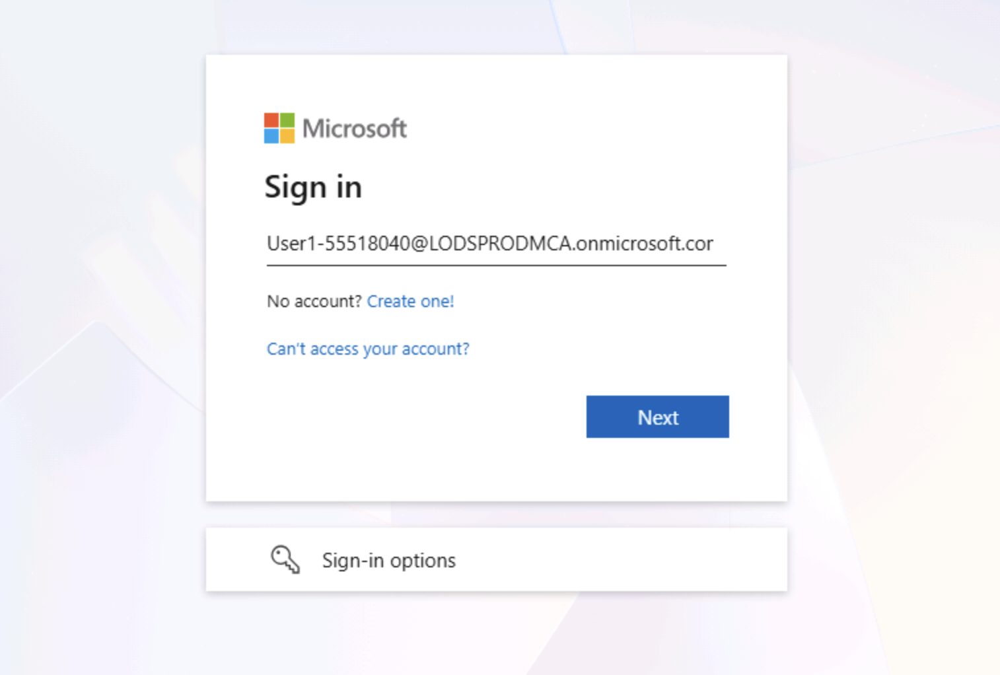

3.  **Copilot Chat** interface is now open

> 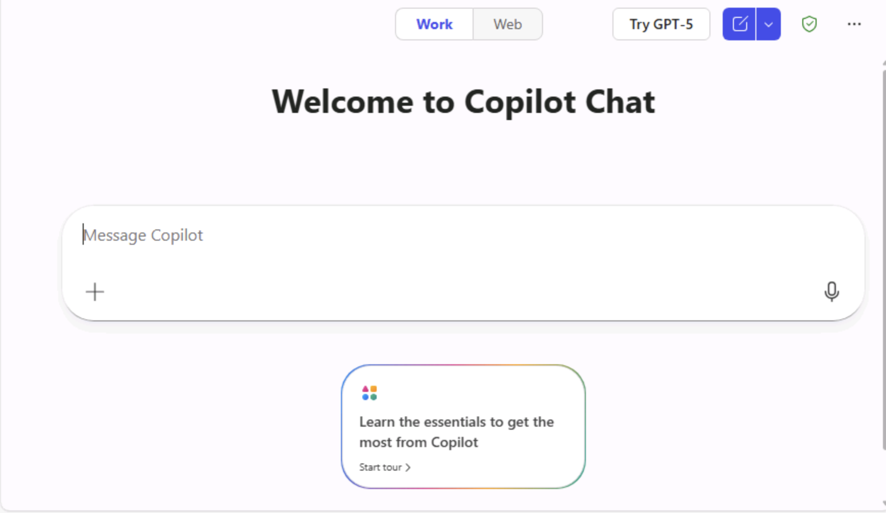
>
> **Note**: If, for some reason, “**Something went wrong”** message
> appears, click **Refresh** to open Copilot app.

4.  Click on **Create an agent** from left navigation pane of Copilot
    Chat home page.

> 

5.  **Copilot Studio Agent Builder Interface:**  
    When you open **Copilot Studio Agent Builder**, you’ll see **three
    tabs** at the top of the screen:

-   **Describe** – Define the purpose and functionality of your agent.

-   **Configure** – Customize the agent’s behaviour, triggers, and
    actions.

-   **Try it** – Test your agent’s responses and refine its performance.

> **Note:** Use these tabs sequentially to design, configure, and
> validate your Copilot agent before deployment.
>
> 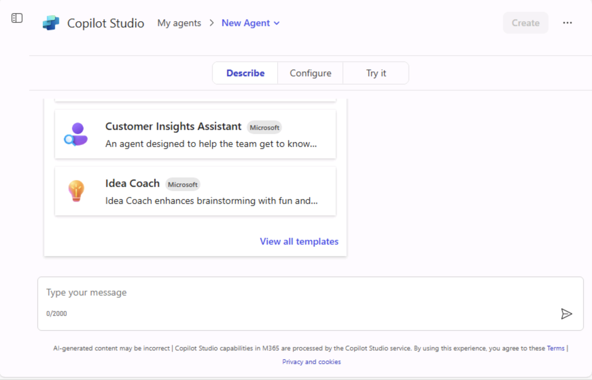

6.  In the **Describe tab**, enter the description of the agent's
    purpose in natural language description and then click on the
    **Execute** button.

> Enter the following description in chat field: +++**An agent that
> assists users in finding popular learning paths and modules from
> Microsoft**+++.
>
> 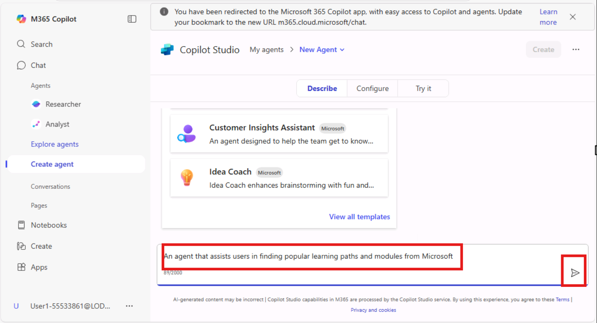

7.  Validate the agent response on for description provided, the chat
    will suggest you a name for the agent and ask you to change the new
    name. For this lab guide enter +++Use suggested name+++ in the field
    and then click on the **Execute** button.

> 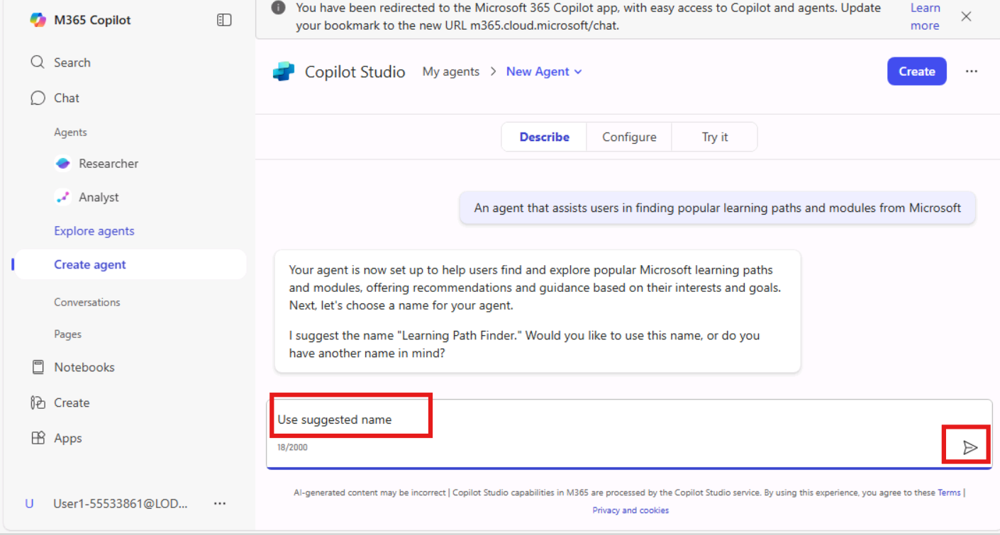

8.  Click **Create** button on top right side of agent builder window to
    submit the agent.

**Note**: In this exercise you will use the default settings to expedite
the creation process.

9.  Once the agent is created successfully, click **Go to agent** button
    to begin the interaction with your agent

> 

**Note**: If the **agent's name** does not appear updated in the
**Copilot chat** **i** **nterface**, try the following steps:

-   **Refresh** the page, or go to the **left navigation pane**, select
    the **Agents** tab, and choose your agent from the list.

> 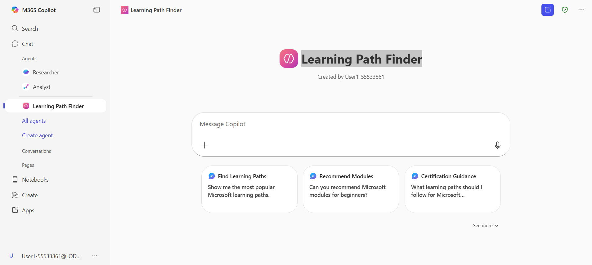

10. You have now created the **Learning Path Finder** agent with default
    settings.

> 

### Testing Your Agent

You will now test whether the agent responds based on the default
configuration settings.

1.  Input the following prompt in the agent chat field to assess the
    agent's response and validate the response.

> **Prompt:** +++List the popular learning paths and modules offered by
> Microsoft+++
>
> 
>
> 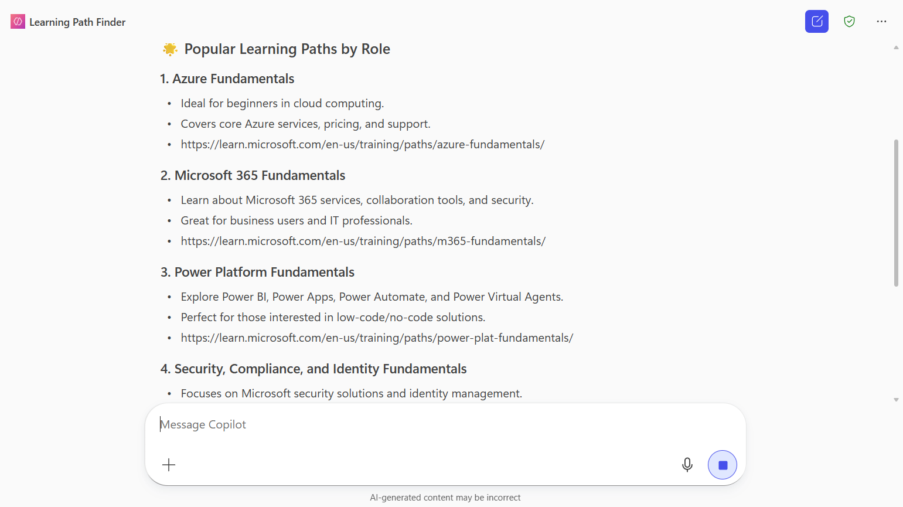

2.  Similarly, test the agent response by entering some irrelevant
    prompt in the chat field.

> Prompt: +++**Help me with instructions for baking cakes**+++

-   By default, the agent avoids providing answers based on information
    unrelated to the **Microsoft Learning** paths, demonstrating its
    accuracy and reliability in building on the default experience.

> 
>
> 
>
> **Tip:** You can explore more about Microsoft learning paths by
> clicking the **prompt Gallery**. Click on the **Learning Path Finder**
> agent. Scroll down, click on the **see more,** click on the **Prompt
> Gallery** to see the suggested prompt.
>
> 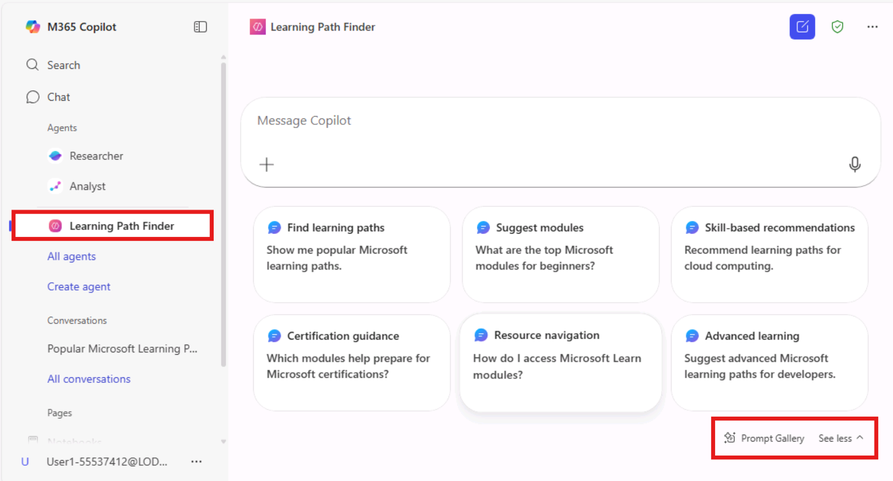
>
> 

## Exercise 2: Configure Agent Details Using the Configure Tab

In this exercise you will configure agent settings to fine-tune its
behaviour.

**Note**: If you are creating an agent from **Configure t**ab, you need
to define the agent's name, description, and purpose.

1.  In the left navigation pane, select the **Learning Path Finder**
    agent that was created using the default settings.

2.  Click the **three-dot (⋯) icon** next to it and choose **Edit**.

3.  You can configure the agent's behaviour settings, including response
    tone and interaction style. In this exercise you will proceed with
    the default instructions.

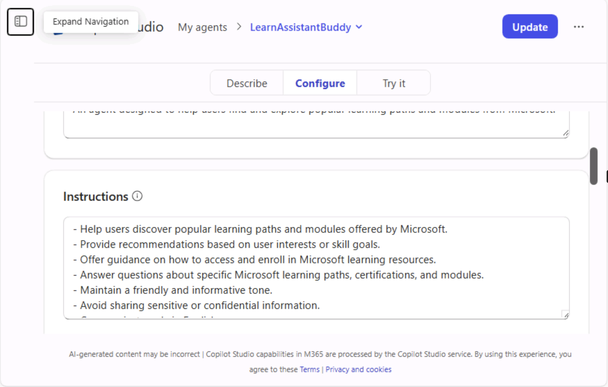

4.  Upload your organization’s recommended files, folders, or sites to
    the agent’s **Knowledge Source**. Click the **Upload** icon to add
    files directly from your **OneDrive**.

5.  You will now set up the knowledge sources the agent will use, such
    as specific SharePoint sites, document libraries, and web sites. In
    this exercise you will use a website as knowledge source to ground
    the agent responses.

6.  Click on Knowledge source search field and paste the following link
    and press enter Link:
    +++**https://learn.microsoft.com/en-us/training/**+++

> **Note**: The website URL can’t be more than two levels deep. Also,
> the agent will search public websites if you don’t add a URL, and you
> turn web search on.
>
> 

7.  The configuration changes are automatically saved as you edit. To
    finalize and apply all updates, click the **Update** button located
    at the top-right corner.

**Note**: You have now completed configuring agent with customized
settings tailored to your organization's needs.

8.  Click **Go to agent** button to view the updates in the Copilot chat
    window and ensure the agent functions as intended and make necessary
    adjustments.

### Test you Customised agent 

Test your customized agent to verify that the applied configurations,
knowledge sources, and behaviour settings are working as intended.

1.  Enter t the following prompt in the **LearnAssistantBuddy** agent
    chat field and assess the agent's response. 

> +++**List the popular learning paths and modules offered by
> Microsoft**+++ 
>
> 
>
> 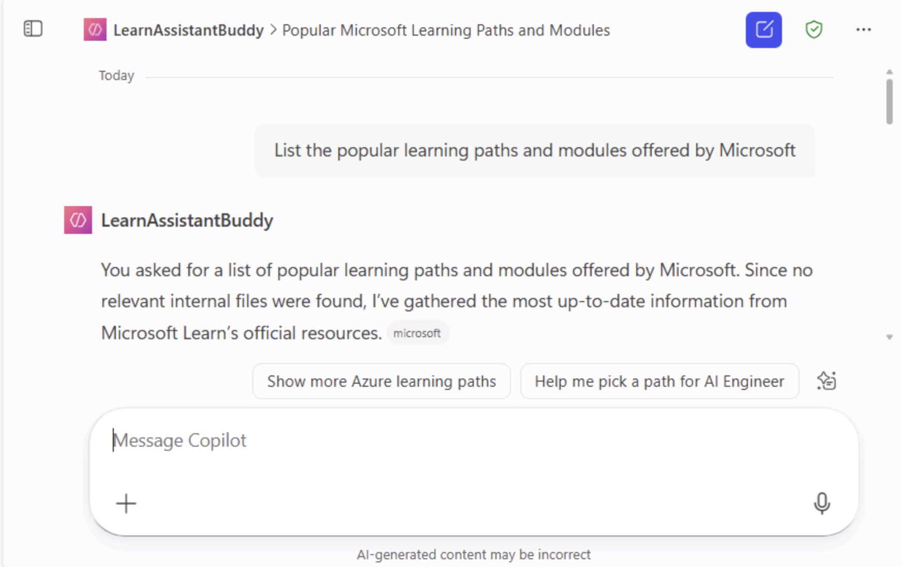

2.  You can check the response by comparing it with the information
    available in the URL entered used as knowledge source. 

>  
>
> 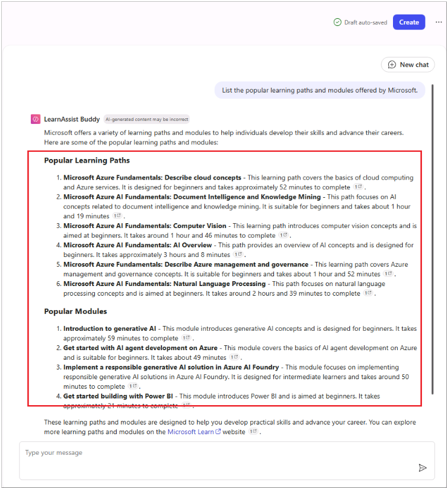 

3.  Now, test the agent response by entering some irrelevant prompt. 

> **Prompt**: +++**Find out the top 10 tourist places in India**+++ 
>
> 
>
> **Note**: The agent avoids providing answer based on the instruction
> “Avoid discussing topics unrelated to Microsoft learning paths and
> modules”.
>
> 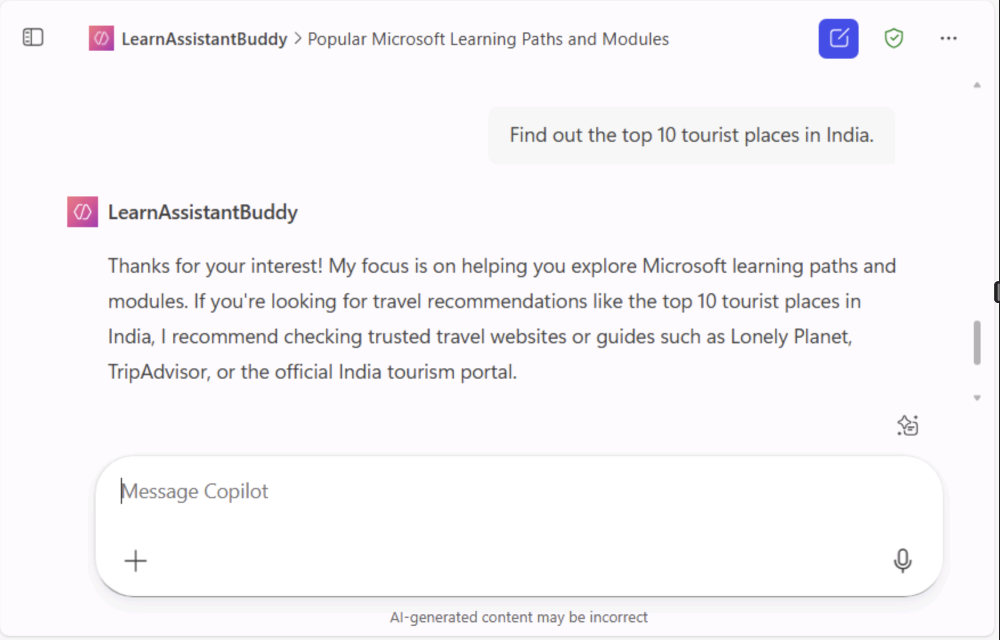
>
> **Note**: The default instruction set in your case may be different.
> Please ensure that the instructions are properly configured to make
> the agent avoid providing the answer. 

## Exercise 3: Managing and Sharing the Agent

You will now deploy the agent within your organization and manage its
accessibility.

1.  Share the agent with specific users or groups by setting appropriate
    permissions.

2.  In the left navigation pane, go to **LearnAsiistantBuddy** agent.
    Click the **three-dot (⋯) menu** next to it and select **Share**.

> 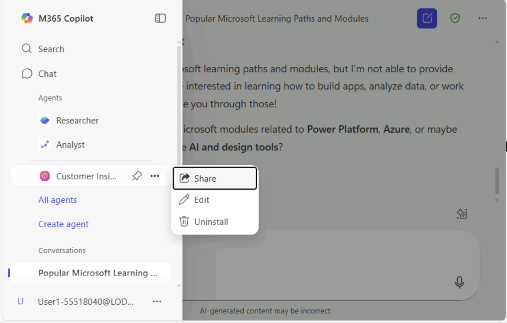

3.  In the **Share agent** dialog box, select how you want to share the
    agent.

-   Choose **Anyone in your organization** to make the agent accessible
    to all users.

-   Alternatively, select **Specific users in your organization** or
    **Only you** based on your sharing preference.

-   Click **Save** to confirm your selection.

> 

4.  Here select first option **Anyone in my organisation** to avail this
    agent for everyone’s quick access and then click on the **Save**
    button.

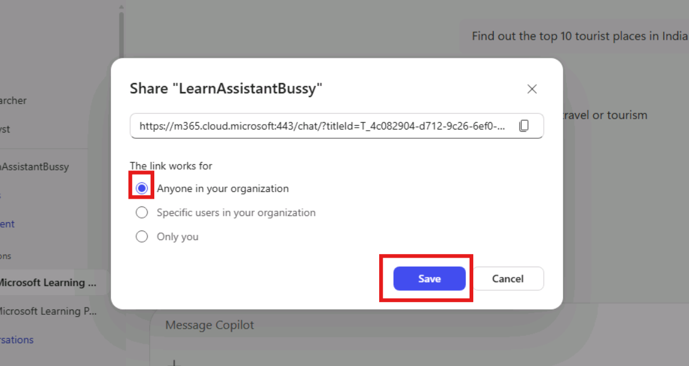

5.  After clicking **Save**, copy the generated link and share it with
    your team members so they can access the agent.

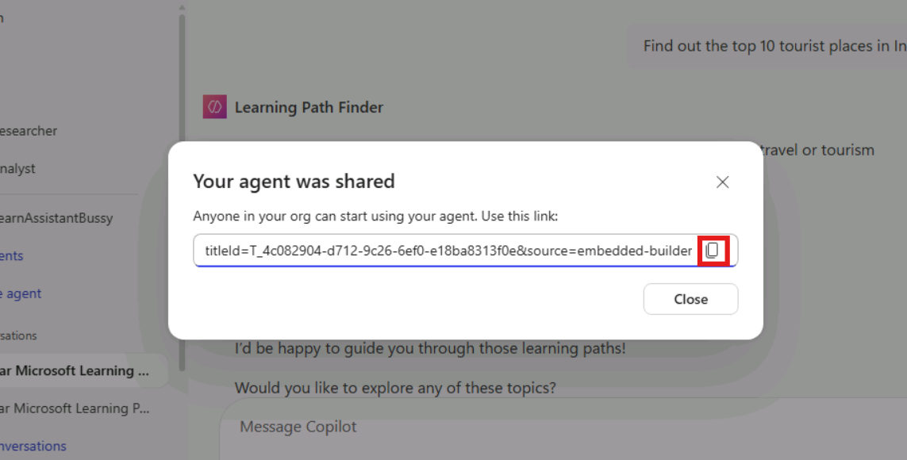

## Try yourself: 

1.  Create an agent “Product Buddy” to get product details.

2.  Map the knowledge source to document library that you created in
    “Lab 0 - Preparing for lab execution”

3.  Test the agent by asking relevant product related prompts to check
    its functioning.

## Summary

By completing this lab, you gained hands-on experience in designing,
personalizing, and deploying Copilot agents that deliver context-aware
assistance aligned with organizational knowledge and goals.
