# Laboratorio 4: Explorar el agente Document Analyzer para realizar preguntas, analizar contenido y transformar documentos con Microsoft 365 Copilot en Word

**Duración estimada:** 10–15 minutos

## Objetivo

En este laboratorio, se aprenderá a utilizar Microsoft 365 Copilot para
interactuar con documentos empresariales de muestra almacenados en
OneDrive. Se explorará cómo Copilot puede ayudar a resumir, analizar y
mejorar documentos en Microsoft Word.

## Requisitos previos

1.  Una cuenta **profesional o educativa de Microsoft 365** con una
    licencia de Microsoft 365 Copilot.  
    *(o una cuenta personal de Microsoft, como outlook.com, hotmail.com,
    live.com o msn.com)*

2.  Acceso a **Microsoft Word (versión web o de escritorio)** con
    Copilot habilitado.

3.  Conexión a Internet y acceso a almacenamiento en OneDrive.

## Ejercicio 1: Seguir las instrucciones utilizando datos de muestra

Aprenda a usar Microsoft 365 Copilot con archivos empresariales de
muestra almacenados en OneDrive.

1.  Abra el archivo **Analysis Report for Mystic Spice Premium Chai
    Tea.docx** ubicado en "C:\LabFiles\Market Analysis Report for Mystic
    Spice Premium Chai Tea.docx".

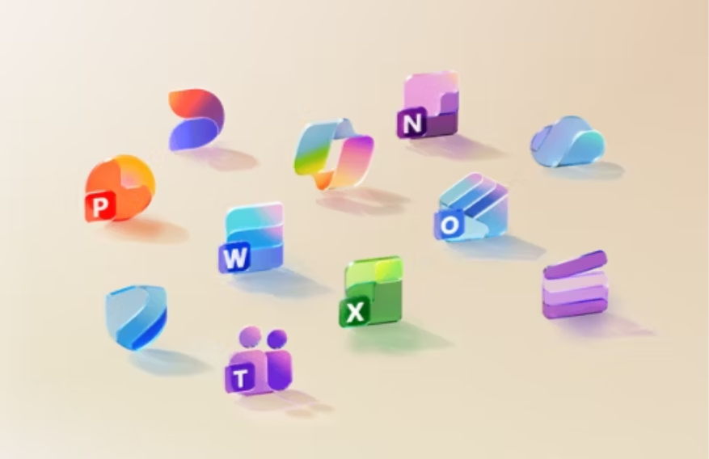

2.  Asegúrese de que los archivos sean accesibles por Copilot.

- Abra el documento en **Word Online, Excel Online o PowerPoint
  Online**.

- Pruebe **Copilot** dentro del archivo (por ejemplo: “Summarize this
  document”).

3.  Es necesario iniciar sesión en las aplicaciones de escritorio con
    las credenciales de usuario o administrador proporcionadas en el
    entorno.

- Ingrese el nombre de usuario y contraseña indicados en la pestaña
  **Resources**, ubicada en el lado derecho del entorno, y haga clic en
  **Sign in.**

> 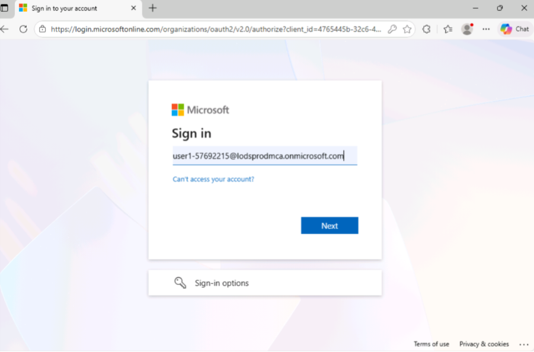
>
> 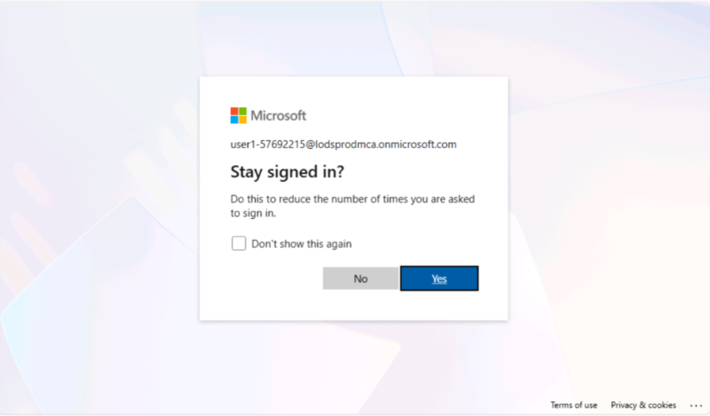
>
> 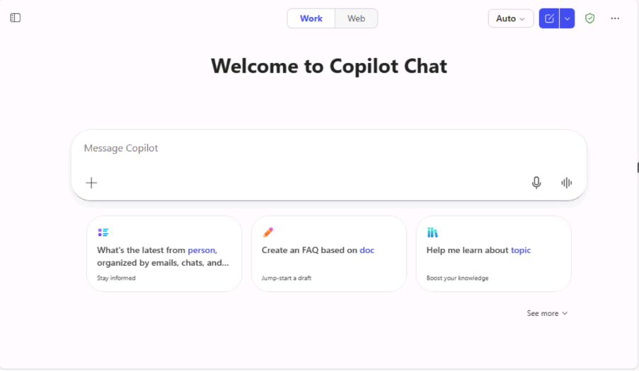
>
> 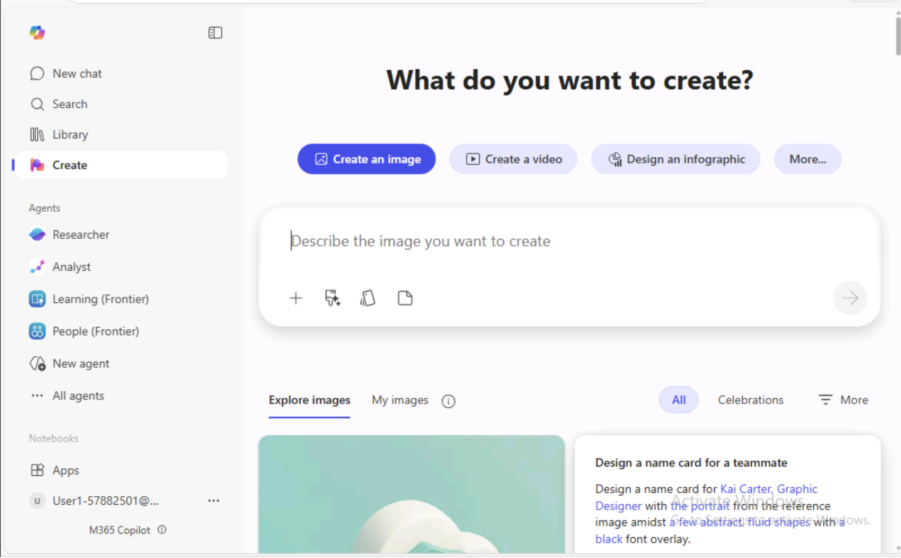

- Acepte el acuerdo de licencia y continúe.

> 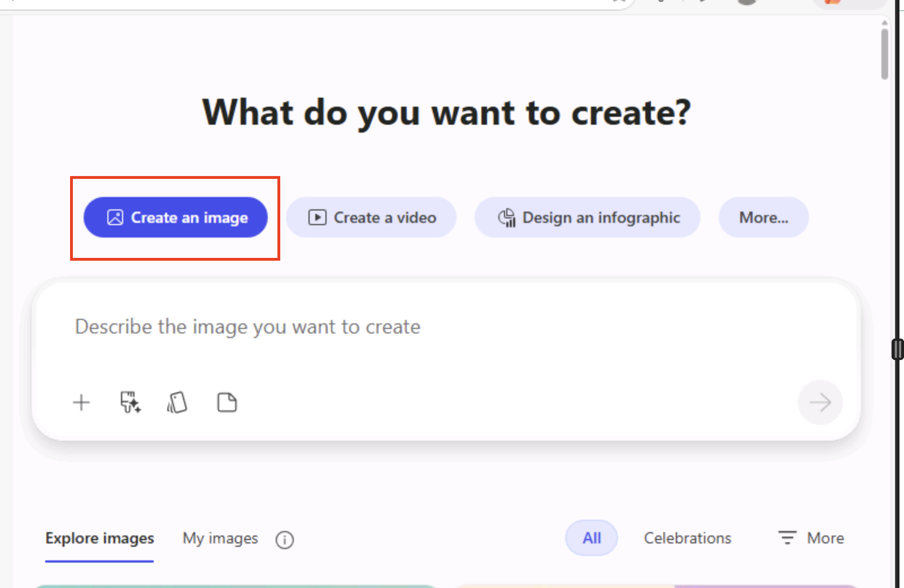

4.  Una vez abierto el documento en Word, estará listo para su análisis.

- Haga clic en **Enable editing** para habilitar la edición del
  documento y permitir su análisis.

## Ejercicio 2: Utilizar Microsoft 365 Copilot en Word

Además de crear contenido o generar ideas, Copilot en Word puede
responder preguntas sobre el documento en lectura.  
Una vez que Copilot responda al prompt, también es posible ver
referencias o citas de las fuentes dentro del documento.

1.  Con el documento ya abierto, utilice Copilot para analizar y mejorar
    el contenido.

2.  **Abra el panel de Copilot en el archivo Word:**

- Vaya a la pestaña **Home.**

- Seleccione el ícono **Copilot** para abrir el panel lateral.

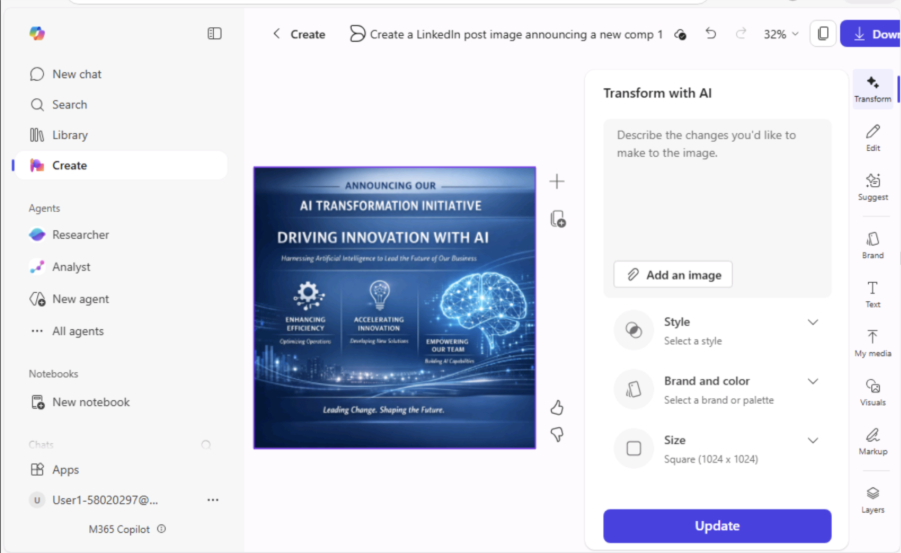

- Haga clic en el ícono de **Copilot** para visualizar la interfaz de
  chat.

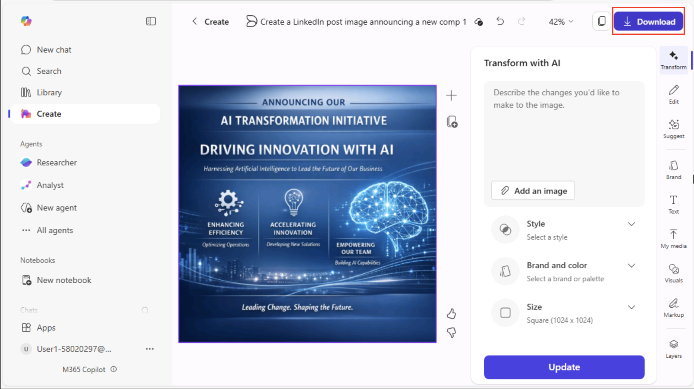

3.  **Interactúe con Copilot**  
    Utilice los siguientes prompts para explorar sus capacidades:

&nbsp;

1)  **Prompt básico: +++Is there a call to action?+++**

**Propósito:** Identificar rápidamente si el documento contiene un
mensaje de acción principal.

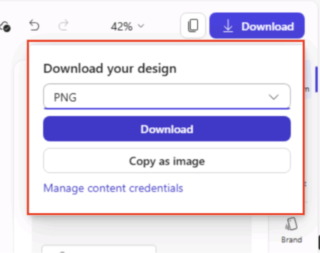

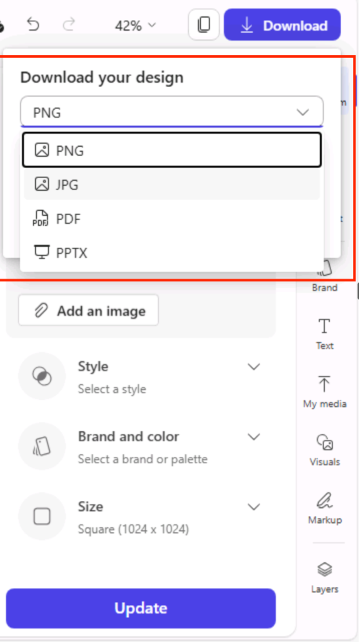

2)  **Prompt mejorado:** +++Is there a call to action in this market
    analysis report?+++

**Propósito:** Agregar una referencia contextual para mejorar la
comprensión.

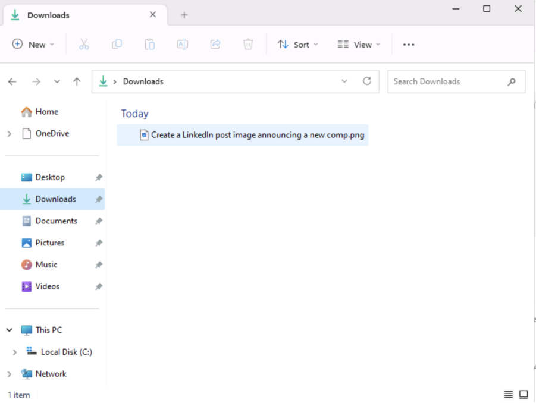

3)  **Prompt avanzado**: +++Is there a call to action in this market
    analysis report to address our challenges and concerns? Please check
    if the marketing plan includes a clear and specific plan of action,
    such as a promotional plan or limited-time discount.+++

**Propósito:** Proporcionar contexto adicional para obtener insights más
personalizados.

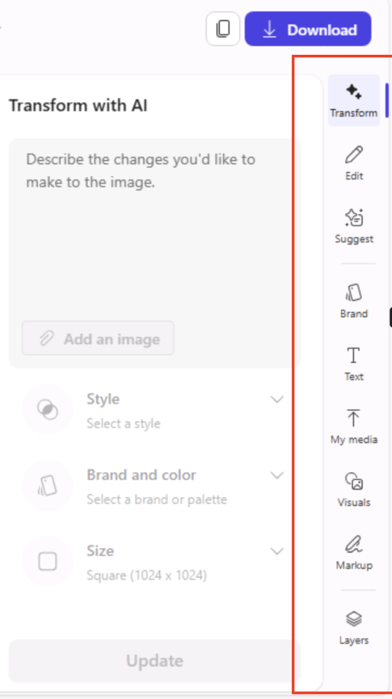

4)  **Prompt óptimo: +++**Is there a call to action in this market
    analysis report to address our challenges and concerns? Please
    provide suggestions for improving the call to action if
    necessary.+++

**Propósito:** Establecer expectativas claras para recibir
recomendaciones detalladas.

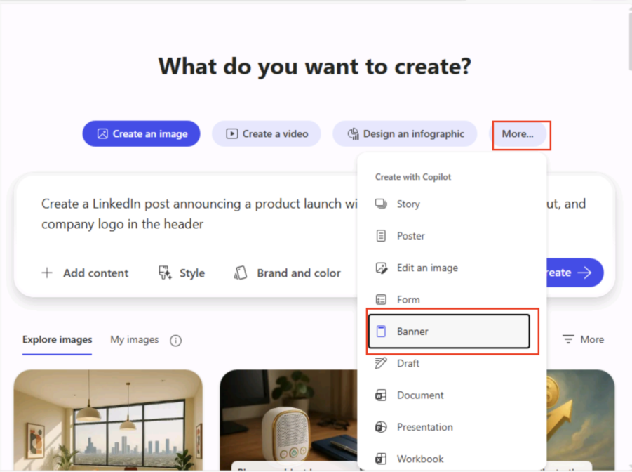

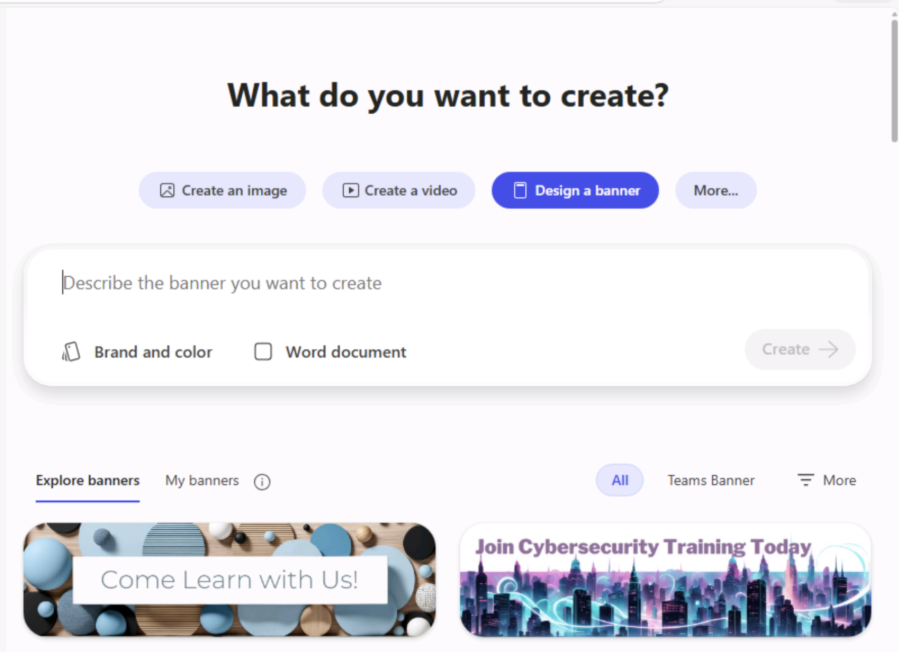

- **Observe la respuesta  
  **Revise la respuesta de Copilot en el panel lateral.

**Nota:** Tenga en cuenta que Copilot hace referencia a la información
del documento y puede citar sus fuentes.

## Ejercicio 3: Realizar preguntas abiertas

Formule preguntas generales a Copilot; este intentará proporcionar
respuestas adecuadas:

- **Prompt**: +++How can I edit this document to make it sound more
  academic?+++

> 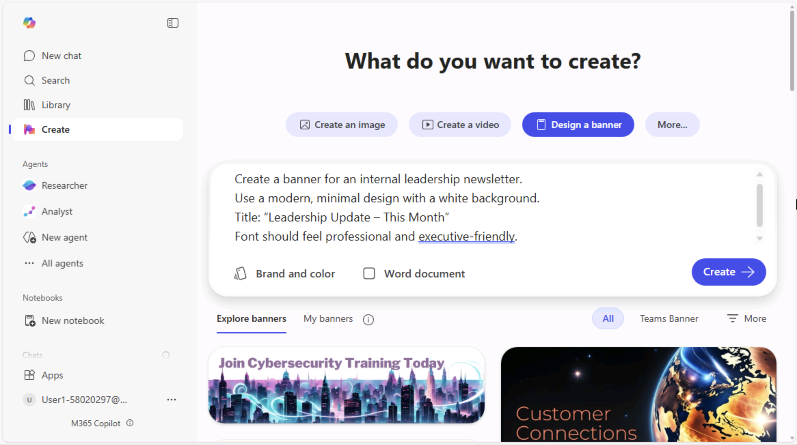
>
> 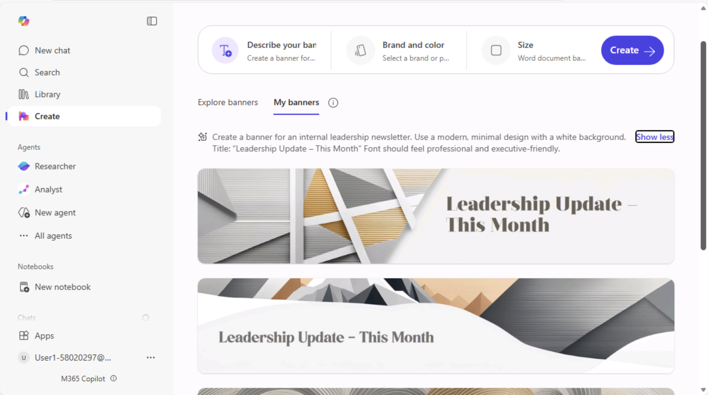

- **Prompt**: +++Is there a quote by a United States President about
  courage?+++

> 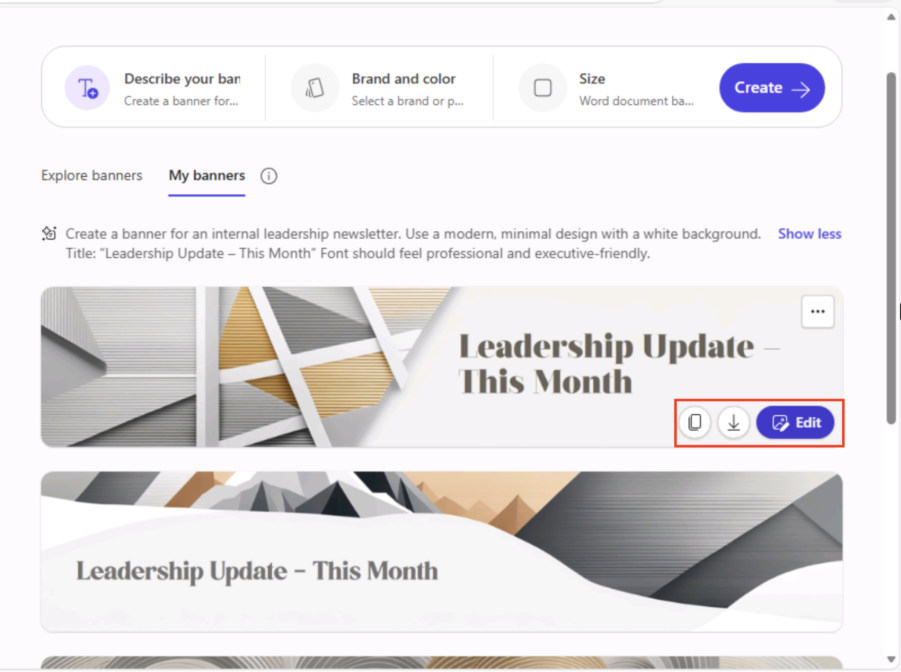
>
> 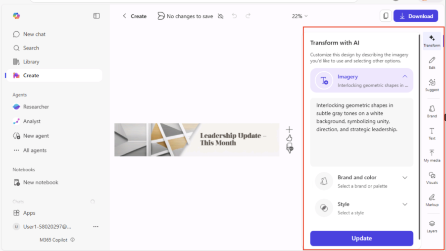
>
> 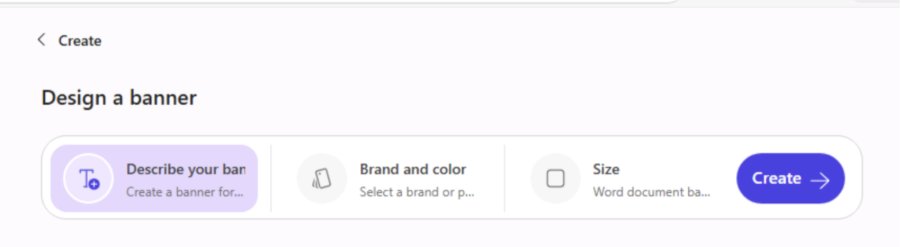

Pasos siguientes

Continúe el aprendizaje explorando:

- Uso de Copilot en **Excel** para análisis de datos.

- Uso de Copilot en **PowerPoint** para generación automática de
  diapositivas.

- Mejora de técnicas de ingeniería de prompts para casos de uso
  específicos.

Resumen del laboratorio  
En este laboratorio se:

- Configuraron archivos empresariales de muestra para la interacción con
  Copilot.

- Abrieron y referenciaron archivos almacenados en OneDrive.

- Practicaron la redacción de prompts eficaces para Copilot en Word.

- Aprendió a extraer resúmenes, identificar mensajes clave y generar
  recomendaciones contextuales.
