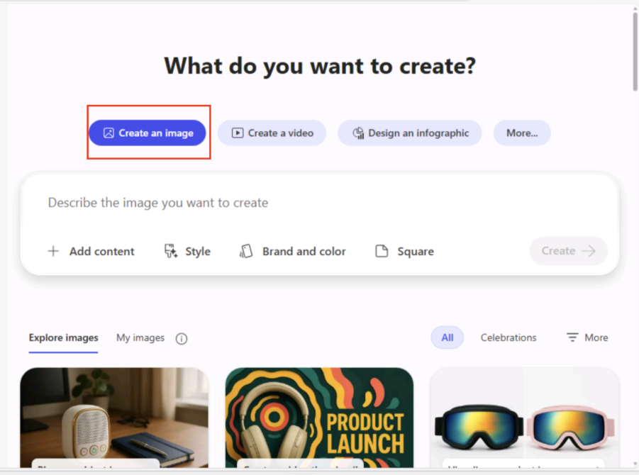
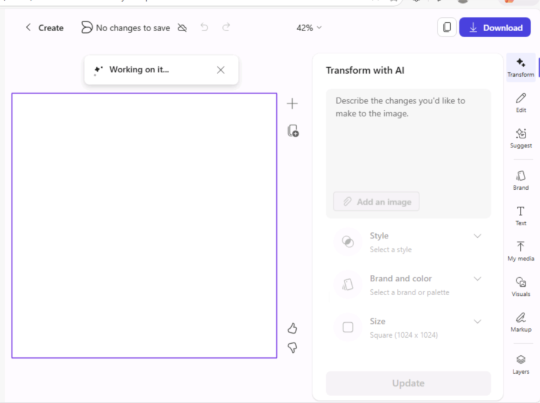
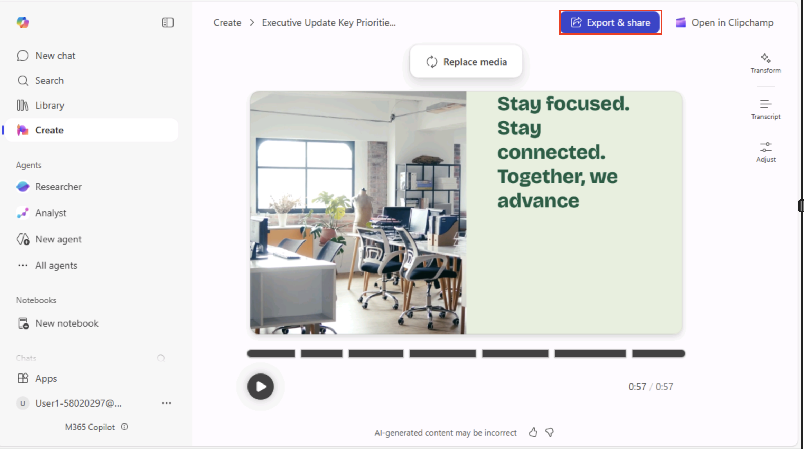
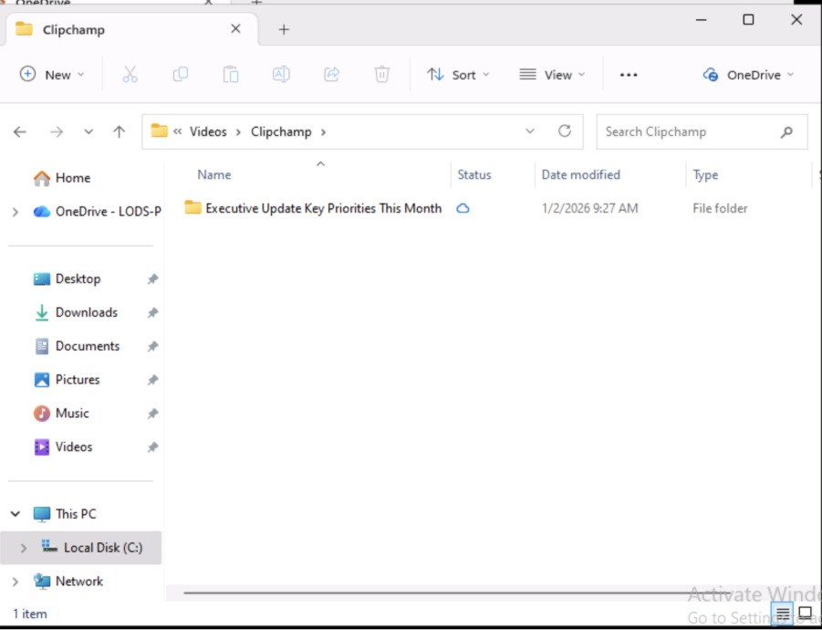
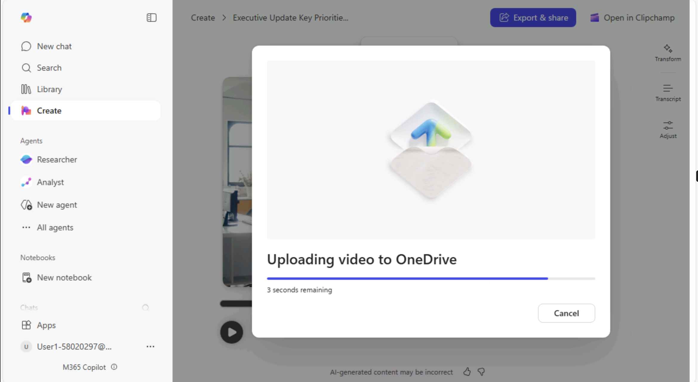
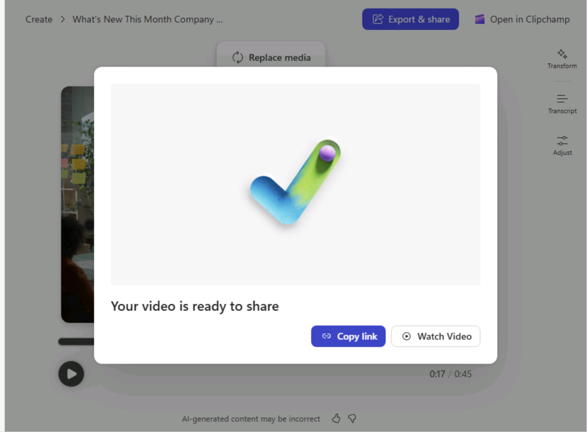
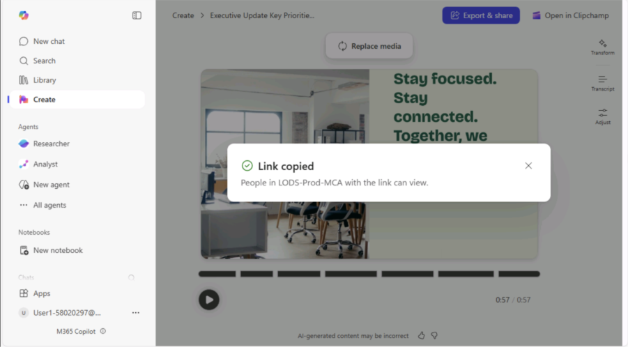
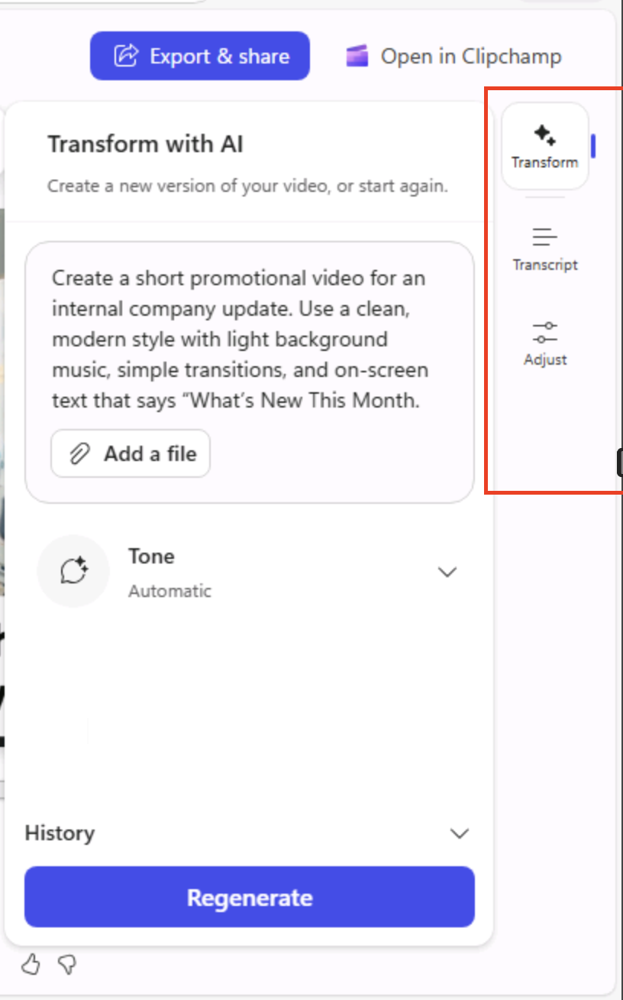

# Laboratorio 4: Crear contenido visual utilizando la experiencia Create en Microsoft 365 Copilot

## Objetivo del laboratorio (contexto ejecutivo)  
En este laboratorio, aprenderá a utilizar la experiencia **Create en
Microsoft 365 Copilot** para generar rápidamente **contenido visual de
nivel ejecutivo**, sin necesidad de habilidades de diseño.  
Creará elementos visuales que los ejecutivos suelen necesitar para:  
- Comunicaciones de liderazgo  
- Actualizaciones a toda la empresa  
- Mensajes a nivel directivo  
- Iniciativas internas de cambio

Al finalizar este laboratorio, podrá:  
- Acceder al módulo Create  
- Generar imágenes, banners y videos utilizando lenguaje natural  
- Personalizar elementos visuales mediante plantillas  
- Reutilizar contenido en comunicaciones de liderazgo

## Escenario ejecutivo en tiempo real (utilizado en todo el laboratorio)  
Usted es un **líder empresarial senior** (CXO / VP / Director).

Este mes, es responsable de:  
- Comunicar una **actualización estratégica** a los empleados.  
- Anunciar **una nueva iniciativa o cambio.**  
- Compartir el progreso con liderazgo y equipos  
- Asegurar que los mensajes sean **profesionales, claros y creíbles.**

**No dispone de tiempo** para:  
- Abrir herramientas de diseño.  
- Dar instrucciones a diseñadores.  
- Iterar en diseños.

Utilizará **Copilot Create** para producir **elementos visuales
ejecutivos listos para usar** en minutos.

Requisitos previos  
- Suscripción a Microsoft 365 Copilot.  
- Acceso a la aplicación Microsoft 365 Copilot.  
- Navegador moderno y conexión a internet.  
**Nota:** Algunas funcionalidades de **Create** pueden variar en planes
Personal o Family.

## Ejecución paso a paso

### Ejercicio 1: Acceder al módulo Create (punto de entrada ejecutivo)

**Contexto del mundo real:**  
Un ejecutivo necesita un único lugar para crear elementos visuales sin
cambiar de herramienta.

**Pasos:**

1.  Inicie sesión en la aplicación **Microsoft 365 Copilot** utilizando
    su cuenta profesional o educativa.  
    +++<https://m365.cloud.microsoft/>+++

    1. Inicie sesión con su cuenta de **Microsoft 365 Copilot**

        

    2.  Haga clic en **Yes** para mantener la sesión iniciada.

        

    3. Después de iniciar sesión correctamente, verá la página principal de
    **Copilot Chat**.

        

2.  En el panel de navegación izquierdo de M365 Copilot, seleccione
    **Create**.

    

### Resultado esperado  
- Se abre el **panel de Create**, mostrando tipos de contenido como
imágenes, banners y videos.

## Ejercicio 2: Crear una imagen de anuncio ejecutivo (comunicación de liderazgo)

**Escenario ejecutivo:**  
Como **CEO o líder de negocio**, desea anunciar una **nueva iniciativa
estratégica** en LinkedIn o Viva Engage.

**Pasos:**

1.  En la ventana **What do you want to create?,** asegúrese de que la
    pestaña **Create** an image esté seleccionada e introduzca el
    siguiente prompt.  
    - Introduzca el siguiente texto y haga clic en **Generate the
    image**.  
    **Prompt:** “Create a LinkedIn post image announcing a new
    company-wide AI transformation initiative. Use a professional,
    executive tone with a clean layout suitable for senior leadership
    communication.”
    

    

2.  Revise la imagen generada basada en el prompt proporcionado, con la
    imagen del lanzamiento del producto con el logo.  
    - El panel **Transform with AI** es donde puede **refinar, mejorar y
    personalizar** la imagen que Copilot ya ha generado, sin comenzar
    desde cero.  
    - Piense en ello como:  
    “Tell Copilot what to change, and it will update the image for
    you.”   
    - No necesita habilidades de diseño ni herramientas de edición; solo
    describa el cambio en lenguaje natural.

    

3.  Puede descargar la imagen generada; haga clic en **Download** en la
    esquina superior derecha de la ventana **Create** para descargar la
    imagen.

    

    

4.  Explore diferentes opciones de descarga desde el menú **Download
    your design**, como: JPG, PDF, PPTX.

    

5.  Abra la imagen **PNG** descargada desde la carpeta **Downloads** de
    su máquina virtual.

    

    

    **Nota**: También puede copiar la imagen desde el icono Copy ubicado
    junto al botón **Downloads** en la esquina superior derecha.

    

6.  **Barra de herramientas contextual:** Esta barra contiene acciones
    rápidas que puede utilizar para refinar y controlar la imagen o el
    contenido visual en el que está trabajando, sin salir de la
    experiencia **Create.**  
    - Proporciona opciones directas de edición y mejora para la imagen o
    visual seleccionado.  
    - Piense en ello como:  
        “Everything you might want to adjust—grouped in one place.”  
    - Cada icono representa un tipo específico de cambio que puede
    realizar.

    

### Resultado esperado  
- Copilot genera una imagen profesional adecuada para redes sociales
como LinkedIn.

**Nota:** Después de crear correctamente una imagen, vuelva a la ventana
**Create chat** para continuar con los siguientes ejercicios.

### Ejercicio 3: Crear un banner para boletín interno de liderazgo

**Escenario ejecutivo:**
Como CHRO o COO, envía una actualización mensual de liderazgo a todos
los empleados.

**Pasos:**

1.  Seleccione **Banner** entre las opciones de creación en la sección
    **What do you want to create?  **
    a. Vaya a **More** y seleccione la opción **Banner** del menú
    desplegable

    

    · Verá la ventana **Design a banner.**

2.  En la ventana **Design a banner**, introduzca el siguiente prompt y
    haga clic en **Create** para generar el banner.  
    **Prompt:** 
    “Create a banner for an internal leadership
    newsletter.
    Use a modern, minimal design with a white background.
    Title: “Leadership Update – This Month”
    Font should feel professional and executive-friendly.”

    

    

    - Revise los banners generados para boletines mensuales.  
    **Nota:** Se generarán múltiples banners según el prompt proporcionado.
    Revise las opciones y seleccione la que prefiera.

        

3.  Una vez generado el banner, mueva el cursor a la **esquina inferior
    derecha de la vista previa.  **
    - Verá tres iconos de acción:  
    - **Edit** – Modificar el diseño, texto o disposición del banner.  
    - **Download** – Guardar el banner en su dispositivo local.  
    - **Copy** – Copiar el banner para reutilizarlo rápidamente en
    correos electrónicos o documentos.  
    - Seleccione la opción adecuada según lo que desee hacer a
    continuación.

    

    

4.  Explore y personalice sus banners generados utilizando la barra de
    herramientas **Design a banner.**  
    

    **Nota:** Puede editar, guardar o reutilizar el banner directamente
    desde la vista previa sin salir de la experiencia Create.

### Resultado esperado  
- Aparece un banner limpio y moderno que puede reutilizarse en boletines
internos.

### Ejercicio 4: Crear una imagen para campaña de cambio o iniciativa

**Escenario ejecutivo:**  
Como **CIO o** **líder de transformación**, está implementando un
**nuevo modelo operativo** o política.

**Pasos:**

1.  Seleccione nuevamente la opción **Create an image** en la ventana
    **What do you want to create?**

    

2.  Introduzca el siguiente prompt y haga clic en **Generate the
    image**.  
    **Prompt:** 
    “Create a professional image to support an internal
    change initiative announcement.
    Use confident, modern visuals and include text: Driving Change.
    Delivering Impact”.

    

    

    - Revise la imagen generada para la campaña “**Driving Change.
    Delivering Impact”.**

        

    **Nota:** Puede editar, copiar o descargar la imagen según sea necesario
    desde la barra **Transform with AI** en el lado derecho de la ventana
    **Create an Image.**

### Resultado esperado  
- Un **elemento visual de gestión del cambio**.  
- Adecuado para encabezados de correo, publicaciones en intranet o
presentaciones.

### Ejercicio 5: Crear un video corto de actualización ejecutiva

Escenario ejecutivo:  
Como **patrocinador ejecutivo**, desea compartir una **actualización en
video** en lugar de un correo extenso.

**Pasos:**

1.  En las opciones de contenido, seleccione **Create a video** en la
    ventana **What do you want to create?**

2.  En el cuadro de prompt, introduzca la siguiente descripción:  
    **Prompt:** 
    “Create a short executive update video. Use a clean, modern style with light background music.
    Include on-screen text: “Executive Update: Key Priorities This Month”

    

3.  Seleccione **Generate** y espere mientras Copilot crea el video.

      
    - Revise el video corto promocional en formato mp4 generado.

        

        

4.  **Exportar y compartir:** en la parte superior derecha seleccione el
    icono **Export & Share**

      
    · La exportación del video puede tardar algún tiempo.

    

    **Nota:** El video mp4 se cargará automáticamente en su OneDrive.

     

    · **Ruta del archivo:** C:\Users\Admin\OneDrive -
    LODS-Prod-MCA\Videos\Clipchamp  
    

5.  Haga clic en **Copy link** para copiar el enlace del video mp4 y
    compartirlo con liderazgo o equipos.  
    

6.  Haga clic en **Copy link** para copiar el enlace y compartirlo con
    su equipo. Las personas en **LODS-Prod-MCA** con el enlace pueden
    visualizarlo.  
    

7.  **Transforme, transcriba** y **ajuste** el video desde la sección
    **Regenerate** en el lado derecho.  
    

8.  Haga clic en **Open in Clipchamp** para abrir el video en
    **Clipchamp** desde la esquina superior derecha de la ventana
    **Create**.  
    

9.  Explore el video en **Clipchamp:** realice ediciones,
    actualizaciones, agregue música, voz en off, exporte y más.  
    

10. Haga clic en **Export** en la esquina superior derecha de la ventana
    **de Clipchamp**.

11. Introduzca el **nombre** del archivo, la **descripción** y haga clic
    en **Export**.  
    

**Nota:** La exportación puede tardar algún tiempo.  
      
    

12. Comparta, descargue, visualice en el navegador, copie el enlace y
    abra la ubicación del archivo exportado.  
      
    

13. Por ejemplo, seleccione **Save to your computer** para guardar el
    video en su dispositivo local.  
    

## Resultado esperado  
- Un **video ejecutivo corto y profesional.**  
- Ideal para visibilidad y participación del liderazgo

## Criterios de finalización del laboratorio  
Ha completado correctamente este laboratorio si:  
- Abrió el módulo Create.  
- Generó al menos una imagen, banner o video.  
- Utilizó prompts en lenguaje natural.  
- Creó contenido adecuado **para comunicación ejecutiva.**

## Conclusiones clave  
- Los ejecutivos pueden crear contenido **visual de alta calidad sin
equipos de diseño.**  
- El lenguaje natural reemplaza herramientas complejas.  
- El contenido es reutilizable en correo, intranet, redes sociales y
presentaciones.  
- Ideal para comunicación de **liderazgo, gestión del cambio y
actualizaciones estratégica**.
