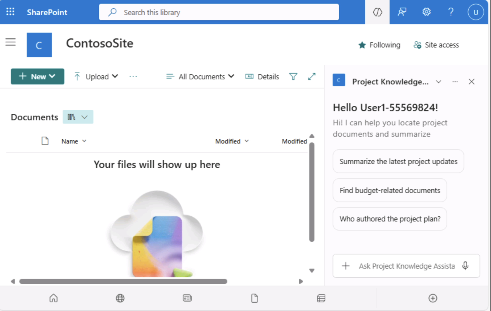

# Lab 5: Create and Configure a Copilot Agent in SharePoint to Deliver Contextual Answers

Lab Duration: 10-15 minutes

## Introduction

As organizations rely more heavily on SharePoint to manage knowledge,
projects, and team resources, the ability to create intelligent agents
that interact with this content becomes a powerful productivity booster.
Microsoft 365 Copilot makes it possible to build a SharePoint-based
Copilot agent that can quickly surface information, answer questions,
and assist users in navigating complex site content.

## Objective

In this lab, you will learn how to:

1.  Create a Copilot Agent in SharePoint.

2.  Customize the agent’s **name, icon, and purpose**.

3.  Add **knowledge sources** such as SharePoint sites, libraries, or
    files.

4.  Configure the agent’s **behavior**, including the **welcome
    message**, **starter prompts**, and **instructions**.

5.  **Publish and test** your agent.

## Pre-Requisites

1.  You must have access to a SharePoint site with **Edit permissions or
    higher**.

2.  Ensure that **Microsoft Copilot for Microsoft 365** is enabled in
    your tenant.

3.  You should be signed into your **SharePoint Online** site via
    **Microsoft 365**.

## Exercise 1: Access the Copilot Agent Creation Tool

You must begin by identifying a SharePoint site that you already have
access to.

1.  Sign in to **SharePoint site**.

-   Click on the given link and open the Microsoft SharePoint log in
    page

> <https://www.microsoft.com/en/microsoft-365/sharepoint/collaboration?market=af>

2.  Click on **Sign in** button and provide the user credentials given
    in your environment under **Resources** tab to sign in to the
    SharePoint site

> 
>
> 

-   Click **Yes**, to stay signed in

> 
>
> 

3.  In the SharePoint site open the already existed site, if you don’t
    have the existed site create one

4.  Click **Create site** button on top left corner of SharePoint site
    home page to create a new site

> 

5.  Here, I am selecting the existing SharePoint Communication site
    named **ContosoSite**.

## Exercise 2: Create Your New Agent

1.  Create a new agent for **ContosoSite**

-   On the ContosoSite **homepage**, select **+ New → Agent**.

2.  **Open the Agent Creation Page**  
    You will see three main tabs at the top: **Overview**, **Sources**,
    and **Behavior**. These tabs help you define your agent’s setup and
    functionality.

### Exercise 2.1: Configure Agent Overview Tab

1.  In the **Overview** tab:

    -   Enter the **Agent Name** : Project Knowledge Assistant

-   Provide a **Description**: Helps users find project documents and
    summaries

-   (Optional) Select **Change icon** and upload a .png file (max size:
    1 MB).

### Exercise 2.2: Add Knowledge Sources

1.  Navigate to the **Source** tab in the Create new agent window

> 

2.  Choose one of the following:

    -   **Source from entire site** (default)

    -   **Sourced from document libraries, folders, or files**

**Note:** Here we choose to go with the default source.

3.  If selecting Sourced from document libraries, folders, or files:

    -   Click + Add document libraries, folders, or files.

    -   In the Pick items window, choose:

    -   Entire Documents library, or

    -   Specific folders/files (select checkboxes).

    -   Click Select.

**Note**: You can add up to 20 sources for a single agent.

### Exercise 2.3: Define Agent Behaviour

1.  Navigate to the **Behavior** tab in Create new agent window

> 

2.  Configure the following:

-   Welcome Message:  
    *+++*Hi! I can help you locate project documents and summarize
    updates*+++*

-   Starter Prompts (max 3):

    1.  +++Summarize the latest project updates.+++

    2.  +++Find budget-related documents.+++

    3.  +++Who authored the project plan?+++

> 

-   **Instructions:**  
    +++Provide concise answers using only verified information from
    included SharePoint sources.+++

3.  Click on **Save and close** to save all the configurations.

## Exercise 3: Test Your Agent

1.  After saving, open the **Copilot chat pane**.

-   Click **Chat with agent** to open agent chat window in the
    SharePoint **ContosoSite**.

> 

-   Now you see the **Project Knowledge Assistant** agent panel in the
    right hand side of your **ContosoSite**

-   You can also switch between agents from the agent drop down

> 
>
> 

2.  Enter one of the starter prompts in the agent chat field:

> **Prompt**: +++Summarize the project plan+++
>
> 

3.  Observe the response.

-   As shown in the image, the **Project Knowledge Assistant** does not
    return any specific project report details.

-   This happens because the **ContosoSite** source currently **does not
    contain any project report files or related data**.

> 
>
> **Note**: You can upload a document or a project report to your
> ContosoSite library

4.  Upload a document to your SharePoint **ContosoSite** library

-   Go to **ContosoSite** Home page, click on **Toggle navigation pane**

-   Select **Documents** option from the dropdown

-   You will see the empty documents library of your ContosoSite

-   Click on **Upload** dropdown and select the **file**, **folder**, or
    **template** you want to upload to the site library.

> 
>
> 

-   Select the file from your **OneDrive** and click **Open** to upload

> 
>
> 

-   Your **Project Nexus survey results** file is successfully uploaded
    to the **ContosoSite** documents library

> 

5.  Test your agent for the new default source Project Nexus Survey
    results

-   Enter the prompt in the agent chat panel and verify the response

Prompt: +++**Summarise the latest project updates**+++

-   The agent replies with accurate answers based only on the SharePoint
    content you included as sources.

> 
>
> 

## Summary

In this lab, you successfully:

-   Created a new **Copilot Agent** in SharePoint.

-   Customized its **name, description, and icon**.

-   Defined **knowledge sources** and **behaviour settings**.

-   Published and tested your agent.

You now understand how SharePoint Copilot Agents help streamline
**information retrieval, collaboration, and workflow automation** using
data already available within your SharePoint environment.
