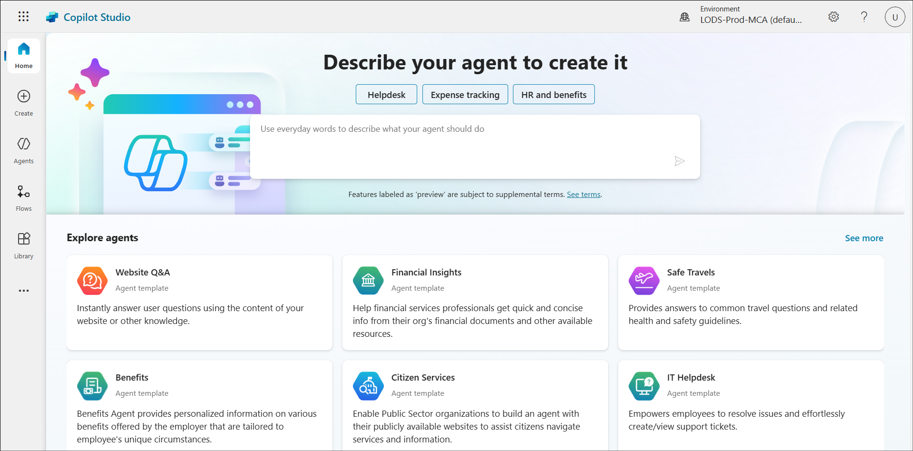
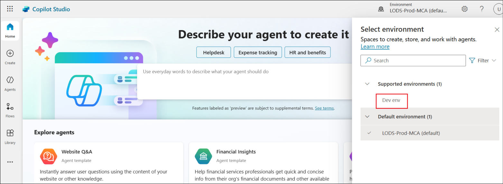
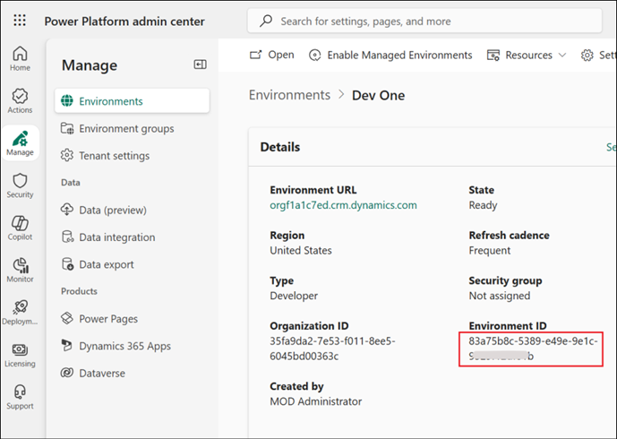
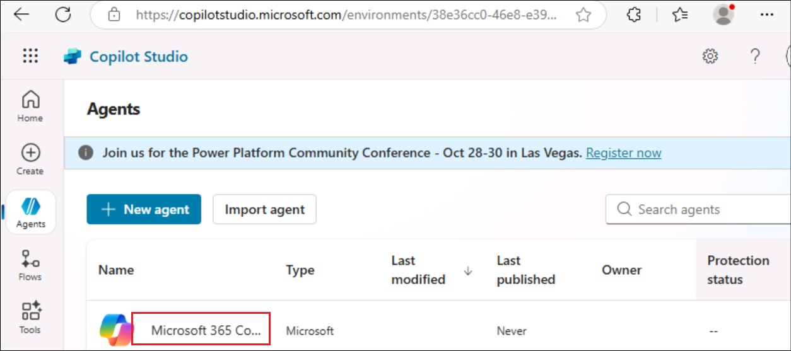
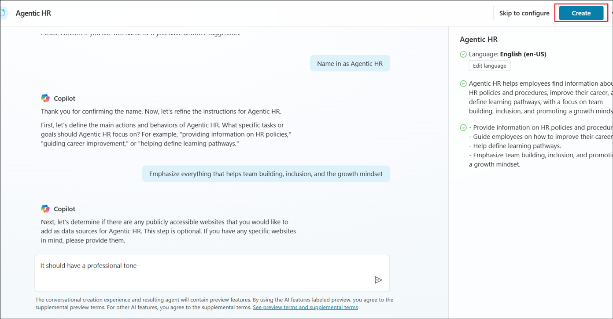
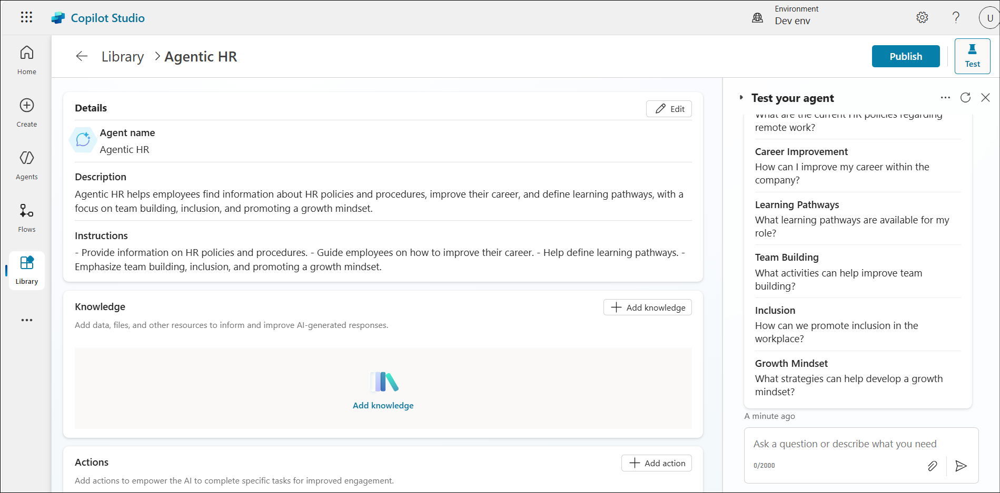
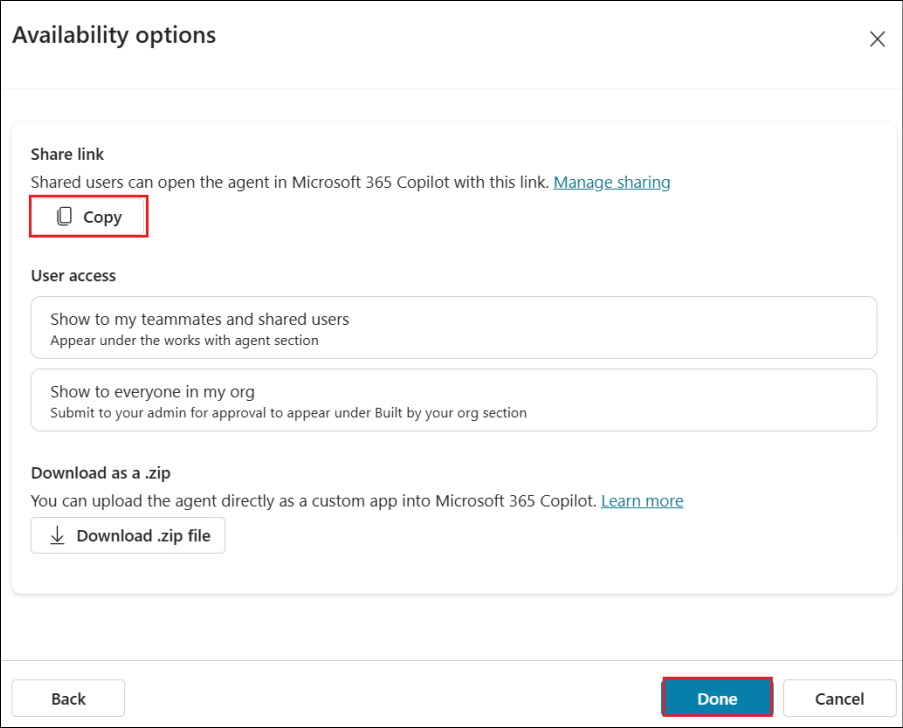
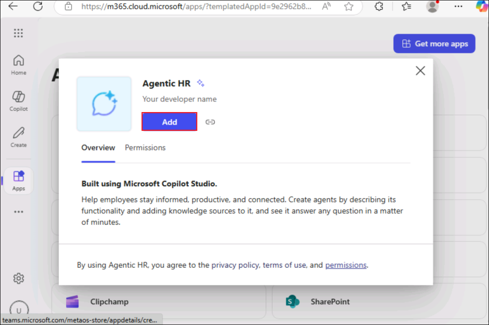
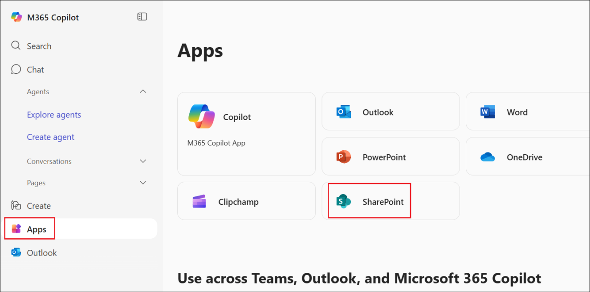
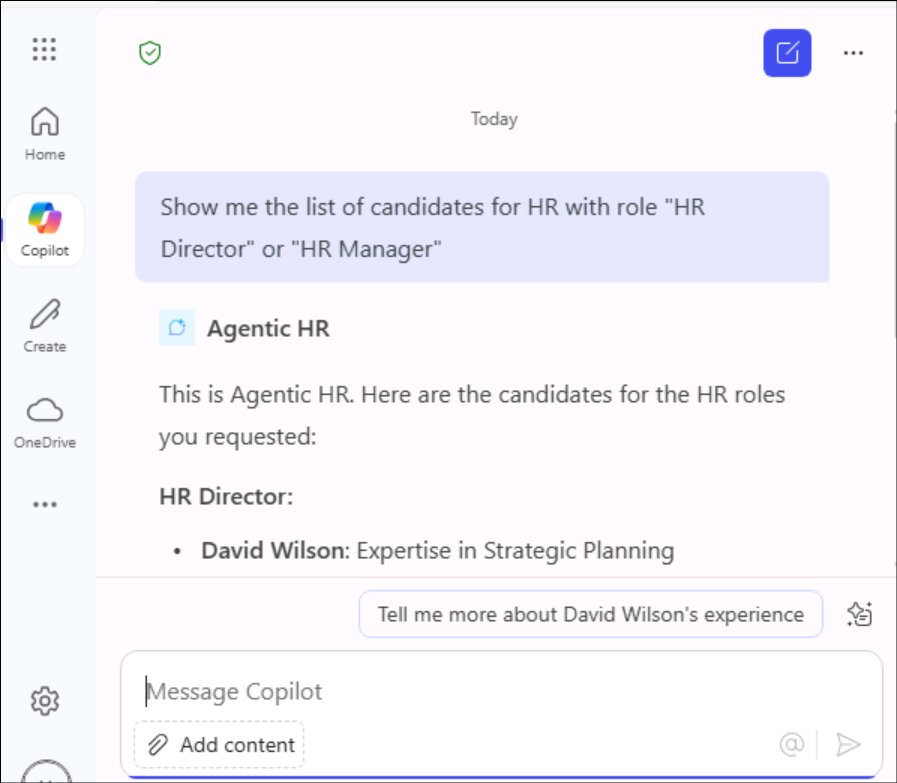

# Lab 6 - Extend Microsoft 365 Copilot Chat with a HR Agent built using Microsoft Copilot Studio

**Objective**

In this lab, you will learn how to extend Microsoft 365 Copilot Chat
with a Declarative Agent made using Microsoft Copilot Studio.  You will
also learn to add a custom action to the agent that you made.

Estimated duration – 45 minutes

## Exercise 1: Creating a Power Platform environment

With the Power Platform, you can create different environments and
easily switch between them accordingly to your needs. An environment
stores apps, flows, data, agents, etc. and each environment is
completely isolated from any other environment. In this exercise, you
will create a new dedicated environment in which you will perform the
remaining exercises and tasks.

1.  Open a browser and, using your login credentials from the
    **Resources** tab, go
    to +++https://admin.powerplatform.com+++.

    

2.  Select **Manage** and then select **+ New** under **Environments**.

    

3.  Provide the Name as +++**Dev env**+++, select the **Type** as
    **Developer** and click on **Next**. Select **Save** in the **Add
    Dataverse** screen.

    

    

4.  The new environment gets created and changes from **Preparing** to
    **Ready** state once it is ready.

    

    

## Exercise 2 : Creating an agent for Microsoft 365 Copilot Chat

In this exercise you are going to create a declarative agent with
Microsoft Copilot Studio and host it in Microsoft 365 Copilot Chat.

1.  Login to +++https://copilotstudio.microsoft.com+++ using the
    login credentials from the **Resources** tab.

    

2. Select **Get Started** in the **Welcome to Microsoft Copilot Studio** screen. 

3.  Select the **Dev env** environment that we created in the previous
    exercise.

    

    >[!Alert] **Important:** If the Copilot Studio and does not show up the option to select **Environment** as in the below screenshot, then follow the below steps.
    >
    >
    >
    >Open +++https://admin.powerplatform.microsoft.com/+++. Select **Manage** -> **Environments** -> **Dev env** and select the value of the **Environment ID**.
    >
    >
    >
    >Navigate back to the Copilot Studio tab and open +++https://copilotstudio.microsoft.com/environments/< EnvironmentID >+++ (Replacing **< EnvironmentID >** with the value fetched above)
    
4.  To create a declarative agent for Microsoft 365 Copilot Chat you
    need to first browse the list of agents in Copilot Studio and then
    select the agent with name **Microsoft 365 Copilot**.

5.  Select **Agents** from the left navigation bar and select **Microsoft 365 Copilot** from the list.

    

6.  A new section of Microsoft Copilot Studio will open. From there,
    select the **+ Add** command to create a new agent for Microsoft 365
    Copilot Chat.

    

7.  Copilot Studio asks you to describe in natural language what is the
    purpose of the agent. You can define your agent requirements. Paste
    the prompt below to do so

    **+++You are an agent helping employees to find information about HR policies and procedures, about how to improve their career, and about how to define learning pathways.+++**

    

8.  When requested by Copilot Studio, give the name "Agentic HR" to your
    custom agent. Use the following prompt.

    +++Name it as Agentic HR+++

    

9.  Then, instruct Copilot Studio to have specific tasks or goals with
    the following instruction:

    **+++Emphasize everything that helps team building, inclusion, and the growth mindset+++**

    

10.  Then, define a professional tone for your agent, providing the
    following input:

    **+++It should have a professional tone+++**

   

11. Once you are done describing your agent, select
    the **Create** command to create the actual agent. 

    

    

## Exercise 3: Publishing the agent in Microsoft 365 Copilot Chat

1.  Select **Publish** from the agent overview page.

    

2.  Select **Publish** in the **Publish agent** screen.

    

    

3.  Select **Copy** under **Share link** to copy the link and then
    select **Done**.

    

4.  Open a new tab and paste the copied url. Select **Add** to add the
    **Agentic HR** to your list agents.

    

    

5.  Select **Skip** in the introduction screen.

    

6.  The **Agentic HR** agent is now added.

    

## Exercise 4: Create SharePoint site

1.  In a new browser, navigate to +++https://m365.cloud.microsoft/chat/+++ Select **Apps** from the left pane and then select **SharePoint** once the Apps are loaded.

    

2.  Select **+ Create site** from the SharePoint page.

    

3.  Select **Communication site** from the **Select the site type**
    page.

    

4.  Select a **template** to be used.

    

5.  Select **Use template**.

    

6.  Enter +++**Contoso site+++** as the **Site name** and select
    **Next.**

    

7.  In the next screen, select **Create site**.

    

8.  Once created, note down the **url** of this site.

    

9.  Select **Documents** from the menu bar. Select **Upload -\> Files**

    

10. Select **Sample-list-of-candidates.xlsx** file from **C:\LabFiles**
    to be uploaded.

    

## Exercise 5: Adding knowledge to the agent

In this exercise you are going to add knowledge from the Sharepoint site, to the agent that
you created.

1. From the **Agent** home page, select **+ Add knowledge** under the Knowledge section.

    

2. Select **SharePoint** and then select **Browse items** to add the document. 

    

    

3. Select your site that you created earlier.

    

4. Select the candidate list tracker and then Confirm selection.

    

5. Select **Add to agent** in the next screen.

    

6. Select **Publish** to publish the agent.

    

7. Select **Publish** again.

    

8. **Copy** the url and **open** it from a browser.

    

9. This time, it will give an option to **Update now** since it is
    already added. Select it.

    

10. Select **Open** once it is updated.

    

11. In the Agentic HR agent screen, send the below message.

    +++Show me a list of candidates for HR with role “HR Director” or ”HR
   Manager”+++
   
    

12. In the Data to be shared with Agentic HR message, select **Allow
    once** (if prompted) option.

    

13. If it asks you to sign in, select the **Sign in to Agentic HR**
    option and then select **Connect** in the next screen.

    
   
    

14. Select **Submit** once connected.

    

    

15. Now, resend the below message to the agent.

    +++Show me a list of candidates for HR with role “HR Director” or ”HR
   Manager”+++
   
    

21. You will then receive the requested list

    

    

## Summary

In this lab, you have successfully learnt, how to use custom connectors
in Copilot Studio.
