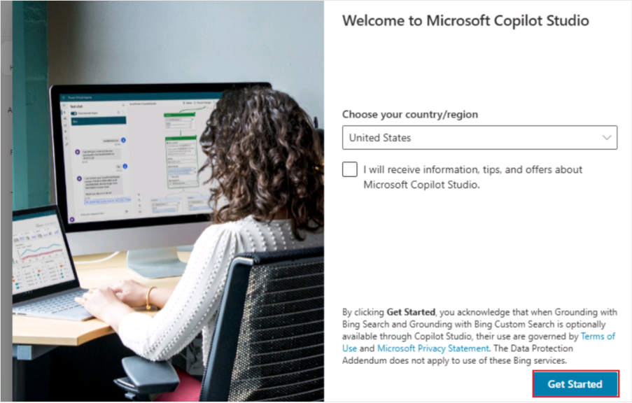
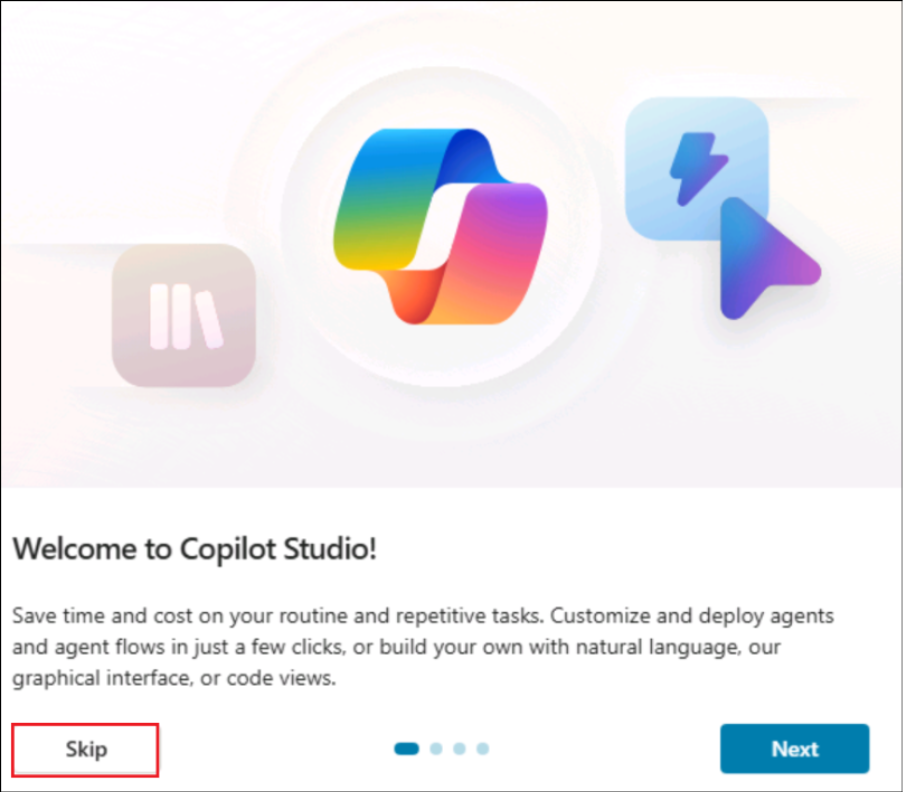
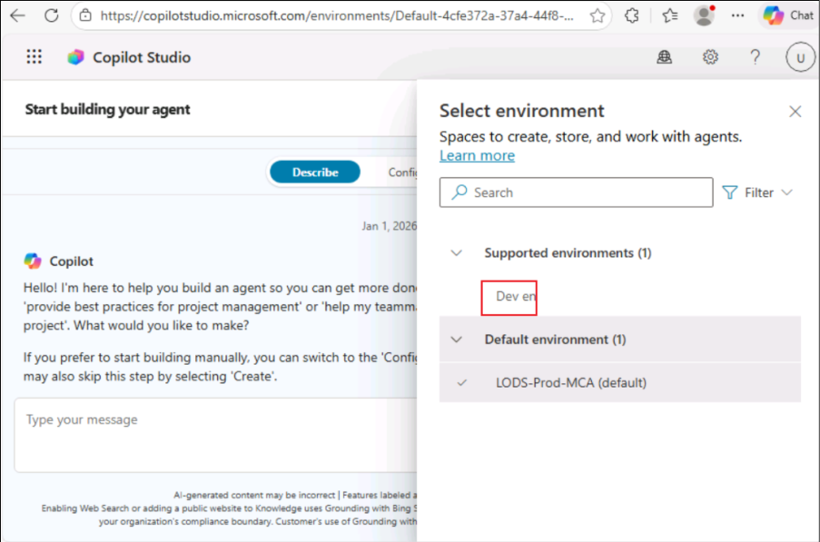
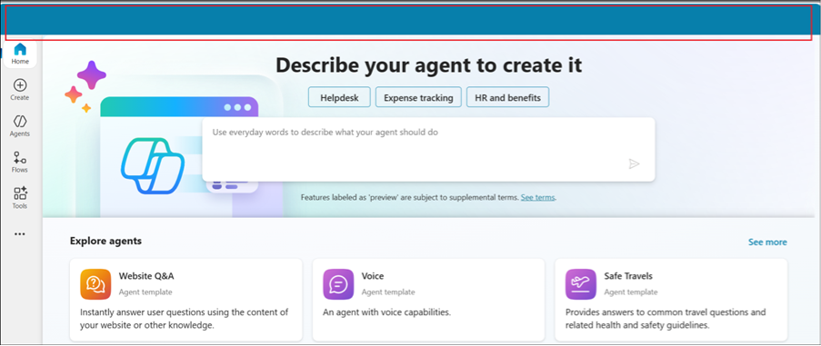
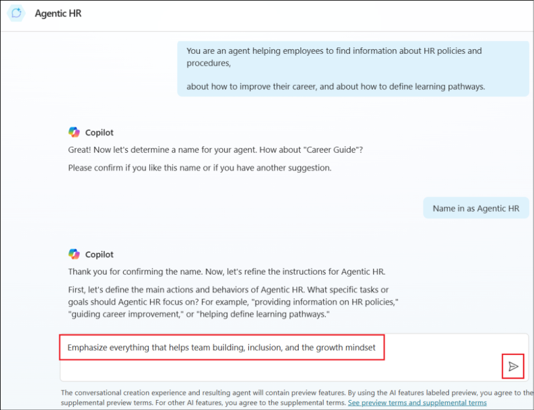

# Laboratorio 5 - Extender Microsoft 365 Copilot Chat con un agente de RR. HH. creado mediante Microsoft Copilot Studio

**Objetivo**

En este laboratorio, se explicará cómo extender **Microsoft 365
Copilot** Chat mediante la creación e integración de un **agente
declarativo personalizado** utilizando **Microsoft Copilot Studio.** Se
configurará el entorno, se diseñará y publicará un nuevo agente de
**asistencia para RR. HH**., y se enriquecerá con conocimiento
organizacional desde **SharePoint**.

Al finalizar este laboratorio, se comprenderá cómo conectar agentes de
Copilot Studio con Microsoft 365 Copilot para ofrecer respuestas
contextuales, específicas de la organización, y automatizar consultas
relacionadas con RR. HH.

**Duración estimada** – 45 minutos

## Ejercicio 1: Crear un entorno de Power Platform

Con Power Platform, es posible crear distintos entornos y cambiar entre
ellos según sea necesario. Un entorno almacena aplicaciones, flujos,
datos, agentes, etc., y cada entorno es completamente independiente. En
este ejercicio, se creará un entorno dedicado en el que se completarán
los ejercicios restantes.

1.  Abra un explorador y, utilizando las credenciales del **Resources**
    tab, vaya
    a +++[https://admin.powerplatform.com+++](https://admin.powerplatform.com+++/).

2.  Seleccione **Manage** y luego seleccione **+ New** en
    **Environments.**

3.  Ingrese el **Name** como +++**Dev env**+++, seleccione **Type** como
    **Developer** y haga clic en **Next**. Seleccione **Save** en la
    pantalla **Add Dataverse.**

4.  El nuevo entorno se creará y cambiará de **Preparing** a **Ready**
    cuando esté disponible.

> 

## Ejercicio 2: Crear un agente para Microsoft 365 Copilot Chat

En este ejercicio, se creará un agente declarativo con Microsoft Copilot
Studio y se alojará en Microsoft 365 Copilot Chat.

1.  Inicie sesión en
    +++[https://copilotstudio.microsoft.com+++](https://copilotstudio.microsoft.com+++/) utilizando
    las credenciales de la pestaña **Resources**.

2.  Seleccione **Get Started** en la pantalla **Welcome to Microsoft
    Copilot Studio**.

3.  Seleccione el entorno **Dev env** que fue creado en el ejercicio
    anterior.

\[!Alerta\] **Importante:** Si Copilot Studio no muestra la opción para
seleccionar **Environment,** siga los pasos indicados:

> 

Abra +++<https://admin.powerplatform.microsoft.com/+++>. Seleccione
**Manage → Environments → Dev env** y copie el **Environment ID**.

Regrese a la pestaña de Copilot Studio y abra:
+++<https://copilotstudio.microsoft.com/environments/>\< EnvironmentID
\>+++ (Reemplace \<**EnvironmentID**\> con el valor obtenido).

4.  Para crear un agente declarativo para Microsoft 365 Copilot Chat,
    primero revise la lista de agentes en Copilot Studio y seleccione
    **Microsoft 365 Copilot**.

5.  Seleccione **Agents** en la barra de navegación izquierda y
    seleccione **Microsoft 365 Copilot**.

6.  Se abrirá una nueva sección de Microsoft Copilot Studio. Seleccione
    **+ Add** para crear un nuevo agente para **Microsoft 365 Copilot
    Chat**.

7.  Copilot Studio solicita describir en lenguaje natural el propósito
    del agente. Es posible definir los requisitos del agente. Pegue el
    siguiente prompt para hacerlo:

**+++You are an agent helping employees to find information about HR
policies and procedures, about how to improve their career, and about
how to define learning pathways.+++**

8.  Cuando Copilot Studio lo solicite, asigne el nombre **Agentic HR**
    al agente personalizado. Use el siguiente prompt:

+++Name it as Agentic HR+++

9.  Luego, indique tareas u objetivos específicos proporcionando la
    siguiente instrucción:

**+++Emphasize everything that helps team building, inclusion, and the
growth mindset+++**

10. Defina un tono profesional para su agente con la siguiente entrada:

\*\*+++It should have a professional tone+++\*\*

11. Una vez finalizada la descripción, seleccione **Create** para crear
    el agente. 

> 

## Ejercicio 3: Publicar el agente en Microsoft 365 Copilot Chat

1.  Seleccione **Publish** desde la página de información general del
    agente.

2.  Seleccione **Publish** nuevamente en la pantalla **Publish agent**.

3.  Seleccione **Copy** en **Share link** para copiar el enlace y luego
    seleccione **Done**.

4.  Abra una nueva pestaña, pegue la URL copiada y seleccione **Add**
    para agregar **Agentic HR** a su lista de agentes.

5.  Seleccione **Skip** en la pantalla de introducción.

6.  El agente **Agentic HR** queda agregado.

## Ejercicio 4: Crear un sitio de SharePoint

1.  En un nuevo explorador, navegue a
    +++<https://m365.cloud.microsoft/chat/+++> Seleccione **Apps** y
    luego seleccione **SharePoint** cuando carguen las aplicaciones.

2.  Seleccione **+ Create site**.

3.  En **Select the site type**, seleccione **Communication site**.

4.  Seleccione una plantilla a utilizar.

5.  Seleccione **Use template**.

6.  Ingrese +++**Contoso site**+++ como **Site name** y seleccione
    **Next.**

7.  En la siguiente pantalla, seleccione **Create site**.

8.  Una vez creado, anote la **URL** del sitio.

9.  Seleccione **Documents** en la barra de menú. Luego, seleccione
    **Upload → Files.**

10. Seleccione el archivo **Sample-list-of-candidates.xlsx** desde
    **C:\LabFiles**. Copie y guarde la URL completa.

## Ejercicio 5: Agregar conocimiento al agente

En este ejercicio, se agregará al agente el conocimiento proveniente del
sitio de SharePoint creado.

1.  Desde la página principal del **agente**, seleccione **+ Add
    knowledge** en la sección **Knowledge.**

2.  Seleccione **SharePoint** e ingrese la **URL** de la carpeta
    **Documents** guardada previamente.

3.  Nómbrelo como +++**HR Document**+++ y seleccione **Add to agent.**

4.  Ahora estará disponible en estado **Ready** en la sección
    **Knowledge**.

> 

5.  Seleccione **Publish** para publicar el agente.

6.  Seleccione nuevamente **Publish**.

7.  Copie la **URL** y ábrala en un **explorador**.

8.  En esta ocasión, se mostrará la opción **Update now** dado que ya se
    encuentra agregado. Selecciónela.

9.  Seleccione **Open** una vez actualizado.

10. En la pantalla del agente **Agentic HR**, envíe el siguiente
    mensaje:

+++Show me a list of candidates for HR with role “HR Director” or ”HR
Manager”+++

11. En el mensaje **Data to be shared with Agentic HR**, seleccione
    **Allow once** (si es solicitado).

12. Si se requiere iniciar sesión, seleccione **Sign in to Agentic HR**
    y luego seleccione **Connect** en la siguiente pantalla.

13. Seleccione **Submit** una vez conectado.

14. Vuelva a enviar el siguiente mensaje al agente:

+++Show me a list of candidates for HR with role “HR Director” or ”HR
Manager”+++

15. Recibirá la lista solicitada.

> 

**Resumen**

En este laboratorio, se extendió **Microsoft 365 Copilot Chat** mediante
un **agente personalizado de RR. HH**. creado en **Microsoft Copilot
Studio**. Se creó un entorno dedicado en Power Platform, se diseñó y
publicó un agente declarativo (*Agentic HR*) y se integró con Microsoft
365 Copilot Chat. También se agregó conocimiento desde un sitio de
SharePoint para enriquecer las respuestas del agente.

Durante este ejercicio, se aprendió a:

- Crear y administrar entornos de Power Platform.

- Diseñar y publicar agentes declarativos en Microsoft Copilot Studio.

- Integrar agentes con Microsoft 365 Copilot Chat.

- Extender capacidades del agente mediante la conexión a fuentes de
  datos organizacionales como SharePoint.

Este ejercicio fundamental demuestra cómo las organizaciones pueden
**personalizar la experiencia de Microsoft 365 Copilot** con
inteligencia específica del dominio y con integración de conocimiento
corporativo.
