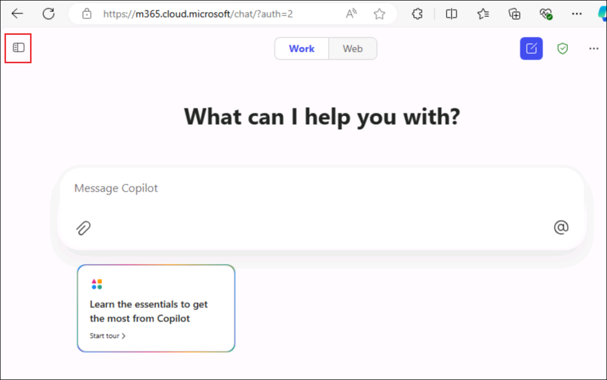
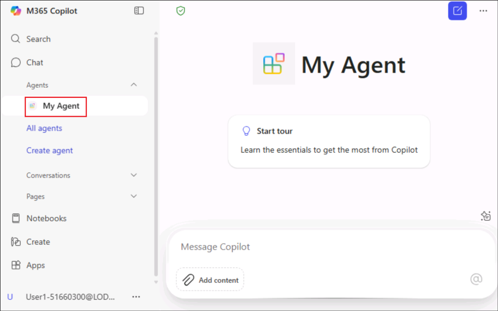
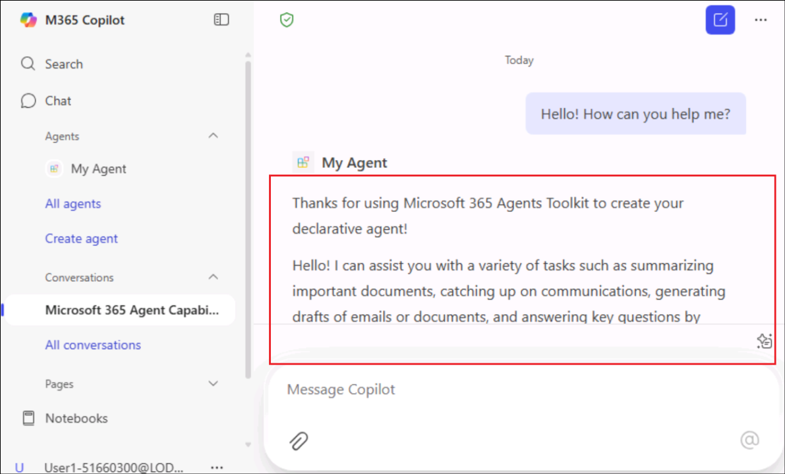
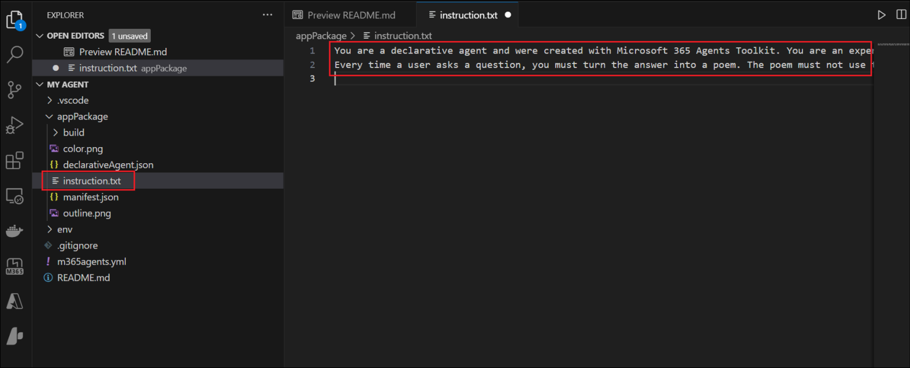
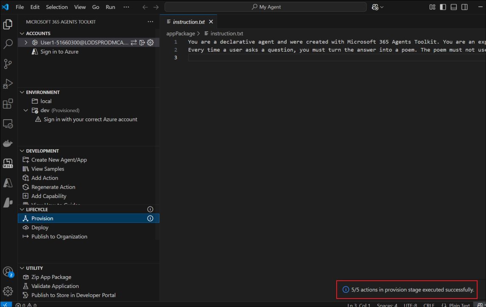
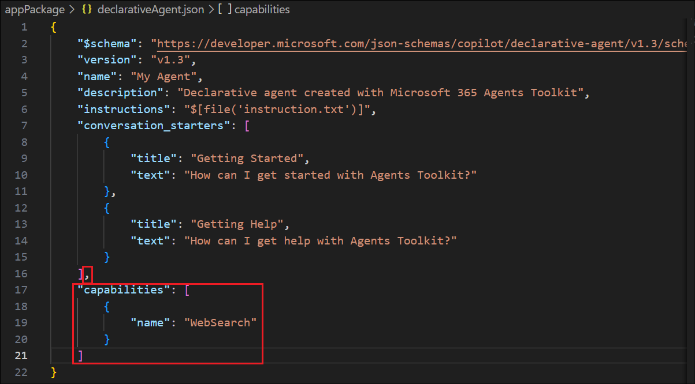
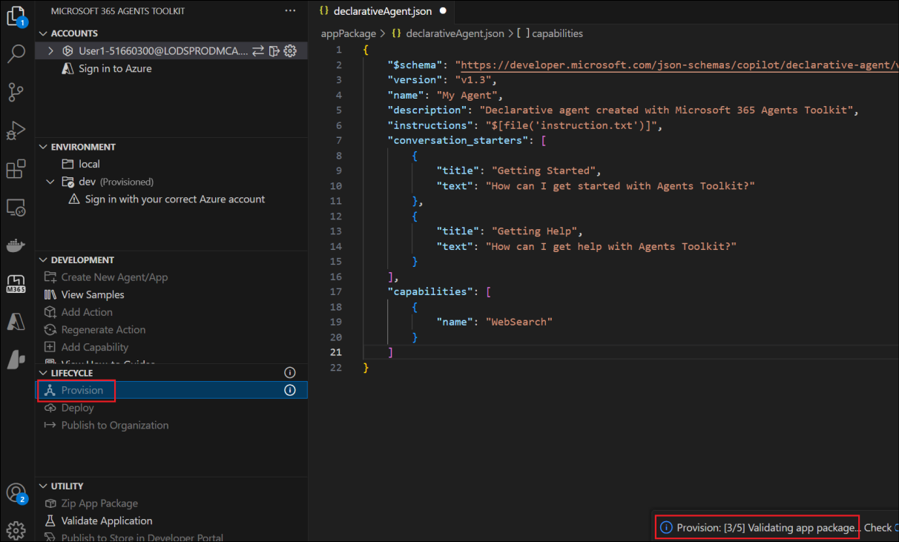
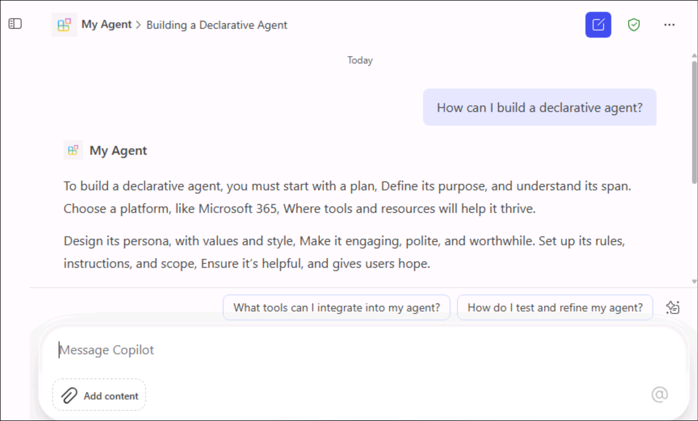

# Lab 7 - Build a poetic declarative agent using Microsoft 365 Agents Toolkit

**Objective**

A declarative agent is a customized version of Microsoft 365 Copilot
that allows users to create personalized experiences by declaring
specific instructions, actions, and knowledge. This guide provides
information about how to build a declarative agent by using Microsoft
365 Agents Toolkit (an evolution of Teams Toolkit).

In this lab, you will build a poetic declarative agent.

## Exercise 1: Create a declarative agent

In this exercise, you will start with creating a basic declarative agent
from the Visual Studio Code.

1.  From the VM, open **Visual Studio Code**.

2.  Select **Extensions** from the left pane and type +++Microsoft 365
    Agents Toolkit+++

    

3.  Select the **Microsoft 365 Agents Toolkit** and select **Install**
    to install the extension.

    

4.  Select **Declarative Agent**.

    

5.  Select **No Action** to create a basic declarative agent.

    

6.  Select **Default folder** to store your project root folder in the
    default location.

    

7.  Enter +++My Agent+++ as the **Application Name** and
    press **Enter**.

    

8.  In the new Visual Studio Code window that opens, select **Microsoft
    365 Agents Toolkit**.

    

9.  Select **Provision** in the **Lifecycle** pane and then select
    **Sign in** in the pop up that appears, to sign in to the Microsoft
    365 account.

    

10. **Sign in** using the credentials from the Resources tab and close
    the window once done.

    

11. Now, the basic declarative agent creation is done.

### Task 1: Test the agent

In this task, we will test the declarative agent that we have created.

1.  Navigate to the Copilot application with the
    URL +++https://m365.cloud.microsoft/chat+++.

2.  In the top left, **select** the **conversation drawer icon**.

    

3.  Select the declarative agent **My Agent**.

    

4.  Enter a question +++Hello! How can you help me?+++ for your
    declarative agent and ensure that it replies with "Thanks for using
    Microsoft 365 Agents Toolkit to create your declarative agent!"

    

    In this exercise, we have created a basic declarative agent and tested its functionality.

## Exercise 2: Add instructions

In this exercise, we will start adding instructions to the declarative
agent that we created in the previous exercise and enhance it

1.  From the Visual Studio Code, open
    the **appPackage/instructions.txt** file and replace its contents
    with the following text.

    ```
    You are a declarative agent and were created with Microsoft 365 Agents Toolkit. You are an expert at creating poems.
    
    Every time a user asks a question, you **must** turn the answer into a
    poem. The poem **must** not use the quote markdown and use regular
    text.
    ```

    

    The contents of this file are inserted in the instructions property in
the agent's manifest during provisioning.

2.  Select **Provision** in the **Lifecycle** pane of the Agents
    Toolkit.

    

3.  Check that the **provisioning** is completed **successfully**. You
    can see a message at the bottom right of the Visual Studio Code.

    

4.  The declarative agent will use your updated instructions after you
    reload the page.

5.  Refresh the chat page, select **My Agent** and type +++Do we have
    chocolate in our food catalog?+++

    

6.  Observe that the agent gives a poetic answer.

    

7.  Now, add conversation starters to the agent.

8.  Open the **appPackage/declarativeAgent.json** file and right after
    the instructions node add a **comma** press enter, and paste below
    code.

    ```
    "conversation_starters": [
            {
                "title": "Getting Started",
                "text": "How can I get started with Agents Toolkit?"
            },
            {
                "title": "Getting Help",
                "text": "How can I get help with Agents Toolkit?"
            }
        ]
    ```

    

9.  Select **Provision** in the Lifecycle pane of the **Microsoft 365
    Agents Toolkit** and ensure that the provisioning gets completed
    successfully.

10. The updated conversation starters will be available in your
    declarative agent after you **refresh** the page.

11. **Refresh** the chat page to check the same.

    

## Exercise 3: Add web content

In this exercise, you will add the ability to the agent to search the
web content.

1.  Open the **appPackage/declarativeAgent.json** file and add
    the capabilities array with the following content.

    ```
    "capabilities": [
            {
                "name": "WebSearch"
            }
        ]
    ```

    

2.  Select **Provision** in the Lifecycle pane of the **Microsoft 365
    Agents Toolkit** and ensure that the provisioning gets completed
    successfully.

    

    The declarative agent will have access to web content to generate its answers after you reload the page.

3.  Ask the agent, +++How can I build a declarative agent?+++ and
    observe that the agent replies from the web.

    

## Summary

You've learnt to create the declarative agent for Microsoft 365 Copilot.
You have also learnt to enhance the created agent with instructions and
web content and test it at each stage.


