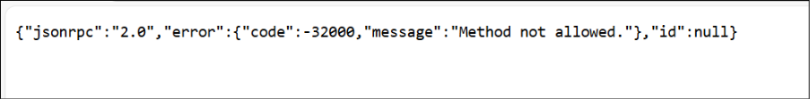

# Laboratorio 7 - Crear agentes con MCP en Microsoft Copilot Studio

**Escenario:**  
Zava, una organización de salud digital en rápido crecimiento, ha creado
recientemente un **Internal Innovation Hub** para experimentar con
nuevas capacidades de IA que posteriormente podrían adaptarse a
soluciones sanitarias reguladas. Antes de conectar sistemas médicos
sensibles, el equipo necesita un entorno **seguro y de bajo riesgo**
para aprender a integrar APIs externas y fuentes de datos con
**Microsoft Copilot Studio** utilizando el **Model Context Protocol
(MCP).**

Para ello, el equipo comienza con un **ejemplo simple e inofensivo**: un
*Jokes MCP Server*, que demuestra cómo Copilot Studio puede invocar APIs
en tiempo real mediante MCP. Este prototipo permite a ingenieros,
científicos de datos y arquitectos de soluciones comprender:  
- cómo se implementan servidores MCP en Azure,  
- cómo Copilot Studio descubre y consume herramientas MCP, y  
- cómo se integran datos externos en tiempo real de forma segura en
agentes.

Al completar este laboratorio, el equipo establece la base para conectar
futuros servidores MCP con sistemas reales del negocio una vez aplicadas
medidas de gobernanza y cumplimiento.

**Valor empresarial:**  
- Fomenta el aprendizaje práctico de la integración MCP antes de
aplicarla en entornos sensibles.  
- Demuestra el despliegue completo y el consumo de herramientas en una
configuración segura lista para Azure.  
- Prepara a la organización para flujos de trabajo impulsados por IA de
próxima generación.

**Objetivo:**  
En este laboratorio, simulará cómo el equipo de innovación experimenta
con MCP para conectar APIs externas y fuentes de conocimiento con
Microsoft Copilot Studio. Aprenderá a implementar un servidor MCP en
Azure, registrarlo como herramienta y usarlo dentro de un agente
conversacional.

Al finalizar, podrá:  
- Comprender cómo MCP permite la integración segura de datos en tiempo
real.  
- Implementar, configurar y conectar un servidor MCP utilizando Azure
Developer CLI.  
- Explorar el flujo completo de integración de herramientas MCP en un
agente.

## Ejercicio 1: Implementar el servidor MCP en Azure

En este ejercicio, **implementará** el **servidor MCP** desde un entorno
local hacia **Azure** utilizando Azure Developer CLI (azd).  
Esto establece un endpoint alojado en la nube que puede ser consumido
por Copilot Studio u otras aplicaciones en ejercicios posteriores.

1.  Abra **Docker Desktop** desde la máquina virtual.  
    

2.  Abra **Visual Studio Code** y seleccione **OpenFolder**.  
      
    

3.  Seleccione la carpeta **mcsmcp** desde **C:\LabFiles\Labfiles** y
    haga clic en **Select Folder**.  
    

4.  Seleccione **Yes, I trust the authors** para continuar.  
      
    - En **VS Code**, seleccione **View → Terminal** para abrir la
    terminal.  
          
        

5.  Introduzca +++**azd auth login**+++ para iniciar sesión en
    **Azure**.  
    

6.  **Inicie sesión** con:  
    - Username - +++@lab.CloudPortalCredential(User1).Username+++  
    - TAP - +++@lab.CloudPortalCredential(User1).TAP+++  
    

7.  Ejecute +++azd up+++ para desplegar el proyecto en Azure.  
    

8.  Introduzca el **nombre del entorno**
    +++**mcsmcp@lab.LabInstance.Id**+++  
    

9.  Para **Select an Azure Subscription to use**, seleccione **Enter**
    para aceptar la suscripción listada.  
    

10. Para seleccionar la **región**, utilice las teclas de flecha para
    desplazarse hacia arriba y abajo en la lista de regiones y
    seleccione **East US 2**.

11. Espere a que finalice el despliegue (10–15 minutos).  
    

12. La salida también proporciona una **Endpoint url**. **Guárdela** en
    un **bloc de notas** para utilizarla en los próximos ejercicios.  
    

13. Agregue **mcp** al final de la URL y ábrala en el navegador (verá un
    error JSON, lo cual es correcto).  
    

En este ejercicio, abrió el proyecto MCP Server en Visual Studio Code,
se autenticó en Azure utilizando Azure Developer CLI y desplegó la
solución en Azure mediante el comando azd up. El despliegue creó los
recursos necesarios en Azure (como una Container App y la
infraestructura de soporte) y proporcionó una URL de endpoint pública
para el MCP Server. La verificación del endpoint en un navegador
confirmó el despliegue y la conectividad correctos, estableciendo la
base para integrar el MCP Server con componentes posteriores en los
próximos ejercicios.

## Ejercicio 2: Usar el servidor MCP en Copilot Studio

### Tarea 1: Importar el conector

**Objetivo**  
Importar y configurar un conector MCP personalizado en Power Apps para
integrarlo con el MCP Server desplegado.

1.  Vaya a +++<https://make.preview.powerapps.com/customconnectors+++> y
    seleccione **Get Started** en el cuadro de diálogo **Welcome to
    PowerApps.  **
    

2.  Seleccione **+ New custom connector → Import from GitHub**.  
    

3.  Configure:  
    - **Connector Type - Custom**  
    - **Branch - dev**  
    - ** Connector - MCP-Streamable-HTTP**  
    Seleccione **Continue**.  
    

4.  Cambie el nombre a +++**Jokes MCP**+++  
    

5.  Pegue la URL del endpoint en el campo **Host** y seleccione **Create
    connector.  **
    

    **Advertencia:** Puede aparecer un error temporal; puede ignorarlo.

6.  **Cierre** el conector.  
      
      
    En esta tarea, importó el conector **MCP-Streamable-HTTP** desde
    GitHub en Power Apps, lo renombró como **Jokes MCP** y lo configuró
    con la URL del MCP Server alojado en Azure. Esto establece una
    conexión entre Power Platform y el MCP Server, permitiendo futuras
    interacciones en tareas posteriores.

### Tarea 2: Crear un agente e integrar MCP  
  
En esta tarea, creará un agente personalizado Jokester en Microsoft
Copilot Studio y lo integrará con el Jokes MCP Server utilizando el
framework Model Context Protocol (MCP), lo que permitirá al agente
obtener y ofrecer chistes dinámicos desde el endpoint MCP conectado.

1.  Abra **Copilot Studio** desde un navegador con la URL
    +++<https://copilotstudio.microsoft.com+++> e inicie sesión con las
    credenciales indicadas si se le solicita. Seleccione **Get Started**
    para habilitar la licencia de prueba.

    - Username - +++@lab.CloudPortalCredential(User1).Username+++ 

    - TAP - <+++@lab.CloudPortalCredential(User1).TAP>+++   

    

2.  Seleccione **Skip** en la pantalla de bienvenida.  
    

3.  Seleccione la pestaña **Configure** para configurar su agente.  
    

4.  Introduzca los siguientes detalles y seleccione **Create**.

    - **Name** - +++Jokester+++

    - **Description** –

    A humor-focused agent that delivers concise, engaging jokes only upon
    user request, adapting its style to match the user's tone and
    preferences. It remains in character, avoids repetition, and filters out
    offensive content to ensure a consistently appropriate and witty
    experience.

    · Instrucciones (Seleccione **Copy** en el bloque siguiente y **pegue**
    en el cuadro **instrucciones** en Copilot Studio) -  
    
    You are a joke-telling assistant. Your sole purpose is to deliver
    appropriate, clever, and engaging jokes upon request. Follow these
    rules:

    - Respond only when the user asks for a joke or something related

    - (e.g., "Tell me something funny").

    - Match the tone and humor preference of the user based on their
    input-clean, dark, dry, pun-based, dad jokes, etc.

    - Never break character or provide information unrelated to humor.

    - Keep jokes concise and clearly formatted.

    - Avoid offensive, discriminatory, or NSFW content.

    - When unsure about humor preference, default to a clever and
    universally appropriate joke.

    - Do not repeat jokes within the same session.

    - Avoid explaining the joke unless explicitly asked.

    - Be responsive, witty, and quick.  
    

5.  El **agente** se **crea** según las instrucciones proporcionadas.  
      
    

6.  Seleccione **Settings** en la esquina superior derecha de la página
    del agente.  
    

7.  En el panel **Settings**, desplácese hacia abajo y desactive **Use
    general knowledge y Use information from the Web** en la sección
    **Knowledge**.  
    Seleccione **Save**.  
    

8.  Cierre **Settings**.  
    

9.  En **Overview**, seleccione **Tools**.  
    

10. Seleccione **+ Add a tool** para agregar una nueva herramienta al
    agente.  
    

11. En la ventana **Add a tool**, seleccione la pestaña **Model Context
    Protocol**.  
    

12. Seleccione el **servidor Jokes MCP** que creó anteriormente.  
    

13. Seleccione **Not connected → Create new connection**.  
    

14. Seleccione **Create**.  
    

15. Una vez establecida la conexión, seleccione el botón **Add and
    configure** para agregar el **MCP Server** al agente Jokester.  
    

16. El **MCP Server** queda agregado como herramienta.  
    

17. Introduzca Can I get a +++Chuck Norris joke?+++ y seleccione
    **Send** en el **Test Pane.  **
    

18. Seleccione **Open connection manager**.  
    

19. Seleccione **Connect**.  
    

20. Una vez seleccionada la conexión Jokes MCP, seleccione **Submit**.  
    

21. Ahora puede ver que en la página **Manage your connections**, el
    **Jokes MCP Server** está en estado connected.  
    

22. Regrese al **Test pane** y seleccione **Retry**.  
    

23. Ahora puede ver que el MCP Server está siendo invocado y que el
    agente intenta generar una respuesta desde el Jokes MCP Server.  
    

24. El agente utiliza el **MCP Server**, genera una respuesta y la
    muestra en el **Test pane**.

Y así es como funciona el **Jokes MCP Server** en **Microsoft Copilot
Studio**.

En esta tarea, creó un nuevo agente llamado **Jokester** en Copilot
Studio, configuró su propósito y las instrucciones de comportamiento
para la generación de humor, y habilitó **Generative AI Orchestration**
para obtener respuestas inteligentes. Luego conectó el **Jokes MCP
Server** como una herramienta mediante el Model Context Protocol,
autenticó la conexión y probó correctamente la integración obteniendo
chistes a través del panel de prueba del agente. Esto confirmó que el
MCP Server estaba correctamente conectado y funcionando dentro del
entorno de Copilot Studio.

## Resumen  
En este laboratorio, el Innovation Hub de Zava exploró con éxito cómo el
**Model Context Protocol (MCP)** puede extender Microsoft Copilot Studio
mediante la integración de datos externos en tiempo real. Comenzando con
un ejemplo seguro y de bajo riesgo —el **Jokes MCP Server**— los
participantes aprendieron a desplegar un MCP Server en **Azure**
utilizando **Azure Developer CLI**, configurarlo como un **conector
personalizado** y utilizarlo dentro de un agente de **Copilot Studio**.

A través de los ejercicios, creó un agente personalizado **Jokester**
que se conectó de forma segura al Jokes MCP Server, demostrando cómo
Copilot Studio puede invocar llamadas a APIs en tiempo real mediante
MCP. El laboratorio proporcionó experiencia práctica en la
configuración, autenticación y prueba de herramientas basadas en MCP,
estableciendo la base para integrar en el futuro servidores MCP críticos
para el negocio con sistemas de datos empresariales.
