# Laboratorio 8 – Optimización de las operaciones de soporte técnico de IT con un agente autónomo mediante Copilot Studio

**Tiempo estimado: 60 minutos**

## Objetivo

El objetivo de este laboratorio es permitir que los participantes
optimicen las operaciones de soporte técnico de TI en Contoso Solutions
mediante la creación de un agente autónomo. Los participantes aprenderán
a configurar Microsoft Copilot Studio, a establecer el Agente de Soporte
de TI, a integrar Power Apps y Dataverse, a mejorar las capacidades del
agente mediante una base de conocimientos, y a automatizar la creación
de tickets utilizando Power Automate. Este laboratorio práctico
proporcionará a los usuarios las habilidades necesarias para mejorar los
flujos de trabajo de IT, reducir el esfuerzo manual y aumentar la
eficiencia del soporte técnico.

## Solución

Participants will create a customized Contoso IT Support Agent using
Microsoft Copilot Studio, configure it to handle common IT issues, and
integrate it with Dataverse for storing support data. They will set up a
development environment, add knowledge sources, and refine the agent's
conversation flows for better user interaction. By leveraging Power
Apps, participants will create a Dataverse table to manage IT support
records. Using Power Automate, they will automate ticket creation and
email notifications for unresolved issues. Finally, participants will
test the agent to validate its troubleshooting accuracy and workflow
automation, ensuring seamless IT support operations.

## Ejercicio 1: Introducción a Power Apps

Este ejercicio introduce a los participantes en Power Apps y Dataverse.
El objetivo es iniciar sesión en Power Apps, configurar un entorno de
trabajo y crear una tabla de Dataverse importando datos desde un archivo
de Excel. Los participantes aprenderán habilidades esenciales para
trabajar con aplicaciones basadas en datos.

### Tarea 1: Iniciar sesión en Power Apps

1.  Vaya al sitio web de Power Apps en
    +++<https://www.microsoft.com/en-us/power-platform/products/power-apps+++%C2%A0and> y
    haga clic en el botón **Try for Free**.

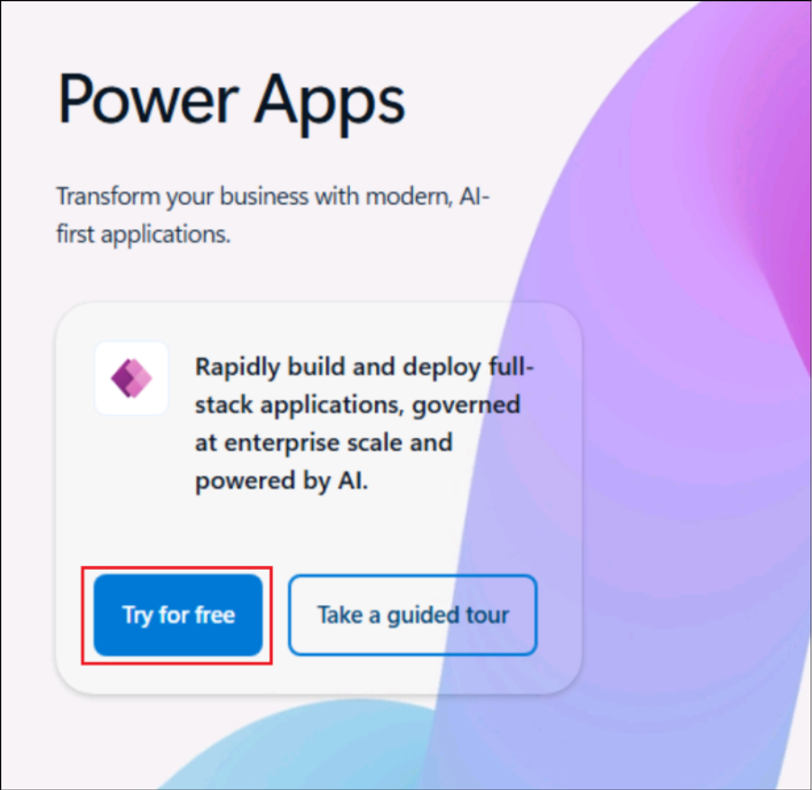

2.  Ingrese el **nombre de usuario** proporcionado en la pestaña
    **Resources** en el campo de correo electrónico, seleccione la
    **casilla de verificación** y haga clic en el botón **Start free**.

> 

3.  Seleccione **Get Started**.

### Tarea 2: Crear un grupo de seguridad en Entra ID y configurar a los autores de Copilot Studio

1.  Vaya al portal de Azure en
    +++<https://portal.azure.com/+++%C2%A0and> e inicie sesión con las
    credenciales del tenant que se encuentran en la pestaña Resources.

> 

2.  Seleccione **Next** en la ventana **Keep your account secure** y
    siga los **prompts** que aparecen en pantalla.

3.  Descargue la aplicación Authenticator en su teléfono si aún no la
    tiene instalada.

4.  Siga los prompts y complete la configuración.

> 

5.  En la pantalla de bienvenida de Azure, seleccione **Get Started**.

6.  Busque y seleccione +++Microsoft EntraID+++.

7.  En el panel izquierdo, seleccione **Manage** -\> **Groups**.

8.  Seleccione **New group** para crear un nuevo grupo de seguridad.

9.  Ingrese los siguientes detalles:

    - Group type – Select **Security**

    - Group name – Enter +++**copilotagentsecurity**+++

    - Microsoft Entra roles can be assigned to the group –
      Seleccione **Yes** (Si esta opción no está visible, ignore este
      paso)

10. Seleccione **No owners selected**, luego seleccione **MOD
    Administrator** desde la página **Add owners** y haga clic
    en **Select**.

11. Del mismo modo, seleccione **No members selected**, agregue **MOD
    Administrator** desde la lista y haga clic en **Select**.

12. Seleccione **No roles selected**. Si esta opción no aparece, ignore
    este paso y el siguiente.

13. Busque y seleccione +++**Global admin**+++ y seleccione **Select**.

14. Seleccione **Create** una vez que se hayan agregado todos los
    detalles y, en el cuadro de confirmación, seleccione **Yes**.

15. Verifique que aparezca un **mensaje de éxito** confirmando que el
    grupo se ha creado correctamente.

16. Seleccione Contoso|Groups en la esquina superior izquierda.

> 

17. En el panel izquierdo, debajo de **Manage**, seleccione
    **Properties**.

> 

18. Active la opción Yes en **Can manage access to all Azure
    subscriptions and management groups in this tenant** y luego
    seleccione **Save**.

> 

19. En el panel izquierdo, debajo de **Manage**, seleccione **Roles and
    administrators**.

> 

20. Busque +++privileged role admin+++ y seleccione el rol **Privileged
    Role Administrator**.

> 

21. Seleccione **+ Add assignments**.

> 

22. Seleccione el **ID** **MOD Administrator** y seleccione **Add**.

> 

23. En una nueva pestaña, navegue a
    +++<https://admin.powerplatform.microsoft.com/+++>. En el panel
    izquierdo, seleccione **Manage** y luego haga clic en **Tenant
    Settings**.

24. Seleccione **Copilot Studio Authors** de la lista disponible.

25. Haga clic en el **icono de edición (Edit)** para modificar la
    configuración.

26. Busque y seleccione el grupo **+++copilotagentsecurity+++** que creó
    anteriormente.

27. Seleccione **Save** para guardar la configuración.

### Tarea 3: Actualizar la configuración del entorno de desarrollo

1.  Inicie sesión en el centro de administración de Power Platform en
    +++<https://admin.powerplatform.microsoft.com/home+++> utilizando
    sus credenciales de inicio de sesión.

2.  Seleccione **Manage** -\> **Environments** -\> **Dev One**.

> 

3.  Seleccione **Settings**.

> 

4.  Seleccione **Product -\> Features**.

5.  En la sección **Features**, asegúrese de que **Dataverse
    search** esté establecido en On. De lo contrario, actívelo.

6.  Desplácese hacia abajo, habilite la opción **Single table search** y
    luego seleccione **Save**.

### Tarea 4: Configurar una tabla de Dataverse

1.  En la página de Power Apps, seleccione el entorno **Dev One** desde
    la esquina superior derecha.

2.  En la barra de navegación izquierda, seleccione **Tables.** En la
    barra superior de la sección de tablas, haga clic en **+ New
    table** y luego seleccione **Create new tables**.

3.  Seleccione la opción **Import an Excel file or CSV** para crear una
    nueva tabla.

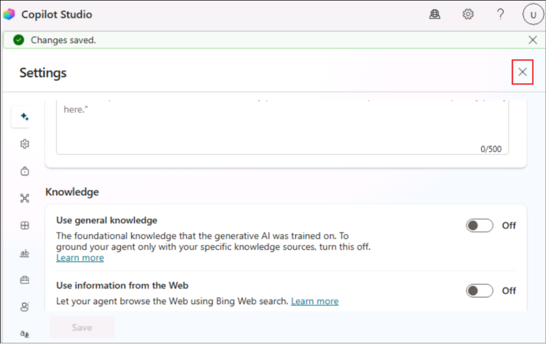

4.  Haga clic en la opción **Select form device** y seleccione el
    archive de Excel **Support Ticket** ubicado en la
    carpeta **C:\Autonomous agent\LabFiles**.

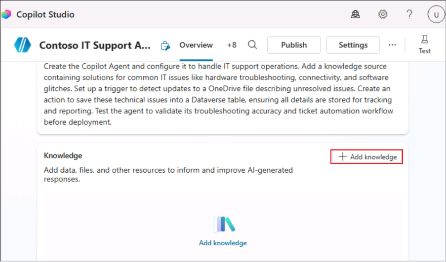

5.  Seleccione **Import** en la siguiente pantalla.

6.  Seleccione la tabla y haga clic en **View data** para visualizar el
    contenido de la tabla.

\[!Nota\] **Nota:** En este caso, la tabla se llama *Employee Technical
Support Record*. El nombre puede variar en cada ejecución. Guarde el
nombre de la tabla para futuras referencias. Los nombres de las columnas
también pueden variar según la ejecución.

7.  Vaya a los datos de la tabla, seleccione el menú desplegable junto
    al campo **Technical Issue Description**, seleccione **Edit
    column**, establezca el tipo de datos como **Text → Multiple line →
    Plain Text**, y haga clic en **Update**. El nombre de la columna
    puede variar en cada caso.

\[!Nota\] **Nota:** El **nombre de la columna puede variar
ligeramente**, pero será algo similar a issue description, ya que fue
generado por Copilot.

> 

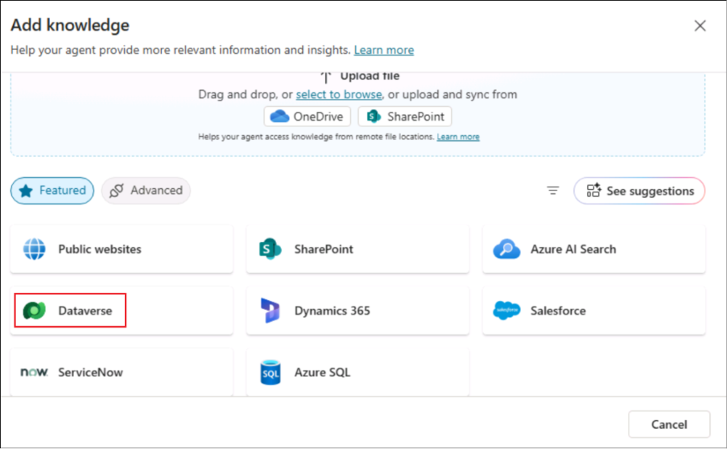

8.  Seleccione el menú desplegable junto al campo **Current Status**,
    seleccione **Edit column** y configure las opciones (choices) como:
    +++**Unresolved**+++, +++**Resolved**+++, +++**Processing**+++.
    Establezca la opción predeterminada (Default choice) como
    **Unresolved** y haga clic en **Update**.

9.  En la parte superior derecha, haga clic en **Save and exit** para
    guardar la tabla.

### Tarea 5: Agregar un archive a OneDrive

1.  En la parte superior izquierda de la página de Power Apps,
    seleccione el menú y luego seleccione OneDrive.

2.  Haga clic en el botón **-\>** para continuar.

3.  Seleccione **My files** -\> **+ create or upload**.

> 

4.  Seleccione **Files upload**.

5.  Seleccione **IT Support.xlsx** desde **C:\LabFiles**.

6.  Este archivo se utilizará en un ejercicio posterior.

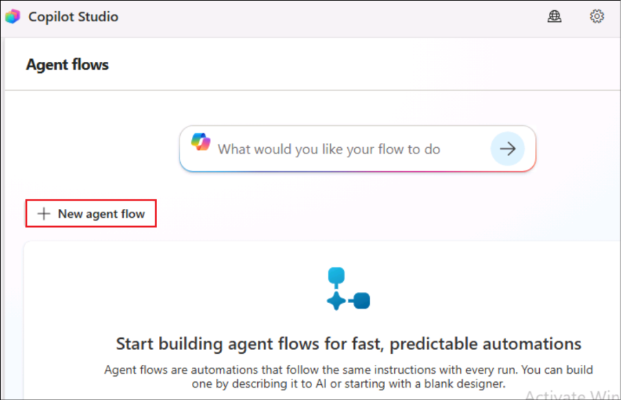

**Conclusión**

Al completar este ejercicio, los participantes aprenderán:

- Cómo acceder y navegar por Power Apps utilizando las credenciales del
  tenant de administrador de Office 365.

- Los pasos para crear y configurar una tabla de Dataverse mediante la
  importación de datos.

- Conocimientos prácticos sobre cómo configurar un entorno que respalde
  los flujos de trabajo de desarrollo de aplicaciones.

## Ejercicio 2: Creación del agente de soporte técnico de Contoso

Este ejercicio se centra en iniciar sesión en Microsoft Copilot Studio y
crear un agente personalizado diseñado para las operaciones de soporte
técnico de Contoso. Los participantes obtendrán experiencia práctica
navegando en Copilot Studio, configurando entornos y creando un agente
con inteligencia artificial que optimice los flujos de trabajo de IT.

### Tarea 1: Creación y configuración del agente de soporte técnico de Contoso

1.  Inicie sesión en
    +++[https://copilotstudio.microsoft.com+++](https://copilotstudio.microsoft.com+++/) utilizando
    sus credenciales de inicio de sesión.

2.  En la sección de inicio de Copilot Studio, desde la parte superior
    derecha, seleccione el **entorno** y seleccione el entorno
    **DevOne**.

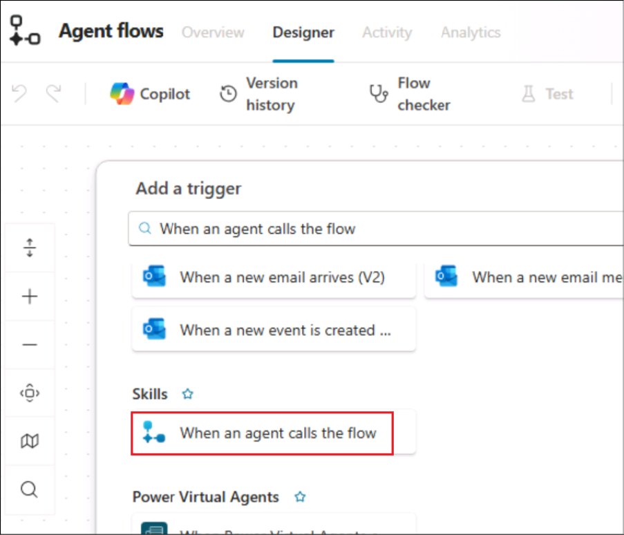

\[!Alerta\] **Importante:** Si en **Copilot Studio** no aparece la
opción para seleccionar un **entorno**, como se muestra en la captura de
pantalla a continuación, siga los pasos indicados a continuación.

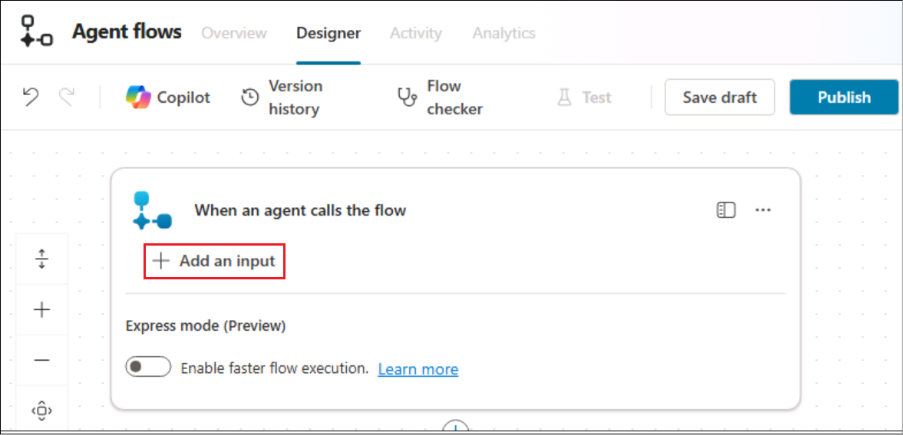

Abra +++<https://admin.powerplatform.microsoft.com/+++>.
Seleccione **Manage** -\> **Environments** -\> **Dev env** y seleccione
el valor del **Environment ID**.

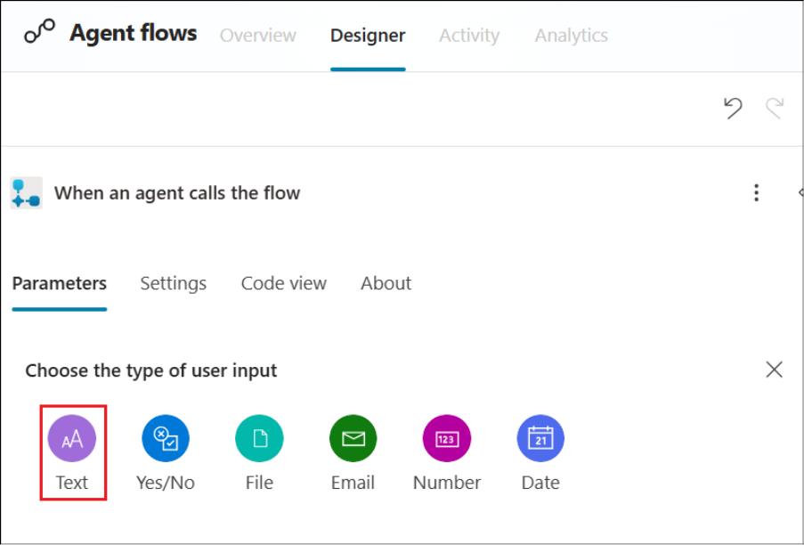

Regrese a la pestaña de **Copilot Studio** y abra el siguiente enlace:
+++<https://copilotstudio.microsoft.com/environments/>\< EnvironmentID
\>+++ (Reemplace **\< EnvironmentID \>** con el valor obtenido en el
paso anterior)

3.  En la pestaña de bienvenida de Copilot Studio, haga clic en **Skip**
    para continuar.

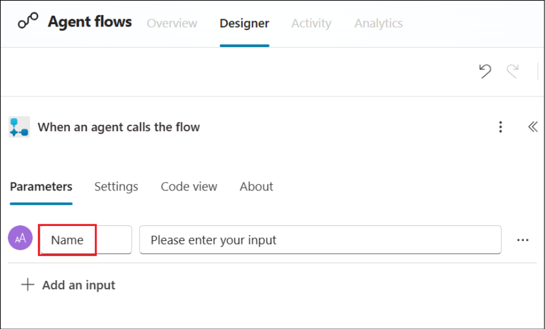

4.  Seleccione Agents -\> + New agent.

> 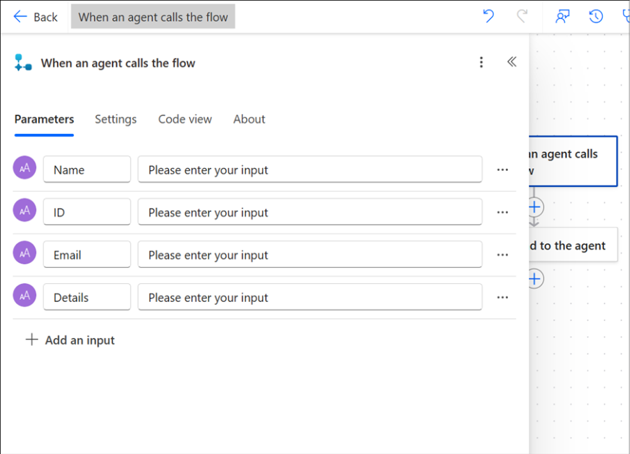

5.  Seleccione la pestaña **Configure**.

> 

6.  Ingrese el **nombre**, **descripción** e **instrucciones** del
    agente según se indican a continuación y haga clic en el botón
    **Create**.

> **Name:** +++Contoso IT Support Agent+++
>
> **Description**: +++Create a Contoso IT Support Agent which transforms
> IT support at Contoso Solutions by providing instant troubleshooting
> for common issues, automating ticket creation for unresolved problems,
> and storing all interactions in Dataverse. This solution enhances
> response times, reduces manual workloads, and boosts employee
> productivity.+++
>
> **Instruction**: +++Create the agent and configure it to handle IT
> support operations. Add a knowledge source containing solutions for
> common IT issues like hardware troubleshooting, connectivity, and
> software glitches. Set up a trigger to detect updates to a OneDrive
> file describing unresolved issues. Create an action to save these
> technical issues into a Dataverse table, ensuring all details are
> stored for tracking and reporting. Test the agent to validate its
> troubleshooting accuracy and ticket automation workflow before
> deployment.+++

7.  En la página de Overview del Contoso IT Support Agent, **habilite**
    la opción Orchestrator para el agente.

8.  Desde la esquina superior derecha del agente, haga clic en el botón
    **Settings**.

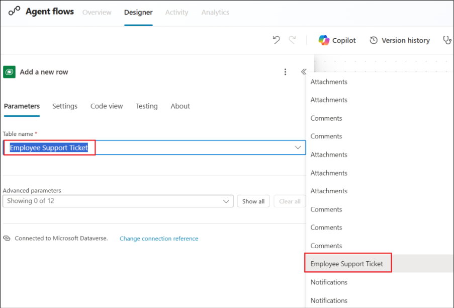

9.  Luego, vaya a la sección **Generative AI**, asegúrese de que la
    opción **Yes** esté seleccionada en **Use generative AI
    orchestration for your agent’s responses?**. Desplácese hacia abajo,
    **deshabilite** la opción **Use general knowledge** y haga clic en
    **Save**.

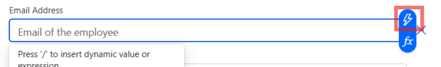

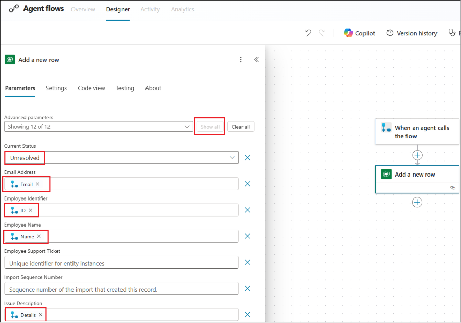

10. Una vez **guardados** los cambios, **cierre** el panel de Settings.

**Conclusión**

Al completar este ejercicio, los participantes aprenderán:

- Cómo acceder y configurar Microsoft Copilot Studio.

- Los pasos para crear y configurar un agente personalizado.

- Habilidades prácticas para habilitar la orquestación y la inteligencia
  artificial generativa del agente.

- Formas de mejorar las operaciones de IT automatizando la creación de
  tickets y aprovechando la IA para la resolución de problemas.

## Ejercicio 3: Mejora de las capacidades del agente

Este ejercicio se centra en mejorar las capacidades del Contoso IT
Support Agent mediante la adición de una base de conocimiento y la
personalización de los temas del agente para optimizar la interacción.
Los participantes refinarán las respuestas del agente y asegurarán que
este brinde asistencia efectiva a los usuarios en tareas de resolución
de problemas y escalamiento.

### Tarea 1: Agregar base de conocimiento

1.  En la página de resumen del agente Contoso, desplácese hacia abajo y
    haga clic en el botón **+ Add Knowledge**.

2.  Seleccione **Upload file** para agregar el archivo del
    laboratorio **Contoso Common IT Issue.docx** desde la
    carpeta **C:\Autonomous agent\LabFiles**, y luego haga clic
    en **Add** para guardar el archivo.

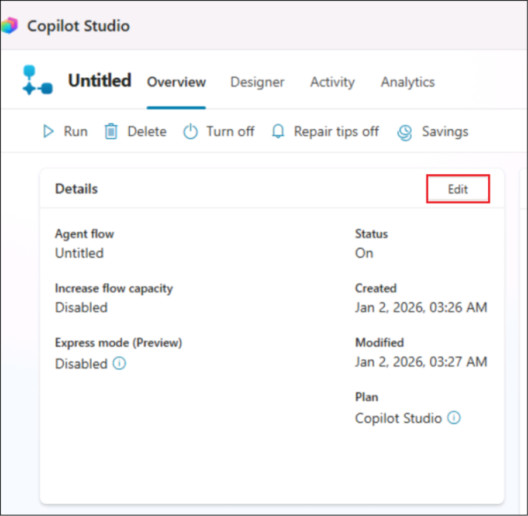

3.  Nuevamente, vaya a la página de resumen del agente, desplácese hacia
    abajo y haga clic en **+ Add knowledge.**

4.  Seleccione la opción **Dataverse (preview)** como origen de datos.

5.  En la barra de búsqueda ubicada en la esquina superior derecha,
    escriba y busque **Employee**, luego seleccione la tabla **Employee
    Technical Support Record**. Después, haga clic en **Next**,
    nuevamente en **Next**, y finalmente en **Add** para añadir la
    fuente de conocimiento.

\[!Nota\] **Nota:** El **nombre de la tabla puede ser diferente** en su
caso, ya que fue generado por Copilot.

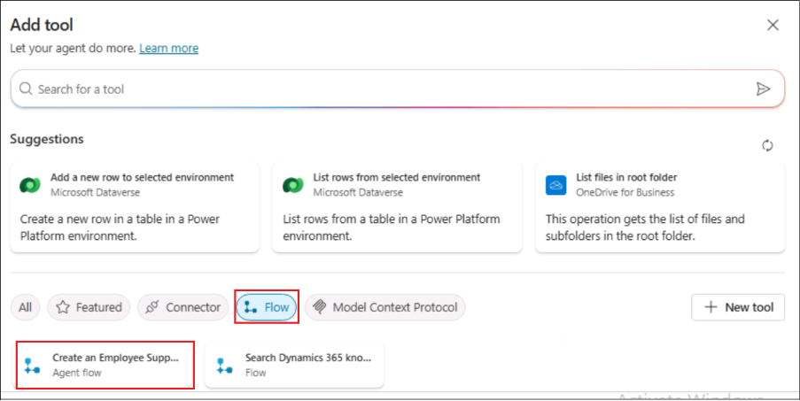

\>\[!Alert\] \*\*Importante:\*\* Desde la página Knowledge, asegúrese de
que la fuente de conocimiento agregada se haya cargado correctamente.
Este proceso suele tardar entre **10 y 15 minutos** en completarse.

### Tarea 2: Personalizar el tema de inicio de conversación

1.  En la barra superior, haga clic en **Topics**, seleccione **System**
    y luego haga clic para abrir el tema **Conversation Start**.

2.  Desplácese hacia abajo hasta el nodo de mensaje. Actualice el
    mensaje después del nombre del agente según se indica a
    continuación:

Hello. I’m Bot Name, a virtual assistant. +++How can I help you?+++

3.  En la parte superior, haga clic en **Save** para guardar el tema.

### Tarea 3: Actualizar el tema de respaldo (Fallback Topic)

1.  En la barra superior, haga clic en **Topics** y luego abra el tema
    **Fallback**.

2.  Desplácese hacia abajo hasta el nodo de mensaje y actualice el
    mensaje según se indica a continuación:

+++I’m sorry. This information is not available in my system. You can
raise the support ticket via mail for this issue.+++

3.  En la parte superior derecha, haga clic en el botón **Save** para
    guardar el tema.

**Conclusión**

Al completar este ejercicio, los participantes aprenderán:

- Cómo cargar e integrar una base de conocimiento para mejorar la
  funcionalidad del agente.

- Los pasos para personalizar los mensajes de inicio de conversación y
  ofrecer una experiencia de usuario más atractiva.

- Técnicas para actualizar las respuestas de respaldo y gestionar de
  mejor manera las consultas no compatibles.

## Ejercicio 4: Probar el agente

Este ejercicio guía a los participantes en la prueba del agente de
soporte de IT de Contoso para validar su funcionalidad. Los
participantes comprobarán cómo el agente maneja los prompts utilizando
la base de conocimiento y los temas de respaldo, asegurando una
interacción y una escalación sin inconvenientes.

1.  En la esquina superior derecha, haga clic en el botón **Test**.

2.  Ingrese el prompt +++**My printer is not working how to fix it**+++.
    El agente proporcionará la solución según la fuente de conocimiento.

3.  Nuevamente, ingrese el prompt +++**Two factor Authentication (2FA)
    issue**+++ .

4.  El problema de 2FA y su solución no están disponibles en la fuente
    de conocimiento, por lo que el agente pasará al tema de respaldo
    (fallback topic) y mostrará un prompt relacionado con Raise Ticket
    (Generar un ticket*)*.

**Conclusión**

Al completar este ejercicio, los participantes aprenderán:

- Cómo probar y activar un agente de IA para la resolución de problemas.

- Cómo validar la capacidad del agente para responder utilizando su base
  de conocimiento.

- Cómo los temas de respaldo gestionan consultas no compatibles y
  redirigen eficazmente a los usuarios.

## Ejercicio 5: Automatización de la creación de tickets de soporte con Power Automate

Este ejercicio demuestra cómo automatizar la creación de tickets de
soporte mediante AgentFlow e integrarlo con el IT Support Agent de
Contoso.  
Los participantes crearán un flujo que optimiza el proceso de registro
de incidencias y guarda los datos en Dataverse.

1.  Desde la barra de menú izquierda del agente, seleccione **Flows**.

2.  Seleccione **+ New agent flow**.

3.  Seleccione **Add a trigger** y luego seleccione el
    desencadenador **When an agent calls the flow**.

4.  Seleccione el desencadenador agregado, **When an agent calls the
    flow** y luego seleccione **Add an Input**.

5.  Seleccione **Text** como tipo de dato de la entrada y cambie el
    nombre de la entrada a +++**Name**+++.

6.  Siga el mismo procedimiento para crear más entradas según los
    siguientes detalles:

[TABLE]

7.  El nodo ahora debería verse de la siguiente manera.

8.  Debajo de **When an agent calls the flow**, haga clic en el
    signo **(+)** y seleccione **Add an action**.

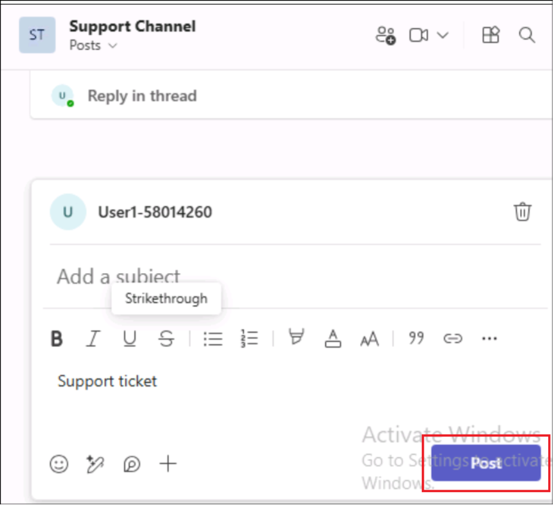

9.  En la barra de búsqueda de Add an action, escriba +++**Add a new
    row**+++ . Luego seleccione **Add a new row** en la sección
    Microsoft Dataverse.

\[!nota\] **Nota:** En algunos casos, la conexión con **Dataverse** no
se crea automáticamente. Es posible que deba **iniciar sesión**
nuevamente con sus credenciales mediante autenticación **OAuth**,
ingrese el nombre de la conexión (Connection name) como +++Dataverse+++.

10. En la sección **Table Name**, busque y seleccione +++**Employee
    Support Ticket**+++ (o el nombre correspondiente de la tabla que
    creó).

11. Debajo del nombre de la tabla, seleccione **Show all**, luego haga
    clic en el campo correspondiente y agregue la **entrada** utilizando
    el botón de **contenido dinámico (icono de rayo)** según la
    siguiente tabla.

Establezca el campo **Current Status** en **Unresolved**.

[TABLE]

12. Debajo de la acción Add a new row, haga clic en el signo (+) y
    seleccione **Add an action**.

13. En la sección Add an action, escriba +++**Send an email**+++ en la
    barra de búsqueda y seleccione **Send an email (V2)** de la sección
    Office 365 Outlook.

14. En la sección Send an email, ingrese los siguientes detalles en los
    campos correspondientes:

> Reemplace los marcadores para **Name**, **ID**, **Details** con las
> variables correspondientes utilizando contenido dinámico
>
> **To**
>
> Ingrese el correo electrónico del ingeniero de soporte (puede usar
> cualquier dirección de correo; el agente enviará el correo allí cuando
> se genere un ticket de soporte)
>
> **Subject**
>
> +++New Technical Support Ticket Raised +++
>
> **Body**
>
> A new technical support ticket has been raised and requires your
> attention. Please find details below:
>
> Employee Name: \< Name \>
>
> Employee ID: \< ID \>
>
> Technical Issue: \< Details \>
>
> Thank you for your prompt attention to this matter.'
>
> Best Regards

15. Guarde y publique el flujo seleccionando **Save** y luego
    **Publish**.

16. En la barra superior, haga clic en **Save draft** y luego seleccione
    **Publish**.

17. Seleccione la pestaña **Overview** y luego haga clic en **Edit**
    dentro del flujo.

18. Asigne al flujo el nombre como +++**Create an Employee Support
    Ticket**+++ y seleccione **Save**.

19. Desde la página **Contoso IT Support Agent** **Overview**,
    seleccione **+ Add tool**.

20. Seleccione **Flow** -\> **Create an Employee Support Ticket** Agent
    flow.

21. Haga clic en **Add and configure**.

22. Seleccione la sección **Inputs**.

23. Seleccione **Custom value** en **Fill using**.

24. Ingrese el valor para cada campo según la siguiente tabla y haga
    clic en el botón **Save**.

[TABLE]

> 
>
> 
>
> **Conclusión**
>
> Al completar este ejercicio, los participantes aprenderán:

- Cómo integrar Agent Flows con un agente para la creación de tickets.

- Los pasos para recopilar y asignar datos de entrada dinámicamente a
  partir de interacciones del usuario.

- Técnicas para automatizar notificaciones por correo electrónico en la
  escalación de incidencias técnicas.

- La capacidad de configurar flujos de trabajo eficientes para la
  gestión de tickets de soporte.

## Ejercicio 6: Configuración de un desencadenador basado en correo electrónico para acciones automatizadas

Esta continuación de la automatización de la creación de tickets de
soporte se centra en configurar un desencadenador en el IT Support Agent
de Contoso para vincular las entradas de correo electrónico con el flujo
automatizado de Power Automate. Los participantes configurarán los
desencadenadores (triggers) y finalizarán la preparación del agente para
su implementación.

1.  Vaya a la página **Overview** del agente, desplácese hacia abajo y
    haga clic en **+ Add** en la sección **Triggers and Channels**.

2.  En la ventana Add trigger, seleccione el desencadenador **When a new
    email arrives (V3)**.

3.  Después de que se establezca correctamente la conexión entre Copilot
    y Outlook, y aparezca una marca verde, haga clic en el botón
    **Next**.

4.  En el campo Folder**,** seleccione el icono de carpeta, seleccione
    la carpeta **Inbox** y luego haga clic en **Create trigger**.

5.  Cierre la ventana emergente **Time to test your trigger**. En la
    página de Overview del agente, desplácese hacia abajo hasta la
    sección Triggers, haga clic en los tres puntos **(…)** y seleccione
    **Edit in Power Automate**.

6.  Haga clic derecho en el desencadenador When a new email arrives y
    seleccione **Delete**.

7.  Luego haga clic en Add a trigger, busque +++**When new email
    arrives**+++ y seleccione el desencadenador **When a new email
    arrives** de la sección **Office 365 outlook**.

8.  Haga clic en **Send a prompt to the specified copilot for
    processing**, en el campo Body/Message, ingrese el siguiente prompt:
    +++**Run Create an Employee Support Ticket flow and use content from
    Body From.**+++ Reemplace **Body** y **From** por las variables de
    contenido dinámico correspondientes.

9.  Guarde el flujo y publíquelo seleccionando **Save** y luego
    **Publish**, cierre la ventana de Power Automate y regrese a Copilot
    Studio.

10. Vaya a la sección Overview y, en la esquina superior derecha, haga
    clic en **Publish**. Luego, vuelva a hacer clic en **Publish** para
    publicar el Copilot.

## Ejercicio 7: Probar el agente

Este ejercicio se centra en probar la integración del IT Support Agent
de Contoso con Power Automate y Outlook. Los participantes verificarán
la capacidad del agente para procesar correos electrónicos, crear
tickets de soporte y activar flujos de trabajo automatizados de manera
efectiva.

1.  Vaya a la página **Overview** del agente, desplácese hacia abajo,
    haga clic en los tres puntos **(…)** del desencadenador (trigger) y
    seleccione **Edit in Power Automate**.

2.  Esto lo redirigirá al flujo de Power Automate. En la barra superior,
    haga clic en el botón **Test**, seleccione **Manually** y luego
    vuelva a hacer clic en **Test**.

3.  **Envíe un correo electrónico** al mail id del tenant de
    administrador de 365 desde cualquier otro buzón para **desencadenar
    la acción**. El correo debe describir un problema y debe incluir sus
    datos, como el ID de empleado, similar al de la captura de pantalla
    a continuación. El contenido de ejemplo es el siguiente.

> Hi Support Team,
>
> I hope this message finds you well.
>
> Iam Mark Brown, working as a Software Engineer at Contoso. My employee
> ID is CONTOSO099
>
> Issue: Monitor is completely balank and not functioning.
>
> Kindly raise a support ticket and assist in resolving this issue at
> the earlierst.
>
> Thank you for your support.
>
> Best Regards,
>
> Mark Brown
>
> 

4.  Vaya a la página de Overview del agente, desplácese hacia abajo y
    seleccione **Test trigger**.

5.  Haga clic en **Start testing**, esto comenzará el proceso de prueba.

6.  En la sección de prueba, haga clic en **Allow**; esto abrirá la
    ventana de conexión.

7.  Desde la ventana de Copilot Studio, vuelva a ejecutar la **prueba
    (Test)**.

8.  La solicitud de soporte se genera automáticamente.

9.  Vaya a Power Apps, abra la tabla Employee Support Ticket Record y
    verifique los detalles.

10. Revise el correo de soporte que configuró en el flujo de Power
    Automate para enviar el mensaje. El correo se envía automáticamente
    al equipo de soporte.

11. Vaya a la ventana de prueba y escriba la consulta como usuario:
    +++**Mark Brown Ticket Current Status**+++. El agente devolverá el
    estado del ticket, que aparecerá como Unresolved.

12. Como ingeniero de soporte, escriba un prompt en la sección de
    prueba. +++**I want to know about all Unresolved ticket**+++.

**Conclusión**

Al completar este ejercicio, los participantes aprenderán:

- Cómo probar la funcionalidad del agente simulando escenarios reales.

- Pasos para validar flujos de trabajo desencadenados por correo
  electrónico y la generación automática de tickets en Power Automate.

- Cómo revisar los registros generados en Dataverse y confirmar que se
  enviaron las notificaciones al equipo de soporte.

- Conocimientos prácticos para depurar y finalizar flujos de
  automatización.

## Conclusión final de la guía de laboratorio

Esta guía de laboratorio proporcionó a los participantes una experiencia
práctica en la implementación de un Agente Autónomo para la mesa de
servicio de soporte de IT de Contoso Solutions. Al seguir los ejercicios
paso a paso, los participantes pudieron:

1.  **Configurar Copilot Studio**: Los participantes aprendieron a
    iniciar sesión en Copilot Studio, crear y configurar el agente de
    soporte de IT, y habilitar configuraciones esenciales como la IA
    generativa y el orquestador para lograr un soporte efectivo en la
    resolución de problemas y la automatización de tickets.

2.  **Navegar Power Apps**: Los participantes obtuvieron conocimientos
    prácticos sobre cómo iniciar sesión en Power Apps, configurar una
    tabla de Dataverse e importar datos desde Excel para registrar y
    administrar tickets de soporte de manera eficiente.

3.  **Mejorar las capacidades del agente**: Los ejercicios se enfocaron
    en agregar una base de conocimientos al agente, personalizar el
    mensaje de inicio de conversación y el tema de fallback para mejorar
    la interacción con el usuario, y asegurar que el agente pudiera
    manejar una amplia variedad de escenarios de soporte de IT.

4.  **Automatizar tareas de soporte de IT**: Los participantes también
    aprendieron a automatizar la creación de tickets de soporte
    utilizando Power Automate, mejorando la capacidad del agente para
    gestionar problemas no resueltos y optimizar los flujos de trabajo
    del equipo de IT.

Al completar estos ejercicios, los participantes pudieron implementar un
sólido sistema autónomo de soporte que mejora los tiempos de respuesta,
reduce la carga de trabajo manual y aumenta la productividad general de
las operaciones de soporte de IT. La integración de Copilot Studio,
Power Apps y Dataverse garantiza un flujo de información sin
interrupciones, automatiza tareas rutinarias y optimiza los flujos de
trabajo de soporte, proporcionando soluciones inmediatas de resolución
de problemas a los empleados y una gestión automatizada de tickets para
los incidentes no resueltos.
